# 📱 Diary App - Complete Flow Visualization

**Generated:** January 2026  
**Purpose:** Comprehensive visualization of entire app functionality from start to end

---

## 📋 Table of Contents

1. [App Startup Flow](#app-startup-flow)
2. [Authentication Flow](#authentication-flow)
3. [Main Navigation Flow](#main-navigation-flow)
4. [Entry Creation & Save Flow](#entry-creation--save-flow)
5. [Data Sync Flow](#data-sync-flow)
6. [AI Features Flow](#ai-features-flow)
7. [Database Functions (RPC)](#database-functions-rpc)
8. [Edge Functions](#edge-functions)
9. [Background Processes](#background-processes)
10. [Complete User Journey](#complete-user-journey)

---

## 🚀 App Startup Flow

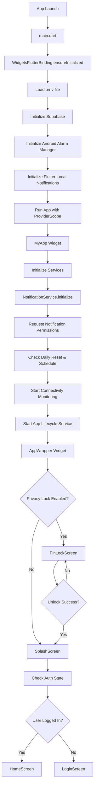

**Key Components:**
- **main.dart**: Entry point, initializes Supabase, notifications, alarm manager
- **AppWrapper**: Handles privacy lock logic
- **SplashScreen**: Checks authentication state
- **Services Initialized**: NotificationService, ConnectivityService, AppLifecycleService

---

## 🔐 Authentication Flow

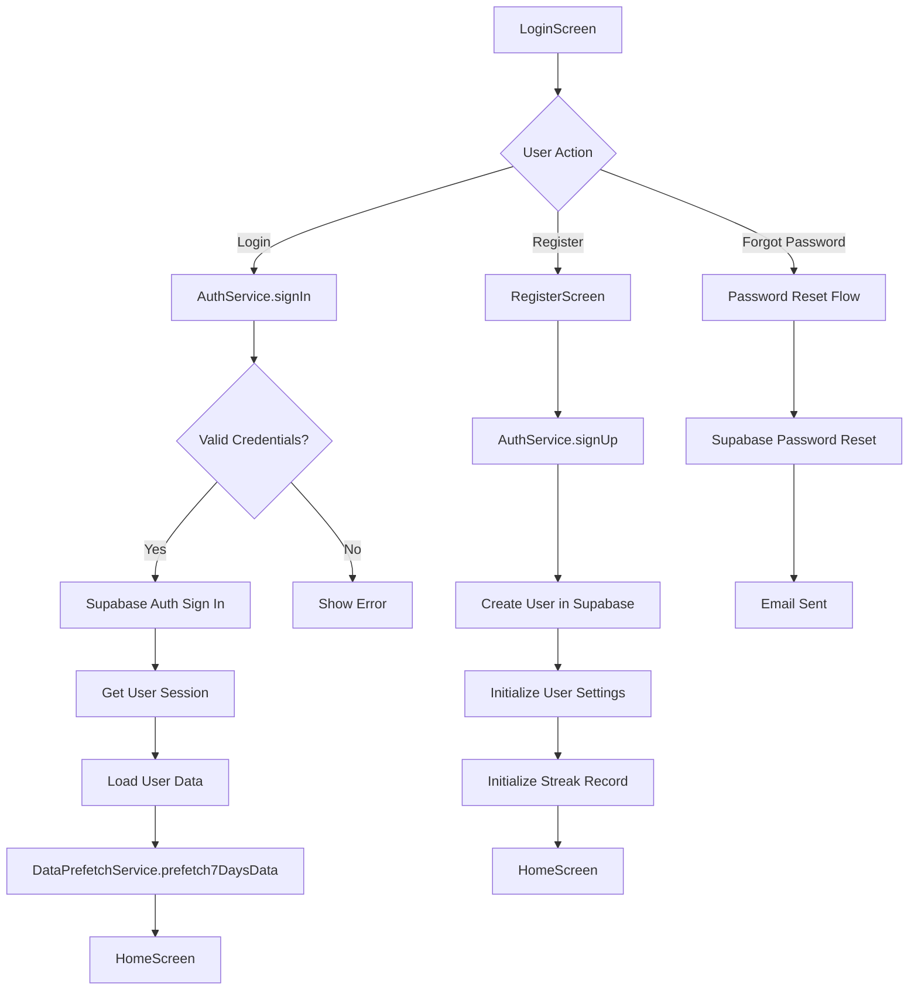

**Key Components:**
- **AuthService**: Handles authentication via Supabase Auth
- **User Data Loading**: Fetches user settings, streaks, preferences
- **Prefetch**: Loads 7 days of data after login

---

## 🗺️ Main Navigation Flow

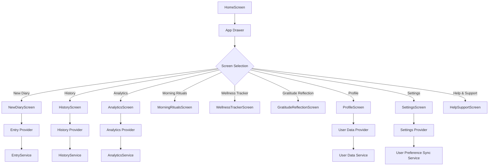

**Navigation Stack:**
- **Home Screen**: Always in stack (base screen)
- **Main Screens**: Replace each other (pushReplacement)
- **Modal Screens**: Stack on top (push)

---

## ✍️ Entry Creation & Save Flow

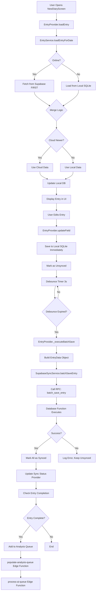

**Key Components:**
- **EntryService**: Manages entry CRUD operations
- **LocalEntryService**: SQLite database operations
- **SupabaseSyncService**: Cloud sync operations
- **EntryProvider**: State management with Riverpod
- **Batch Save**: Single RPC call saves all entry data (80+ calls → 1 call)

**Entry Data Structure:**
- Entry (id, user_id, entry_date, mood_score, diary_text, tags)
- Affirmations (5 items)
- Priorities (6 items)
- Meals (breakfast, lunch, dinner, water_cups)
- Gratitude (6 items)
- Self-Care (10 boolean fields)
- Shower/Bath (took_shower, note)
- Tomorrow Notes (4 items)

---

## 🔄 Data Sync Flow

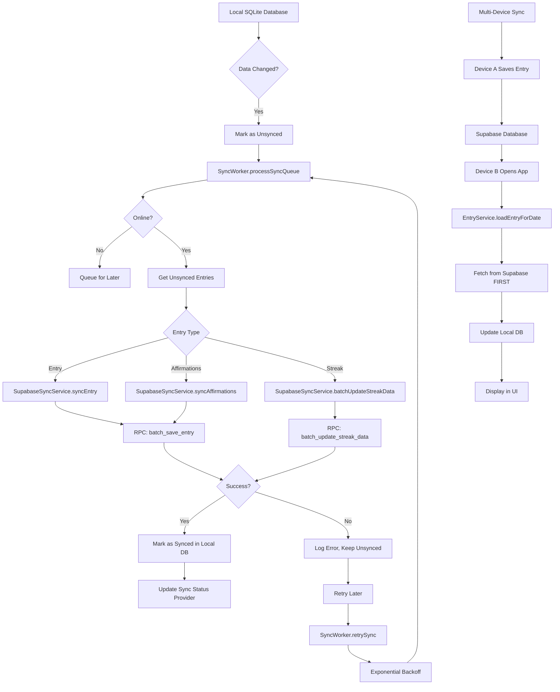

**Sync Strategy:**
- **Local-First**: Save to SQLite immediately
- **Cloud Sync**: Background sync when online
- **Server-First Fetch**: Fetch from cloud first to prevent conflicts
- **Batch Operations**: Use RPC functions for efficiency
- **Conflict Resolution**: Server timestamp wins

**Sync Components:**
- **SyncWorker**: Background sync processor
- **SupabaseSyncService**: Cloud sync operations
- **ConnectivityService**: Network monitoring
- **DataSyncFlagService**: Tracks sync state

---

## 🤖 AI Features Flow

### Daily AI Analysis Flow

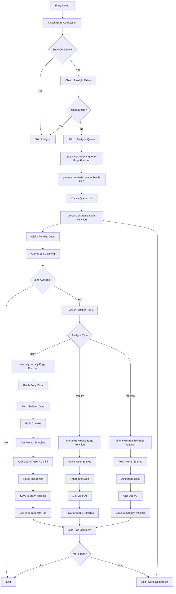

**AI Analysis Types:**

1. **Daily Analysis** (`ai-analyze-daily`)
   - Analyzes single entry
   - Generates: main insight, what went well, progress area, self-care balance, emotional pattern, tags
   - Saves to `entry_insights` table

2. **Weekly Analysis** (`ai-analyze-weekly`)
   - Analyzes week of entries (Sunday-Saturday)
   - Generates: mood avg, water avg, self-care rate, top topics, highlights, key insights, recommendations, mood trend, consistency score, habit correlations
   - Saves to `weekly_insights` table

3. **Monthly Analysis** (`ai-analyze-monthly`)
   - Analyzes month of entries
   - Generates: monthly highlights, growth areas, achievements, next month goals, key moments, reflection questions, strengths
   - Saves to `monthly_insights` table

**AI Queue System:**
- **populate-analysis-queue**: Creates jobs for eligible entries
- **process-ai-queue**: Processes jobs in batches (recursive self-invocation)
- **Atomic Job Claiming**: Prevents race conditions
- **Error Handling**: Comprehensive logging to `ai_errors_log`

**AI Display Flow:**

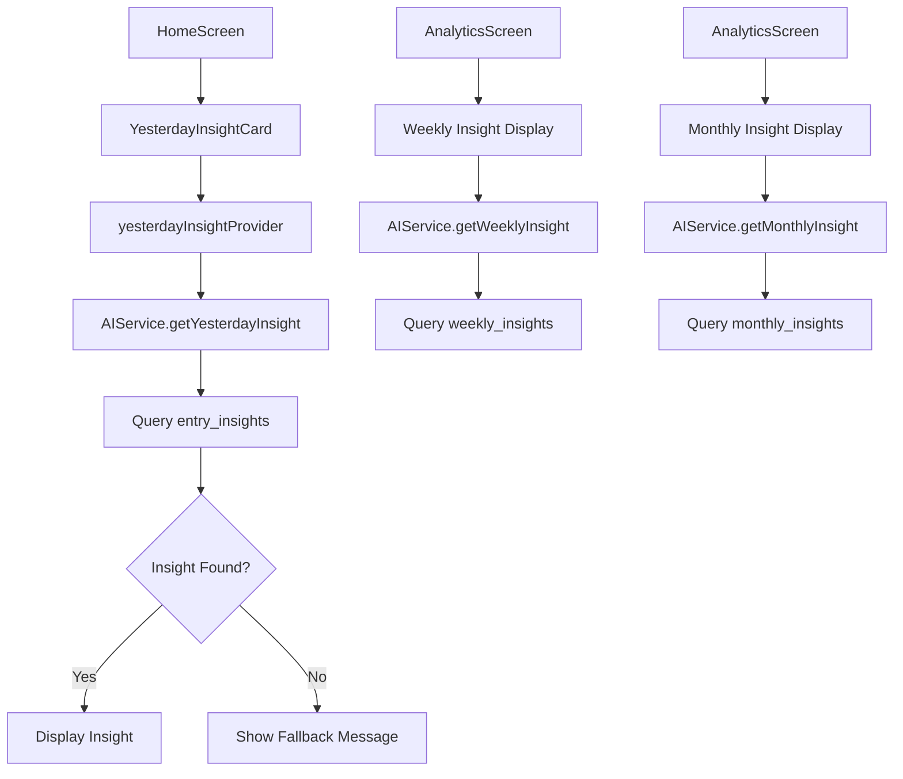

---

## 🗄️ Database Functions (RPC)

### 1. batch_save_entry

**Purpose:** Save complete entry with all related data in single transaction

**Parameters:**
- `p_entry` (jsonb): Entry data
- `p_affirmations` (jsonb, optional): Affirmations array
- `p_priorities` (jsonb, optional): Priorities array
- `p_meals` (jsonb, optional): Meals data
- `p_gratitude` (jsonb, optional): Gratitude items
- `p_self_care` (jsonb, optional): Self-care data
- `p_shower_bath` (jsonb, optional): Shower/bath data
- `p_tomorrow_notes` (jsonb, optional): Tomorrow notes

**Process:**
1. Upsert entry to `entries` table
2. Upsert affirmations to `entry_affirmations`
3. Upsert priorities to `entry_priorities`
4. Upsert meals to `entry_meals`
5. Upsert gratitude to `entry_gratitude`
6. Upsert self-care to `entry_self_care`
7. Upsert shower/bath to `entry_shower_bath`
8. Upsert tomorrow notes to `entry_tomorrow_notes`
9. Return success/error status

**Impact:** Reduces 80+ API calls to 1 call

### 2. batch_update_streak_data

**Purpose:** Update streak and habits_daily in single transaction

**Parameters:**
- `p_user_id` (uuid): User ID
- `p_streak_data` (jsonb): Streak data (current, longest, last_entry_date, freeze_credits, grace_pieces_total, today_date, today_diary, today_affirmations, today_gratitude, today_self_care_count, today_grace_pieces)
- `p_habits_data` (jsonb[], deprecated): Empty array

**Process:**
1. Upsert streak to `streaks` table
2. Upsert/update habits_daily for today
3. Calculate grace pieces
4. Update freeze credits
5. Return success/error status

**Impact:** Reduces 4+ API calls to 1 call

### 3. check_entry_completion

**Purpose:** Check if entry is complete enough for AI analysis

**Parameters:**
- `entry_uuid` (uuid): Entry ID

**Returns:** Boolean

**Completion Criteria:**
- Diary text exists and has minimum word count
- OR Affirmations filled
- OR Gratitude filled
- OR Self-care items completed

### 4. claim_pending_jobs

**Purpose:** Atomically claim pending analysis jobs (prevents race conditions)

**Parameters:**
- `p_batch_size` (integer): Number of jobs to claim

**Process:**
1. Select pending jobs where `process_after <= NOW()`
2. Update status to 'processing' atomically
3. Return claimed jobs

**Impact:** Prevents duplicate processing

### 5. process_analysis_queue_batch

**Purpose:** Create analysis queue jobs for all eligible users/entries

**Process:**
1. Find users with completed entries needing daily analysis
2. Find users needing weekly analysis (if Sunday)
3. Find users needing monthly analysis (if 1st of month)
4. Insert jobs into `analysis_queue` table
5. Return counts

**Called By:** `populate-analysis-queue` Edge Function (hourly cron)

### 6. calculate_grace_days_from_habits

**Purpose:** Calculate grace days from habits (read-only, convenience function)

**Parameters:**
- `p_user_id` (uuid): User ID
- `p_date` (date): Target date

**Returns:** Number of grace days available

---

## ⚡ Edge Functions

### 1. ai-analyze-daily

**Purpose:** Generate daily AI insight for a single entry

**Trigger:** Called by `process-ai-queue` for daily analysis jobs

**Process:**
1. Check if insight already exists (deduplication)
2. Fetch entry from `entries` table
3. Check entry completion via RPC
4. Fetch related data:
   - `entry_self_care`
   - Recent entries (last 3 days) for context
   - Mood trends
5. Build context string
6. Get prompt template from `ai_prompt_templates` (or use fallback)
7. Call OpenAI GPT-4o-mini API
8. Parse structured JSON response:
   - main_insight
   - what_went_well
   - progress_area
   - self_care_balance
   - emotional_pattern
   - tags (3-4 single words)
9. Save to `entry_insights` table
10. Log request to `ai_requests_log`
11. Calculate cost (tokens × pricing)
12. Return success/error

**Error Handling:** Logs to `ai_errors_log` table

### 2. ai-analyze-weekly

**Purpose:** Generate weekly AI insight for a week of entries

**Trigger:** Called by `process-ai-queue` for weekly analysis jobs

**Process:**
1. Check if weekly insight already exists
2. Fetch all entries for the week
3. Aggregate data:
   - Mood average
   - Water cups average
   - Self-care completion rate
   - Topics extraction
   - Consistency score
   - Word count total
4. Fetch related data in parallel:
   - Self-care data
   - Meals data
   - Daily insights
   - Affirmations
   - Gratitude
   - Priorities
   - Tomorrow notes
   - Shower/bath data
5. Build habit correlations
6. Build full data strings (no truncation)
7. Call OpenAI GPT-4o-mini API
8. Parse structured response:
   - Highlights (10-12 lines)
   - Key insights (4-6 points)
   - Recommendations (4-6 points)
   - Mood trend
   - Habit correlations
9. Save to `weekly_insights` table
10. Log request to `ai_requests_log`
11. Return success/error

### 3. ai-analyze-monthly

**Purpose:** Generate monthly AI insight for a month of entries

**Trigger:** Called by `process-ai-queue` for monthly analysis jobs

**Process:**
1. Check if monthly insight already exists
2. Fetch all entries for the month
3. Aggregate data (similar to weekly)
4. Call OpenAI GPT-4o-mini API
5. Parse structured response:
   - Monthly highlights (10-12 lines)
   - Growth areas (4-6 points)
   - Achievements (4-6 points)
   - Next month goals (4-6 points)
   - Key moments (4-6 points)
   - Reflection questions (4-6 points)
   - Strengths (4-6 points)
   - Habit analysis
6. Save to `monthly_insights` table
7. Log request to `ai_requests_log`
8. Return success/error

### 4. populate-analysis-queue

**Purpose:** Create analysis queue jobs for eligible entries

**Trigger:** Hourly cron job

**Process:**
1. Call `process_analysis_queue_batch` RPC function
2. RPC function creates jobs for:
   - Daily analysis (completed entries without insights)
   - Weekly analysis (if Sunday)
   - Monthly analysis (if 1st of month)
3. Return summary counts

**Frequency:** Every hour

### 5. process-ai-queue

**Purpose:** Process analysis queue jobs in batches

**Trigger:** Hourly cron job + recursive self-invocation

**Process:**
1. Check for stuck jobs (>10 min processing) and reset
2. Check active processing (prevent cron conflicts)
3. Claim pending jobs atomically (batch of 20)
4. For each job:
   - Route to appropriate analysis function (daily/weekly/monthly)
   - Invoke edge function
   - Mark as completed/failed
   - Handle retries (max 3 attempts)
5. Check for remaining jobs
6. If jobs remain and progress made:
   - Self-invoke recursively (fire-and-forget)
   - Continue until all jobs processed
7. Return summary

**Features:**
- **Recursive Self-Invocation**: Processes 1000 entries in 50-70 minutes
- **Atomic Job Claiming**: Prevents race conditions
- **Stuck Job Recovery**: Auto-resets jobs stuck >10 minutes
- **Cron Conflict Prevention**: Skips if recursive processing active
- **Error Logging**: Comprehensive logging to `ai_errors_log`

**Batch Size:** 20 jobs per batch  
**Max Recursion Depth:** 50 batches  
**Processing Time:** ~2-3 seconds per job

---

## 🔄 Background Processes

### 1. Sync Worker

**Purpose:** Background sync of unsynced local data to cloud

**Process:**
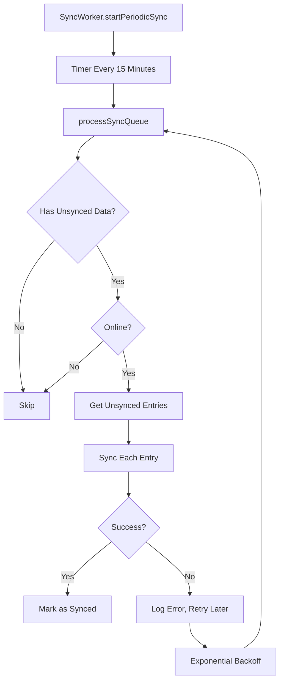

**Components:**
- **SyncWorker**: Manages sync queue processing
- **SupabaseSyncService**: Performs actual sync operations
- **ConnectivityService**: Monitors network status

### 2. Notification Service

**Purpose:** Daily reminder notifications

**Process:**
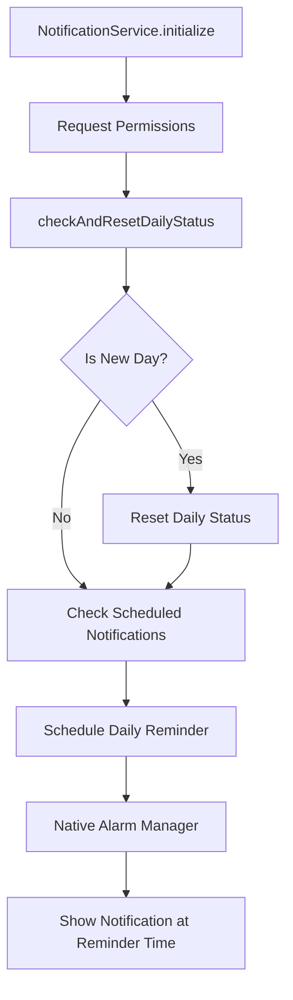

**Features:**
- Daily reset detection
- User-configurable reminder time
- Native alarm manager integration
- Notification permissions handling

### 3. Connectivity Monitoring

**Purpose:** Monitor network status for sync operations

**Process:**
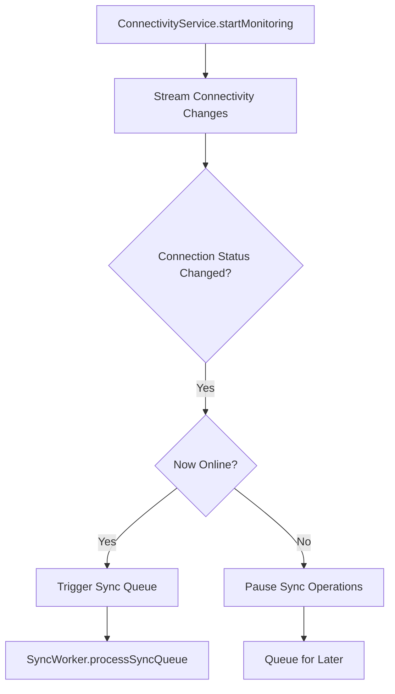

### 4. App Lifecycle Service

**Purpose:** Handle app lifecycle events (background, foreground, termination)

**Process:**
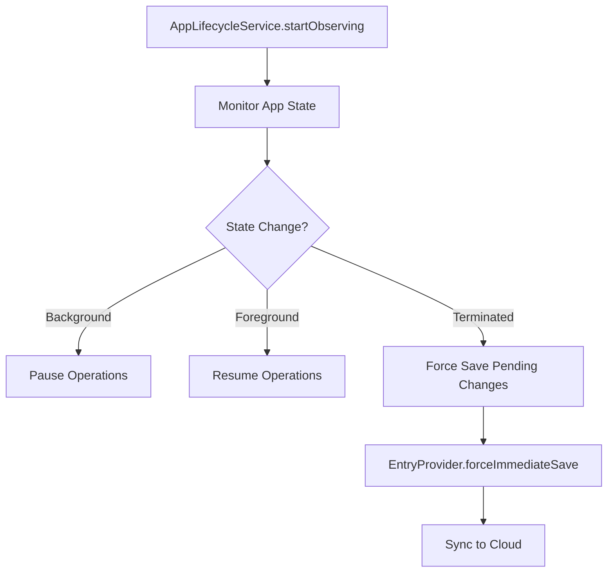

**Features:**
- Force save on app termination
- Pause/resume sync operations
- Handle app state changes

### 5. Data Prefetch Service

**Purpose:** Prefetch data on app startup/login

**Process:**
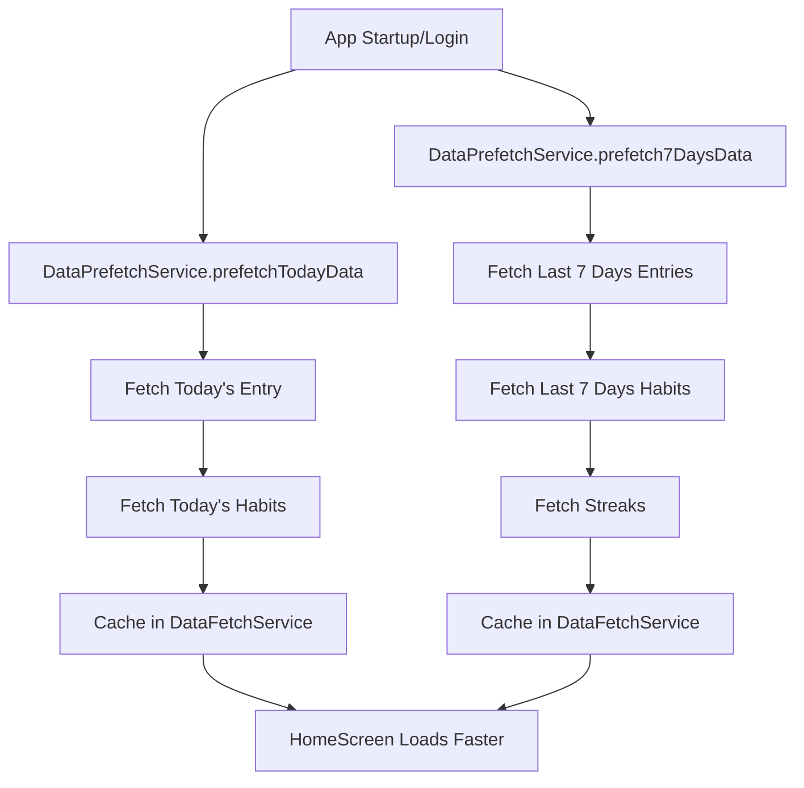

**Benefits:**
- Faster home screen load
- Reduced API calls
- Better offline experience

---

## 👤 Complete User Journey

### Journey 1: New User Registration

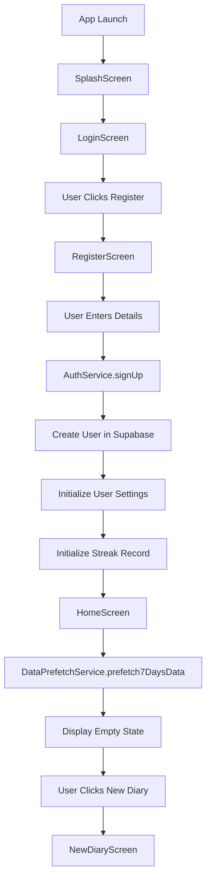

### Journey 2: Daily Entry Creation

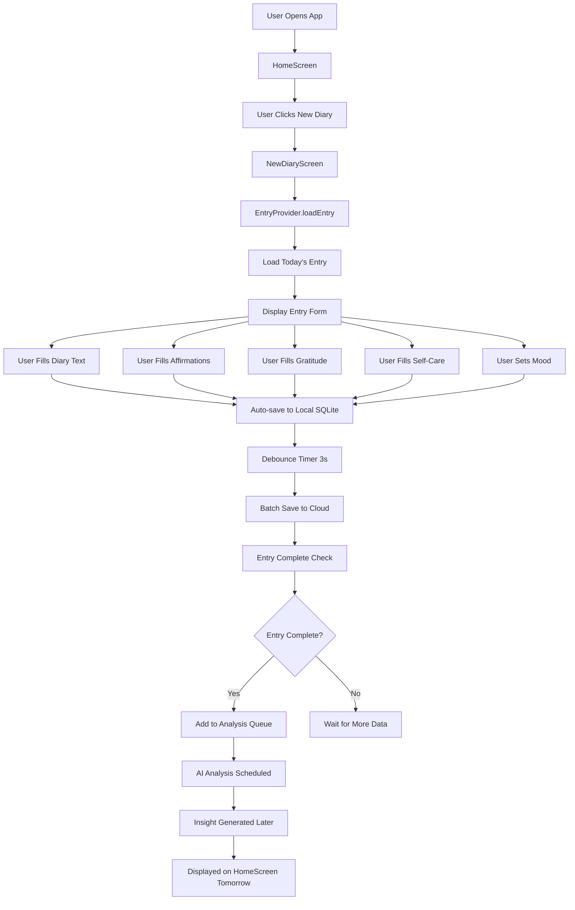

### Journey 3: Viewing Insights

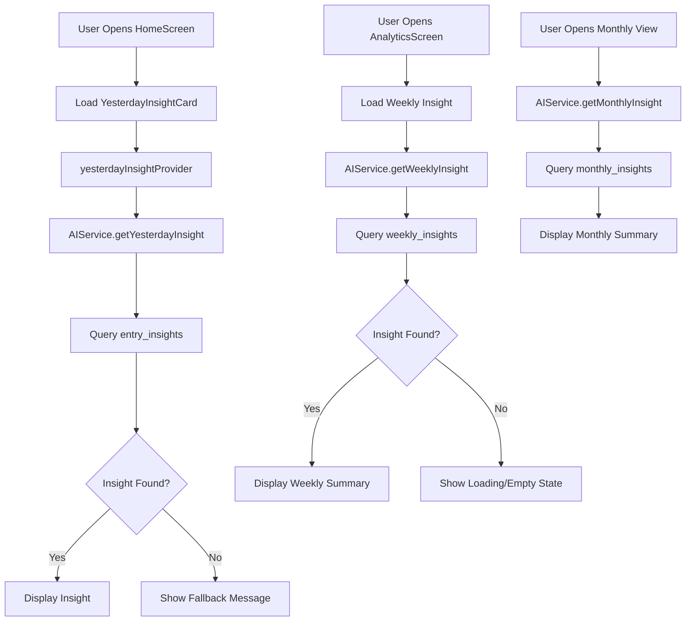

### Journey 4: Multi-Device Sync

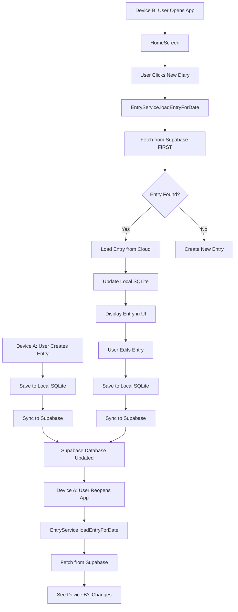

---

## 📊 Database Schema Overview

### Core Tables

1. **users**: User accounts
2. **entries**: Main diary entries
3. **entry_affirmations**: Affirmations (JSONB)
4. **entry_priorities**: Priorities (JSONB)
5. **entry_meals**: Meals and water intake
6. **entry_gratitude**: Gratitude items (JSONB)
7. **entry_self_care**: Self-care checklist
8. **entry_shower_bath**: Shower/bath tracking
9. **entry_tomorrow_notes**: Tomorrow notes (JSONB)

### Analytics Tables

10. **entry_insights**: Daily AI insights
11. **weekly_insights**: Weekly AI insights
12. **monthly_insights**: Monthly AI insights
13. **streaks**: User streak data
14. **habits_daily**: Daily habit completion tracking

### System Tables

15. **analysis_queue**: AI analysis job queue
16. **ai_requests_log**: AI API request logging
17. **ai_errors_log**: AI error logging
18. **ai_prompt_templates**: AI prompt templates
19. **error_logs**: Application error logs
20. **user_settings**: User preferences
21. **prompts**: Daily prompts
22. **prompt_assignments**: User prompt assignments

---

## 🔧 Key Services Overview

### 1. EntryService
- Entry CRUD operations
- Local-first save strategy
- Cloud sync coordination
- Entry caching

### 2. LocalEntryService
- SQLite database operations
- Entry storage and retrieval
- Related data management

### 3. SupabaseSyncService
- Cloud sync operations
- Batch save via RPC
- Streak sync via RPC
- Multi-device sync

### 4. AIService
- AI insight fetching
- Daily/weekly/monthly insights
- Fallback logic
- Insight timeline

### 5. HomeSummaryService
- Home screen data aggregation
- Streak summary
- Today's progress
- Weekly snapshot
- Prompt/motivation

### 6. AnalyticsService
- Analytics data calculation
- Period comparisons
- Trend analysis

### 7. HistoryService
- Entry history retrieval
- Date range queries
- Entry filtering

### 8. NotificationService
- Daily reminder notifications
- Notification scheduling
- Permission handling

### 9. SyncWorker
- Background sync processing
- Retry logic with exponential backoff
- Periodic sync (15 min intervals)

### 10. DataPrefetchService
- Startup data prefetching
- Today's data prefetch
- 7-day data prefetch

### 11. DataFetchService
- Cached data fetching
- Cache invalidation
- Reduced API calls

### 12. ErrorLoggingService
- Comprehensive error logging
- Error categorization
- Supabase error log storage

---

## 🎯 Key Features Summary

### 1. Offline-First Architecture
- All data saved to local SQLite first
- Cloud sync happens in background
- Works completely offline

### 2. Multi-Device Sync
- Server-first fetch prevents conflicts
- Timestamp-based conflict resolution
- Real-time sync when online

### 3. AI-Powered Insights
- Daily insights for each entry
- Weekly summaries
- Monthly reflections
- Queue-based processing

### 4. Batch Operations
- Single RPC call saves entire entry
- Reduces API calls by 98.75%
- Faster save operations

### 5. Grace System
- Grace pieces earned from tasks
- Freeze credits for streak protection
- Local calculation, cloud sync

### 6. Streak Tracking
- Based on habits_daily completion
- Multi-device sync
- Gap detection

### 7. Comprehensive Error Logging
- All errors logged to Supabase
- Error categorization
- Stack trace capture

### 8. Performance Optimizations
- Data prefetching on startup
- Cached data fetching
- Debounced saves
- Batch operations

---

## 📱 Screen Flow Summary

### Authentication Screens
1. **SplashScreen**: Initial loading, auth check
2. **LoginScreen**: User login
3. **RegisterScreen**: New user registration
4. **PinLockScreen**: Privacy lock
5. **PinSetupScreen**: PIN setup
6. **PinRecoveryScreen**: PIN recovery
7. **ChangePinScreen**: Change PIN
8. **SecurityQuestionsScreen**: Security questions

### Main Screens
9. **HomeScreen**: Dashboard, summary, insights
10. **NewDiaryScreen**: Entry creation/editing
11. **HistoryScreen**: Entry history, calendar view
12. **AnalyticsScreen**: Analytics, insights, trends
13. **MorningRitualsScreen**: Morning rituals
14. **WellnessTrackerScreen**: Wellness tracking
15. **GratitudeReflectionScreen**: Gratitude reflection
16. **ProfileScreen**: User profile
17. **SettingsScreen**: App settings
18. **HelpSupportScreen**: Help and support
19. **MyTicketsScreen**: Support tickets
20. **YesterdayInsightScreen**: Yesterday's insight detail
21. **TermsScreen**: Terms of service
22. **PrivacyPolicyScreen**: Privacy policy

---

## 🔐 Security Features

1. **Privacy Lock**: PIN-based app lock
2. **Row Level Security**: Supabase RLS policies
3. **JWT Authentication**: Supabase Auth
4. **Secure Storage**: Local data encryption
5. **Error Logging**: No sensitive data in logs

---

## 📈 Performance Metrics

### API Call Reduction
- **Before**: 80+ calls per entry save
- **After**: 1 call per entry save
- **Reduction**: 98.75%

### Sync Performance
- **Local Save**: <50ms
- **Cloud Sync**: <500ms (background)
- **Batch Save**: <1s for complete entry

### AI Processing
- **Daily Analysis**: ~2-3 seconds per entry
- **Weekly Analysis**: ~5-10 seconds per week
- **Monthly Analysis**: ~10-20 seconds per month
- **Queue Processing**: 20 jobs per batch, recursive

---

## 🎉 Conclusion

This document provides a complete visualization of the Diary App's functionality from start to end. Every component, service, database function, edge function, and user flow is documented with detailed flowcharts and explanations.

**Key Highlights:**
- ✅ Complete offline-first architecture
- ✅ Multi-device sync with conflict resolution
- ✅ AI-powered insights (daily/weekly/monthly)
- ✅ Batch operations for performance
- ✅ Comprehensive error logging
- ✅ Background sync and processing
- ✅ Grace system and streak tracking
- ✅ 21 screens with full navigation flow

**All flows are interconnected and work together to provide a seamless user experience.**

---

*End of Document*
