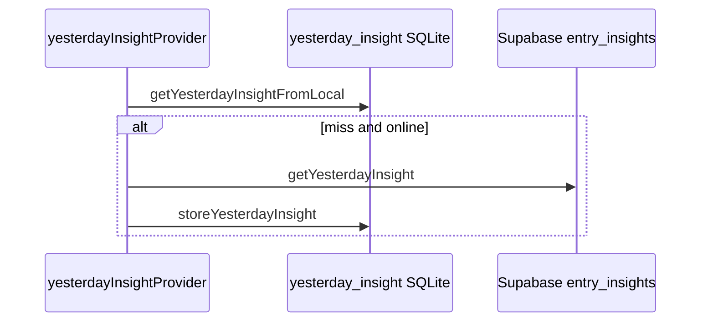

# Feature design doc — AI insights (client)

> **Scope:** **Read-only** Flutter access to **AI-produced** rows in Supabase (`entry_insights`, `weekly_insights`, `monthly_insights`), **`AIService`** query + parse helpers, **local SQLite** cache via **`EntryInsightStorageHelper`**, **Home** yesterday card + provider, **Analytics** weekly timeline widget, **`recentInsightsProvider`** carousel data, **History** lazy fetch (see **History & recent** — uses same storage helper). **Generation** of insights is **server-side** (Edge / queue) — not this doc.

---

## 0. Document control

| Field | Value |
|-------|--------|
| **Feature name (canonical)** | **AI / insights (client)** |
| **Short slug** | `ai-insights-client` |
| **Doc version** | `0.1` |
| **Last updated** | `2026-04-03` |
| **Owner / maintainer** | `[TBD]` |
| **Reviewers (default)** | Anyone changing `AIService` queries, `EntryInsightStorageHelper` schema, or `yesterdayInsightProvider` behaviour |
| **Status of this doc** | `Draft` |

---

## 1. Summary

### 1.1 One-line purpose

**Fetch, parse, and display** persisted AI insights for **daily entries**, **weeks**, and **months**, with **offline-first yesterday** caching and a **60-day** local cache for **per-entry** insights used from History.

### 1.2 Elevator pitch

**`AIService`** wraps **Supabase** selects (mostly **`status = 'success'`**) and maps rows into **`DailyInsight`**, **`WeeklyInsight`**, **`MonthlyInsight`**, **`DailyInsightWithDate`**, **`DailyInsightWithMood`**. **`yesterdayInsightProvider`** (in **`home_summary_provider.dart`**) tries **`EntryInsightStorageHelper.getYesterdayInsightFromLocal`** first; if empty and **online**, calls **`getYesterdayInsight`**, then **`storeYesterdayInsight`**. **`YesterdayInsightCard`** shows a teaser and opens **`YesterdayInsightScreen`**. **`DailyInsightsTimeline`** (embedded from **Analytics** weekly view) calls **`getDailyInsightsTimeline`** via **`FutureBuilder`**. **`recentInsightsProvider`** loads **`getRecentInsights`** for optional carousel use. **`HistoryService.fetchInsightForEntry`** writes **`entry_insights_local`** after a remote fetch.

### 1.3 In scope / out of scope

| In scope | Out of scope |
|----------|----------------|
| `ai_service.dart` (client API + `WeeklyInsight` / `MonthlyInsight` models at file bottom) | **`supabase/functions/ai-analyze-*`**, queue processors, prompts, token billing |
| `entry_insight_storage_helper.dart` | **RLS** policies on `entry_insights` — DB docs |
| `yesterday_insight_card.dart`, `yesterday_insight_screen.dart`, `daily_insights_timeline.dart` | **In-app Analytics** KPI math — **Analytics (in-app)** feature |
| `yesterdayInsightProvider`, `recentInsightsProvider`, `aiInsightProvider` | **Premium** gating on Analytics (insights data may still be restricted by product elsewhere) |

---

## 2. Product & UX

### 2.1 User-facing surfaces

- **Home:** **Yesterday’s Insight** card — loading / empty / error / tap → full screen.
- **Yesterday detail:** **`YesterdayInsightScreen`** — sentiment styling, full text, structured **`InsightDetails`** when present.
- **Analytics (weekly):** **`DailyInsightsTimeline`** between **`startDate`/`endDate`** (week window).
- **History:** Expand entry → fetch insight (local-first) — documented under History feature.

### 2.2 UX principles & constraints

- **Yesterday** uses **calendar yesterday** in **`getYesterdayInsight`** (device-local date string), not user timezone service — align with product if TZ matters.
- **Empty states:** Cards/timeline show empty UI when no rows.

### 2.3 Related product docs

- `bc/CHANGE-SYSTEM/feature-list.md` — **AI / insights (client)**
- **Supabase AI & queue** — server generation

---

## 3. Technical architecture

### 3.1 Stack & layers

| Layer | Details |
|-------|---------|
| **Transport** | Supabase Flutter (`from`, `rpc`) |
| **Models** | `DailyInsight`, `InsightDetails`, `DailyInsightWithDate`, `DailyInsightWithMood` in `analytics_models.dart`; **`WeeklyInsight` / `MonthlyInsight`** in `ai_service.dart` |
| **Cache** | SQLite `yesterday_insight`, `entry_insights_local` |

### 3.2 Key modules & file paths

```
lib/
  services/ai_service.dart
  services/entry_insight_storage_helper.dart
  providers/home_summary_provider.dart    # yesterdayInsightProvider, recentInsightsProvider, aiInsightProvider
  widgets/yesterday_insight_card.dart
  screens/yesterday_insight_screen.dart
  widgets/daily_insights_timeline.dart
  models/analytics_models.dart
  services/history_service.dart           # fetchInsightForEntry → storage helper
```

### 3.3 Data model (feature-specific)

| Remote table | Client usage |
|--------------|----------------|
| `entry_insights` | Daily/yesterday/recent/timeline; join **`entries`** for `user_id` / `entry_date` filters |
| `weekly_insights` | `getWeeklyInsight` |
| `monthly_insights` | `getMonthlyInsight` |

| Local table | Role |
|-------------|------|
| `yesterday_insight` | One row per **`user_id`** — last fetched yesterday payload |
| `entry_insights_local` | Per **`entry_id`** cache; **60-day** retention helper |

### 3.4 External dependencies

- **Supabase** auth for `user_id`
- **Optional** `DataFetchService` on `AIService` constructor (field exists; not all methods use it)

### 3.5 Platform notes

N/A.

### 3.6 Functions & methods (code map)

#### 3.6.1 AIService (primary)

| Method | Purpose |
|--------|---------|
| `getYesterdayInsight(userId)` | `entry_insights` + `entries!inner` — **yesterday** date, `status=success` |
| `getDailyInsight(entryId)` | Single row by `entry_id` |
| `getWeeklyInsight(userId, weekStart)` | `weekly_insights` |
| `getMonthlyInsight(userId, monthStart)` | `monthly_insights` + `habit_analysis` parse |
| `getRecentInsights(userId, {limit:7})` | Recent successful insights with entry join |
| `getDailyInsightsTimeline(userId, start, end)` | Date range, ordered by `processed_at` |
| `getMostRecentInsight(userId)` | Latest success + **ownership** check via `entries` |
| `checkEntryCompletion(entryId)` | RPC **`check_entry_completion`** |

#### 3.6.2 EntryInsightStorageHelper

| Method | Purpose |
|--------|---------|
| `storeYesterdayInsight` / `getYesterdayInsightFromLocal` / `clearYesterdayInsight` | **`yesterday_insight`** table |
| `storeEntryInsightLocal` / `getEntryInsightFromLocal` | **`entry_insights_local`** |
| `clearEntryInsightsOlderThan({retentionDays:60})` | Prune old rows |

#### 3.6.3 Providers (`home_summary_provider.dart`)

| Provider | Role |
|----------|------|
| `yesterdayInsightProvider` | Local → remote → store |
| `recentInsightsProvider` | `getRecentInsights`, limit 7 |
| `aiInsightProvider` | `HomeSummaryService.fetchAiInsight` (deprecated path; prefer yesterday provider per file comment) |

### 3.7 Variables, constants & configuration keys

#### 3.7.1 Defaults

| Name | Value |
|------|--------|
| `getRecentInsights` default `limit` | `7` |

#### 3.7.2 Error codes (`AIService`)

| Code | Operation |
|------|-----------|
| ERRAI005 | getYesterdayInsight / getDailyInsight |
| ERRAI007 | getWeeklyInsight |
| ERRAI009 | getRecentInsights |
| ERRAI010 | getDailyInsightsTimeline |
| ERRAI011 | checkEntryCompletion RPC |
| ERRAI012 | getMostRecentInsight |
| ERRAI013 | getMonthlyInsight |

### 3.8 Core logic & behaviour

#### 3.8.1 Yesterday local-first

1. Read **`yesterday_insight`** for user.
2. If null and online → **`getYesterdayInsight`** → **`storeYesterdayInsight`** on success.

#### 3.8.2 Parsing

- **`insight_text`** / **`summary`** — fallback chain on strings.
- **`insight_details`** — optional **`InsightDetails.fromJson`**; failures → null.

#### 3.8.3 Timeline widget

- **`DailyInsightsTimeline`** constructs **`AIService()`** inline and uses **`FutureBuilder`** — **not** a Riverpod provider (no automatic invalidation).

#### 3.8.4 Edge cases

| Scenario | Behaviour |
|----------|-----------|
| No row / error | Methods return **null** or **[]**; errors logged **low** severity typically |
| `getMostRecentInsight` wrong user | Second query verifies **`entries.user_id`** |

### 3.9 State management

| Provider | Location | Notes |
|----------|----------|--------|
| `yesterdayInsightProvider` | `home_summary_provider.dart` | `FutureProvider.autoDispose` |
| `recentInsightsProvider` | same | Carousel |

---

## 4. Boundaries & coupling

### 4.1 Upstream

- **Supabase** must contain **`status=success`** rows for UI to show text.
- **Auth** — user id for scoped queries.

### 4.2 Downstream

- **Analytics** consumes **`getWeeklyInsight`** / **`getMonthlyInsight`** inside **`AnalyticsService`**, not only this file — see Analytics doc.
- **History** uses **`fetchInsightForEntry`** + local cache.

### 4.3 Shared hotspots

- **`entry_insights`** shape changes → update **`AIService`** + **`EntryInsightStorageHelper`** + History models together.

---

## 5. Change control alignment

### 5.1 `primary_feature`

**AI / insights (client)** for `AIService`, storage helper, yesterday UI/widgets. **Supabase AI & queue** for server generation changes.

### 5.2 Approver

Match **AI / insights (client)** for read paths; **Analytics (in-app)** if only embedding timeline layout changes.

### 5.3 CTASK expectations

- New **columns** on insight tables → client parse + migration CTASK.
- Changing **yesterday** definition → UX + QA CTASK.

### 5.4 Risk class

**Medium** — read-only client, but PII in insight text; cache leaks if user switch not cleared.

---

## 6. Operations & quality

### 6.1 Feature flags

None in client service layer.

### 6.2 Observability

ERRAI* codes on failures.

### 6.3 Performance

- Timeline: one query per widget build unless widget is rebuilt — consider caching if needed.
- **Recent insights**: limit 7 by default.

### 6.4 Security & privacy

Insights may quote diary content; ensure **RLS** enforces **`user_id`**.

---

## 7. Testing strategy

### 7.1 Manual critical paths

1. Home: offline shows local yesterday if present; online fills cache.
2. Yesterday full screen renders **`InsightDetails`** when JSON valid.
3. Analytics week: timeline lists days with insights in range.
4. History: second open uses **`entry_insights_local`** without network.

### 7.2 Automated

| Type | Location |
|------|----------|
| Unit | `[TBD]` — JSON → `DailyInsight`, date string formatting |

### 7.3 Regression triggers

Change **`entry_insights`** select shape → retest AIService + History + yesterday card.

---

## 8. Releases & migration

### 8.1 User-visible

Note when insight **format** or **sections** change (copy, structure).

### 8.2 Data migrations

SQLite: migrations for `yesterday_insight` / `entry_insights_local` columns.

---

## 9. Documentation & support

### 9.1 User-facing

Strings in **`YesterdayInsightCard`** / **`YesterdayInsightScreen`**.

### 9.2 FAQ

| Issue | Note |
|-------|------|
| Stale yesterday | Local row overwritten on successful fetch; clear app data resets |

---

## 10. Glossary

| Term | Definition |
|------|------------|
| **Daily insight** | Row in `entry_insights` for one entry |
| **Weekly/Monthly insight** | Aggregated AI rows in `weekly_insights` / `monthly_insights` |

---

## 11. Open questions & decisions

### 11.1 Open questions

1. **`AIService._dataFetchService`** — intended for future cached reads? Currently many methods query Supabase directly.
2. User **timezone** — should “yesterday” use **`TimezoneService`** instead of `DateTime.now()`?

### 11.2 Decisions

| Date | Decision | Rationale |
|------|----------|-----------|
| `2026-04-03` | Client doc excludes Edge generation | Split from **Supabase AI & queue** |

---

## 12. Appendix

### 12.1 References

- `lib/services/ai_service.dart`
- `lib/services/entry_insight_storage_helper.dart`
- `lib/providers/home_summary_provider.dart`
- `bc/CHANGE-SYSTEM/feature-doc-template.md`

### 12.2 Diagram (yesterday flow)



### 12.3 Changelog of *this* doc

| Version | Date | Notes |
|---------|------|-------|
| `0.1` | `2026-04-03` | Initial |
