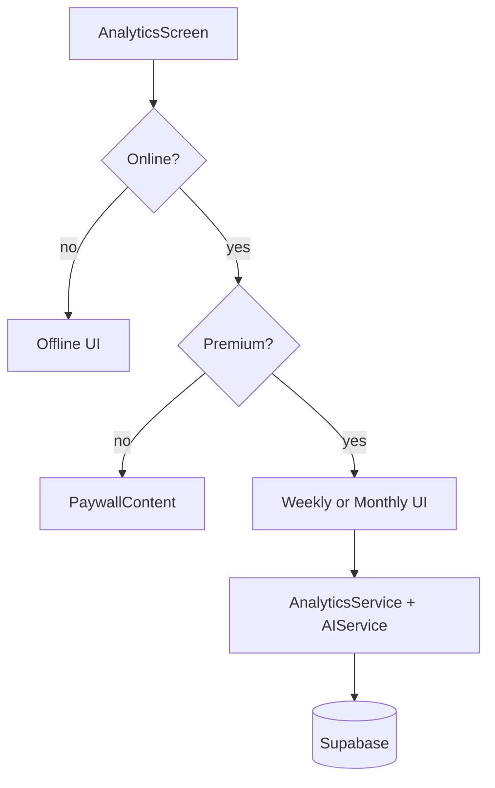

# Feature design doc — Analytics (in-app)

> **Scope:** **Analytics tab** — **week / month** views, **premium + online** gating, **`AnalyticsService`** aggregations (mood, water, self-care, consistency) merged with **AI weekly/monthly insights** (`AIService`), **navigation** via **`WeekChipsCarousel`** / **`MonthChipsCarousel`** / **`MiniCalendarWidget`**, and charts (**`InteractiveBarChart`**, mood trends). Riverpod wires period selection and **`DataFetchService`**-first fetching for monthly paths.

---

## 0. Document control

| Field | Value |
|-------|--------|
| **Feature name (canonical)** | **Analytics (in-app)** |
| **Short slug** | `analytics-in-app` |
| **Doc version** | `0.1` |
| **Last updated** | `2026-04-03` |
| **Owner / maintainer** | `[TBD]` |
| **Reviewers (default)** | Anyone changing `AnalyticsScreen` gating, `AnalyticsService` aggregation rules, or `analytics_provider` providers |
| **Status of this doc** | `Draft` |

---

## 1. Summary

### 1.1 One-line purpose

Show **trends and AI narrative** for the user’s journaling over a **selected week or month**, using **entries**, **`entry_meals`**, **`entry_self_care`** (weekly daily rows), and server tables **`weekly_insights`** / **`monthly_insights`** for chip metadata — **only when online and subscribed (premium)**.

### 1.2 Elevator pitch

**`analyticsConnectivityProvider`** gates the screen: **offline** → static offline copy + retry. **Online** → **`premiumProvider`**: non-premium or error → **`PaywallContent`**; premium → scrollable analytics. User toggles **`AnalyticsPeriodSwitch`** (**Week** default via **`analyticsPeriodProvider`**). **Week** uses **`selectedWeekProvider`** (Sunday start, aligned with list builder) + **`weeklyInsightsListProvider`** + **`weeklyAnalyticsProvider`**. **Month** uses **`selectedMonthProvider`** (defaults to **previous calendar month**) + **`monthlyInsightsListProvider`** + **`monthlyAnalyticsProvider`** (prefers **`DataFetchService.fetchMonthlyAnalytics`** / **`fetchMonthlyInsightsList`**). **`AnalyticsService`** computes fallbacks when AI rows are missing; **`habits_daily`** pulls are **disabled** in service (commented “DISCONNECTED”) so self-care **rate** from habits is often **0** while **per-entry `entry_self_care`** still feeds **weekly** `DailyProgress`.

### 1.3 In scope / out of scope

| In scope | Out of scope |
|----------|----------------|
| `analytics_screen.dart`, `analytics_service.dart`, `analytics_provider.dart` | **Edge functions** that *generate* weekly/monthly insights |
| `analytics_period_switch.dart`, `interactive_bar_chart.dart` | **Home** “This Week” local aggregates — different code path |
| `WeekMetadata` / `MonthMetadata` navigation | **Marketing** web analytics |
| Premium paywall **entry** from Analytics | **RevenueCat** SDK internals — see Premium feature |
| `AIService.getWeeklyInsight` / `getMonthlyInsight` | Full **AI / insights** client doc |

---

## 2. Product & UX

### 2.1 User-facing surfaces

- **Tab:** Bottom nav **Analytics** — large screen with period switch, chips, optional calendar dialog, KPI cards, AI highlights, bar chart (weekly), mood trend visuals.
- **Gating:** **Internet required** (copy explains). **Subscription required** — paywall if not premium.
- **Navigation:** Horizontal **week** / **month** chips; **MiniCalendarWidget** for week pick.

### 2.2 UX principles & constraints

- **Week start:** **`SelectedWeekNotifier`** uses **`now.weekday % 7`** (Sunday-based week).
- **Default month:** **`SelectedMonthNotifier`** starts at **last month**, not current.
- **`DailyProgress.overallScore`:** Weighted mix of mood (40%), water (30%), self-care completion (30%).

### 2.3 Related product docs

- `bc/CHANGE-SYSTEM/feature-list.md` — **Analytics (in-app)**
- `bc/CHANGE-SYSTEM/features-docs/Home-&-calendar.md` — shared calendar widgets

---

## 3. Technical architecture

### 3.1 Stack & layers

| Layer | Details |
|-------|---------|
| **UI** | Flutter, Riverpod, responsive tokens |
| **Data** | Supabase `entries`, `entry_meals`, `entry_self_care`, `weekly_insights`, `monthly_insights` + optional local cache via **`DataFetchService`** |
| **AI** | `AIService` weekly/monthly insight objects merged into `WeeklyAnalyticsData` / `MonthlyAnalyticsData` |

### 3.2 Key modules & file paths

```
lib/
  screens/analytics_screen.dart
  services/analytics_service.dart
  providers/analytics_provider.dart
  widgets/analytics_period_switch.dart
  widgets/interactive_bar_chart.dart
  widgets/week_chips_carousel.dart
  widgets/month_chips_carousel.dart
  widgets/mini_calendar_widget.dart
  models/analytics_models.dart
  services/ai_service.dart
  services/data_fetch_service.dart
  widgets/paywall_content.dart
```

### 3.3 Data model (feature-specific)

| Type | Role |
|------|------|
| `AnalyticsPeriod` | `weekly` \| `monthly` |
| `WeeklyAnalyticsData` / `MonthlyAnalyticsData` | KPIs, trends, AI payloads, `DailyProgress` list (weekly) |
| `WeekMetadata` / `MonthMetadata` | Chip labels, `entries_count`, `status`, optional `mood_avg` |
| `DailyProgress` | Per-day mood / water / self-care / preview for bars |

### 3.4 External dependencies

- **Supabase** — queries as above
- **Premium** — `premiumProvider` + `PaywallContent`

### 3.5 Platform notes

None specific beyond network requirement.

### 3.6 Functions & methods (code map)

#### 3.6.1 Entry points & orchestration

| Symbol | File | Role |
|--------|------|------|
| `AnalyticsScreen.build` | `analytics_screen.dart` | Connectivity → premium → content vs paywall vs offline |
| `AnalyticsPeriodNotifier.setPeriod` | `analytics_provider.dart` | Week/month toggle |
| `SelectedWeekNotifier` / `SelectedMonthNotifier` | same | Selected period anchors |
| `weeklyAnalyticsProvider` | same | `AnalyticsService.getWeeklyAnalytics(selectedWeek)` |
| `monthlyAnalyticsProvider` | same | `DataFetchService.fetchMonthlyAnalytics` → fallback `getMonthlyAnalytics` |
| `weeklyInsightsListProvider` | same | `AnalyticsService.getWeeklyInsightsList` |
| `monthlyInsightsListProvider` | same | `DataFetchService.fetchMonthlyInsightsList` → fallback `getMonthlyInsightsList` |

#### 3.6.2 Services

| Symbol | File | Notes |
|--------|------|--------|
| `AnalyticsService.getWeeklyAnalytics` | `analytics_service.dart` | Entries + meals + `entry_self_care`; AI weekly insight; ERRANA001 |
| `AnalyticsService.getMonthlyAnalytics` | same | Entries + meals; AI monthly; ERRANA002 |
| `AnalyticsService.getWeeklyInsightsList` | same | `weekly_insights` + last 4 weeks entry fill-in; ERRANA002 |
| `AnalyticsService.getMonthlyInsightsList` | same | `monthly_insights` + recent months with entries; ERRANA004 / ERRANA003 |

#### 3.6.3 Widgets

| Widget | File | Role |
|--------|------|------|
| `AnalyticsPeriodSwitch` | `analytics_period_switch.dart` | Pill toggle Week/Month |
| `InteractiveBarChart` | `interactive_bar_chart.dart` | Tap bar → day callback |

### 3.7 Variables, constants & configuration keys

#### 3.7.1 List limits (service)

| Constant | Meaning |
|----------|---------|
| Weekly insights list | **12** weeks from `weekly_insights` |
| Month list | **12** months from `monthly_insights` |
| Extra week fill | Last **4** weeks checked for entries without insight rows |

#### 3.7.2 Error codes (representative)

| Code | Area |
|------|------|
| ERRANA001 | `getWeeklyAnalytics` failure |
| ERRANA002 | Weekly list / monthly analytics |
| ERRANA003 / ERRANA004 | Monthly list paths |
| ERRPROV001–005 | Analytics providers |
| ERRMODEL001 | `MonthMetadata.fromJson` |

### 3.8 Core logic & behaviour

#### 3.8.1 Weekly aggregation (simplified)

1. Load **entries** in **[weekStart .. weekEnd]** (7 days).
2. Load **`entry_meals.water_cups`** for those entry ids.
3. **`habits_daily`** path **empty** in current code — weekly self-care **rate** from habits is **0** unless AI overrides.
4. Build **7 × `DailyProgress`** using **`entry_self_care`** presence for completion signal.
5. **`AIService.getWeeklyInsight`** — if highlights present, prefer AI **moodAvg**, **cupsAvg**, **selfCareRate** (stored as **0–100**), **consistencyScore**, topics, etc.

#### 3.8.2 Monthly aggregation

- Similar entry/meal averaging; self-care fallback uses **`entriesCount * 5`** denominator in one branch (vs **×10** weekly habits path — different formula in code).
- **`getMonthlyInsight`** fills **`combinedHighlights`**, topics, etc., when present.

#### 3.8.3 Gating order

1. Connectivity async → offline UI.
2. Premium async → paywall if not premium.

#### 3.8.4 Edge cases

| Scenario | Behaviour |
|----------|-----------|
| `DataFetchService` null in `AnalyticsService` | Direct Supabase for entries; meals still queried |
| AI insight null | Calculated metrics only |
| Premium loading | Spinner |

### 3.9 State management

| Provider | File | Role |
|----------|------|--------|
| `analyticsConnectivityProvider` | `analytics_provider.dart` | Online bool |
| `analyticsPeriodProvider` | same | `AnalyticsPeriod` |
| `selectedWeekProvider` / `selectedMonthProvider` | same | Selected range |
| `weeklyAnalyticsProvider` / `monthlyAnalyticsProvider` | same | `FutureProvider.autoDispose` data |

---

## 4. Boundaries & coupling

### 4.1 Upstream

- **Auth** — all queries scoped by `user_id`.
- **Premium** — hard gate for UI.
- **AI pipeline** — populates `weekly_insights` / `monthly_insights` / AI fields.

### 4.2 Downstream

- **Paywall** UX shared with Premium feature.
- **History** does not depend on Analytics providers.

### 4.3 Shared hotspots

- **`DataFetchService`** — monthly list/analytics; changes affect Analytics and caching behaviour.
- **`AIService`** — contract changes affect merged KPIs.

---

## 5. Change control alignment

### 5.1 `primary_feature`

**Analytics (in-app)** for screen, service, providers, charts. **Premium & paywall** if only `PaywallContent` copy/layout.

### 5.2 Approver

Match **Analytics (in-app)** for KPI or gating logic.

### 5.3 CTASK expectations

- Changing **premium** requirement → product + QA + Premium CTASK note.
- **DB** changes to insight tables → migration CTASK.

### 5.4 Risk class

**Medium** — subscription-gated; wrong aggregates undermine trust but rarely corrupt data.

---

## 6. Operations & quality

### 6.1 Feature flags

None beyond premium.

### 6.2 Observability

ERRANA*, ERRPROV*, ERRMODEL001.

### 6.3 Performance

- `getWeeklyInsightsList` batches entry dates for 4-week gap fill.
- Large `analytics_screen.dart` — watch rebuild cost when editing.

### 6.4 Security & privacy

Analytics surfaces **aggregated** diary-derived metrics; still user-private under RLS.

---

## 7. Testing strategy

### 7.1 Manual critical paths

1. Offline → offline UI; online → premium check.
2. Non-premium → paywall.
3. Premium → week view loads; switch month; chips change selection.
4. Bar chart tap fires day callback (navigation/detail per screen).
5. Week with entries but no `weekly_insights` row still appears in chips (fill-in path).

### 7.2 Automated

| Type | Location |
|------|----------|
| Unit | `[TBD]` — `DailyProgress.overallScore`, date range helpers |

### 7.3 Regression triggers

Touch **`getWeeklyAnalytics`** / **`getMonthlyAnalytics`** → re-test premium + offline + both periods.

---

## 8. Releases & migration

### 8.1 User-visible

Call out AI insight wording changes or new KPIs.

### 8.2 Data migrations

Align `weekly_insights` / `monthly_insights` columns with `WeekMetadata` / `MonthMetadata` parsers.

---

## 9. Documentation & support

### 9.1 User-facing

Offline string; paywall content from **`PaywallContent`**.

### 9.2 FAQ

| Issue | Note |
|-------|------|
| Self-care rate always 0 | **`habits_daily`** integration disabled in **`AnalyticsService`** — see §3.8.1 |

---

## 10. Glossary

| Term | Definition |
|------|------------|
| **Weekly insight** | AI + DB row in `weekly_insights` merged into `WeeklyAnalyticsData` |
| **Consistency** | Entries / 7 (weekly) or entries / days in month (monthly) in fallbacks |

---

## 11. Open questions & decisions

### 11.1 Open questions

1. Re-enable **`fetchHabitsDaily`** in **`AnalyticsService`** for accurate self-care rates?
2. Align **monthly** self-care denominator (**×5** in code) with **weekly** (**×10** habits) if habits return.

### 11.2 Decisions

| Date | Decision | Rationale |
|------|----------|-----------|
| `2026-04-03` | Doc reflects premium + online double gate | Matches `AnalyticsScreen` |

---

## 12. Appendix

### 12.1 References

- `lib/screens/analytics_screen.dart`
- `lib/services/analytics_service.dart`
- `lib/providers/analytics_provider.dart`
- `lib/models/analytics_models.dart`
- `bc/CHANGE-SYSTEM/feature-doc-template.md`

### 12.2 Diagram (gating + data)



### 12.3 Changelog of *this* doc

| Version | Date | Notes |
|---------|------|-------|
| `0.1` | `2026-04-03` | Initial |
