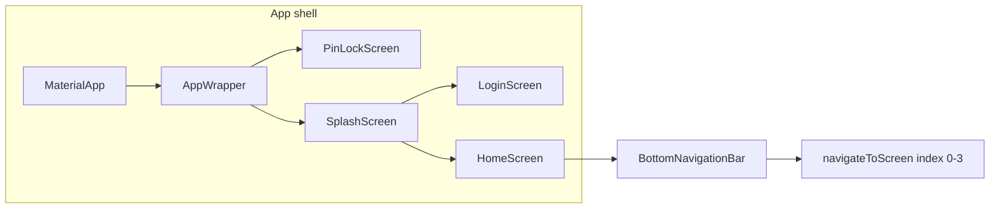

# Feature design doc — App shell & routing

> **Scope note:** This doc covers the **app chrome**: `MaterialApp`, global `navigatorKey`, privacy gate → splash → auth routing, **bottom navigation** (four main tabs), and the **imperative navigation** pattern (`Navigator` + `MaterialPageRoute`). It also references **responsive layout** helpers under `lib/ui/responsive/` (catalog feature **Responsive UI**).  
> **Canonical names** (for `changes` / `change_reviews.team_key`): use **Bottom Navigation** for bar + tab switching; **App Startup** for splash/init routing; **Responsive UI** when only breakpoints/layout tokens change.

---

## 0. Document control

| Field | Value |
|-------|--------|
| **Feature name (canonical)** | **Bottom Navigation** (primary for tab bar & `navigateToScreen`); **App Startup** (splash → login/home); **Responsive UI** (layout shell — see §3.2) |
| **Short slug** | `app-shell-routing` |
| **Doc version** | `0.1` |
| **Last updated** | `2026-04-03` |
| **Owner / maintainer** | `[TBD — assign]` |
| **Reviewers (default)** | Anyone touching `main.dart`, `splash_screen.dart`, `bottom_navigation_bar.dart`, or root navigation |
| **Status of this doc** | `Draft` |

---

## 1. Summary

### 1.1 One-line purpose

Provide a single **Flutter app shell** (`MaterialApp` + theme + global navigator) and **route the user** from cold start through privacy lock (optional), splash/init, authentication, into the **four-tab main shell** (Home, History, Analytics, Profile), using **stack navigation** without a declarative router (no `go_router`).

### 1.2 Elevator pitch

The diary app does not use a route table: **root** is `AppWrapper` → `PinLockScreen` or `SplashScreen`. Splash decides **Login** vs **Home** from Supabase session, then users move between main areas via **`AppBottomNavigationBar`**, which replaces the stack with **`Navigator.pushAndRemoveUntil`** to the selected tab’s root screen. **`navigatorKey`** in `main.dart` exists for services that must navigate without a `BuildContext` (e.g. notifications). **Responsive** wrappers (`ResponsiveInfo`, `ResponsiveBody`, grids) adapt layout per breakpoint on those screens.

### 1.3 In scope / out of scope

| In scope | Out of scope |
|----------|----------------|
| `lib/main.dart` — `MyApp`, `AppWrapper`, `navigatorKey`, `MaterialApp` home chain | Business logic inside Home/History/Analytics/Profile feature content |
| `lib/screens/splash_screen.dart` — initial auth + prefetch + navigate | Supabase Auth implementation details (see **Authentication**) |
| `lib/widgets/bottom_navigation_bar.dart` — 4 tabs + `navigateToScreen` | `go_router` / auto_route / deep links (not used today) |
| `lib/ui/responsive/*` — breakpoints, tokens, responsive body/grid | Pixel-perfect design specs (Figma) |
| `lib/screens/pin_lock_screen.dart` as **gate** before splash when enabled | PIN crypto / storage internals (see **PIN Lock** / **Privacy Lock**) |

---

## 2. Product & UX

### 2.1 User-facing surfaces

- **Screens / routes / tabs:** Home (0), History (1), Analytics (2), Profile (3); Login screen; Splash; PIN lock when privacy lock on.
- **Entry points:** App icon → (PIN if enabled) → Splash → Login or Home → bottom tabs.
- **Primary user journeys:**
  1. Cold start → splash animation → logged in → **Home** tab.
  2. Tap bottom tab → **stack cleared** → that tab’s root screen (no nested tab state preserved across tabs by default).
  3. From Home, **FAB / actions** may `Navigator.push` to **New diary** and other sub-screens (owned by other features).

### 2.2 UX principles & constraints

- **Theme:** Light/dark from `themeProvider` (Riverpod); `AppTheme` in `theme/app_theme.dart`.
- **Bottom nav:** Fixed type; 4 items; labels + outlined/filled icons.
- **Tab switch:** Full stack reset — **back stack does not persist** when switching tabs (by design in `navigateToScreen`).
- **Accessibility:** Standard `BottomNavigationBar` semantics; ensure contrast via theme.

### 2.3 Related product docs

- `FEATURES CONTROL/feature-list.md` — **Bottom Navigation**, **App Startup**, **Responsive UI**
- `bc/CHANGE-SYSTEM/feature-list.md` (if maintained separately)

---

## 3. Technical architecture

### 3.1 Stack & layers

| Layer | Details |
|-------|---------|
| **Client (Flutter)** | `main.dart`, `screens/splash_screen.dart`, `widgets/bottom_navigation_bar.dart`, main tab screens, `ui/responsive/` |
| **State** | Riverpod (`ProviderScope`, `Consumer` / `ConsumerWidget`); `themeProvider`, `privacyLockProvider`, etc. |
| **Backend** | N/A for shell routing (Supabase used inside splash/auth flows, not “routing” itself) |
| **Persistence** | N/A at routing layer; splash uses services that may touch local DB |

### 3.2 Key modules & file paths

```
lib/
  main.dart                    # ProviderScope, MyApp, MaterialApp, navigatorKey, AppWrapper
  theme/app_theme.dart
  screens/
    splash_screen.dart
    pin_lock_screen.dart
    login_screen.dart
    home_screen.dart
    history_screen.dart
    analytics_screen.dart
    profile_screen.dart
  widgets/
    bottom_navigation_bar.dart
  ui/responsive/
    breakpoints.dart
    responsive_info.dart
    responsive_body.dart
    responsive_grid.dart
    responsive_tokens.dart
```

### 3.3 Data model (feature-specific)

| Entity / table | Role |
|----------------|------|
| N/A at shell layer | Routing does not own Supabase tables |

### 3.4 External dependencies

- **Packages:** `flutter_riverpod`, `supabase_flutter` (splash/auth), `flutter_dotenv`, plus app services initialized from `main.dart` / splash
- **Services:** See splash (`ConnectivityService`, prefetch, sync flags, etc.) — cross-feature
- **Env / secrets:** `SUPABASE_URL`, `SUPABASE_ANON_KEY` (loaded in `main()`)

### 3.5 Platform notes

- **Android / iOS:** Same navigation code; `MaterialApp` + `Navigator`.
- **Web / desktop:** Not primary targets; responsive helpers still apply if built.

### 3.6 Functions & methods (code map)

#### 3.6.1 Entry points & orchestration

| Symbol (function / method / class) | File path | Role |
|-----------------------------------|-------------|------|
| `main()` | `lib/main.dart` | `WidgetsFlutterBinding`, `dotenv.load`, `Supabase.initialize`, alarm/notifications init, `runApp(ProviderScope(MyApp))` |
| `MyApp` / `_MyAppState.build` | `lib/main.dart` | `MaterialApp` — `theme`, `darkTheme`, `themeMode`, `navigatorKey`, `home: AppWrapper()` |
| `AppWrapper` | `lib/main.dart` | Branches to `PinLockScreen` vs `SplashScreen` from `privacyLockProvider` |
| `SplashScreen` / `_initializeApp` | `lib/screens/splash_screen.dart` | Auth check, connectivity, prefetch, `_navigateToAuth` / home via `Navigator.pushReplacement` |
| `AppBottomNavigationBar.navigateToScreen` | `lib/widgets/bottom_navigation_bar.dart` | Maps index 0–3 → screen widget, `Navigator.pushAndRemoveUntil(..., (r) => false)` |

#### 3.6.2 Services & repositories

| Symbol | File path | Notes |
|--------|-----------|--------|
| N/A dedicated “routing service” | — | Navigation is direct `Navigator` calls |

#### 3.6.3 Widgets / UI building blocks

| Widget / builder | File path | When used |
|------------------|-----------|-----------|
| `AppBottomNavigationBar` | `lib/widgets/bottom_navigation_bar.dart` | Bottom bar on Home, History, Analytics, Profile |
| `ResponsiveInfo.of` | `lib/ui/responsive/responsive_info.dart` | Breakpoint from `MediaQuery` / constraints |
| `ResponsiveBody`, `ResponsiveGrid` | `lib/ui/responsive/` | Layout on several screens (e.g. Home) |

#### 3.6.4 Backend / Edge

| Function / route / RPC | Location | Purpose |
|-------------------------|----------|---------|
| N/A | — | — |

### 3.7 Variables, constants & configuration keys

#### 3.7.1 Constants & enums

| Name | Type / file | Value / meaning |
|------|-------------|-----------------|
| Tab indices `0–3` | `bottom_navigation_bar.dart` | 0 Home, 1 History, 2 Analytics, 3 Profile |

#### 3.7.2 Keys (storage, prefs, routing, analytics)

| Key / route name | Where defined | Purpose |
|------------------|---------------|---------|
| `navigatorKey` | `lib/main.dart` | Global `NavigatorState` for navigation without context |
| *(No named route registry)* | — | Routes are ad hoc `MaterialPageRoute` classes |

#### 3.7.3 Environment & remote config

| Name | Notes |
|------|--------|
| `SUPABASE_URL`, `SUPABASE_ANON_KEY` | Required before splash auth check |

### 3.8 Core logic & behaviour

#### 3.8.1 Main flow (happy path)

1. `main()` initializes env, Supabase, optional Android alarm + local notifications plugin, `PremiumService.configure`, then `runApp`.
2. `MaterialApp` builds `AppWrapper`.
3. If privacy lock enabled and locked → **PIN screen**; else **Splash**.
4. Splash: animations + `_initializeApp` → no user → **Login** (`pushReplacement`); user → prefetch path → **Home** (`pushReplacement`).
5. User taps bottom nav → `navigateToScreen` → **new route as only route** (stack cleared).

#### 3.8.2 State machine / status rules (simplified)

| State | Entered when | Valid next | Side effects |
|-------|----------------|------------|--------------|
| PIN visible | Privacy on + locked | Unlocked → Splash | — |
| Splash | After PIN or privacy off | Login or Home | Prefetch / sync triggers |
| Main tabs | After login from Home entry | Tab switches replace stack | Each tab is a full-screen route |

#### 3.8.3 Business rules & invariants

- **Tab index** must stay **0–3** for known roots; default falls back to `HomeScreen` on unknown index.
- **`pushAndRemoveUntil(..., (route) => false)`** — **only one root route** after tab change; inner pushes from a tab are dropped when switching tabs.
- **Invariants:** `navigatorKey.currentState` must remain valid for global navigation helpers.

#### 3.8.4 Edge cases & failure modes

| Scenario | Behaviour |
|----------|-----------|
| Logout from Profile | `pushAndRemoveUntil` → `LoginScreen` (see `profile_screen.dart`) |
| Deep link / notification tap | Must use `navigatorKey` or context from active route — **verify** when adding |

#### 3.8.5 Pseudocode (tab switch)

```
navigateToScreen(context, index):
  screen = map(index) // Home | History | Analytics | Profile
  Navigator.pushAndRemoveUntil(context, MaterialPageRoute(screen), (_) => false)
```

### 3.9 State management (providers / notifiers)

| Provider / symbol | File | What it holds |
|-------------------|------|----------------|
| `themeProvider` | `lib/providers/theme_provider.dart` | Light/dark/system for `MaterialApp` |
| `privacyLockProvider` | `lib/providers/privacy_lock_provider.dart` | Drives `AppWrapper` PIN vs splash |
| `ProviderScope.containerOf` | used in `MyApp` | Passed into `AppLifecycleService` |

---

## 4. Boundaries & coupling

### 4.1 Upstream dependencies

- **Authentication** — session drives splash → login vs home.
- **Privacy lock / PIN** — gates before splash.
- **Theme** — global look for entire shell.

### 4.2 Downstream dependents

- **All tab features** (Home, History, Analytics, Profile) assume they can be reached as **root** of a fresh stack.
- **Services** using `navigatorKey` for overlays / navigation from background.

### 4.3 Shared code hotspots

- `main.dart` — touched for any global navigator, theme, or init order change.
- `bottom_navigation_bar.dart` — any new main tab requires index mapping + all tab screens updated.

---

## 5. Change control alignment

### 5.1 Default `primary_feature` usage

- **Bottom Navigation** — tab bar, `navigateToScreen`, new tab root screens wiring.
- **App Startup** — splash flow, cold start init order in `main()` / splash.
- **Responsive UI** — breakpoint changes, `ResponsiveInfo`, grid/body tokens only.

### 5.2 Typical approver (`change_reviews.team_key`)

Match the area you touch: **Bottom Navigation** / **App Startup** / **Responsive UI** as separate approver rows if the change is scoped that way.

### 5.3 CTASK expectations

- New tab or **GoRouter migration** → likely multiple CTASKs (shell + each tab + QA).
- **navigatorKey** behaviour change → CTASK for **regression** on notification / logout flows.

### 5.4 Risk class (default)

**Medium** — affects every user path; **High** if changing init order (crash on startup) or auth gating.

---

## 6. Operations & quality

### 6.1 Feature flags

None specific to shell (use app-wide flags if introduced).

### 6.2 Observability

- **Logging:** Feature-specific services; no unified “route trace” today.
- **Analytics:** Not documented here — add if route analytics added.

### 6.3 Performance & limits

Splash animations + prefetch can delay TTI; keep `_initializeApp` stages reviewable.

### 6.4 Security & privacy

PIN gate prevents content exposure before unlock; routing does not store secrets.

---

## 7. Testing strategy

### 7.1 Critical test cases (manual)

1. Cold start → splash → Home (logged in).
2. Cold start → splash → Login (logged out).
3. Privacy on → PIN → splash → Home.
4. Each tab switch → correct screen; back from sub-screen then tab switch clears as expected.
5. Logout → login screen, stack clean.

### 7.2 Automated tests

| Type | Location / pattern |
|------|---------------------|
| Unit | `[TBD]` |
| Widget / integration | `[TBD]` — golden tests for bottom nav if added |

### 7.3 Test data / fixtures

Authenticated vs unauthenticated session for splash tests.

### 7.4 Regression triggers

Touching **`navigateToScreen`** or **tab order** → re-run full tab + logout matrix.

---

## 8. Releases & migration

### 8.1 Version / release notes

Call out **navigation** or **new tab** in user-visible changelog if behaviour changes.

### 8.2 Data migrations

None for routing layer.

### 8.3 Rollback considerations

Revert `main.dart` / `bottom_navigation_bar.dart` together if a release breaks startup.

---

## 9. Documentation & support

### 9.1 User-facing help

N/A unless onboarding copy references “Home / History / Analytics / Profile”.

### 9.2 Runbooks

“If app won’t start” — check `main()` init order, Supabase env, splash errors.

### 9.3 FAQ / known issues

| Issue | Workaround / status |
|-------|----------------------|
| Tab switch loses inner stack | By design (`pushAndRemoveUntil`); document if UX changes |

---

## 10. Glossary & naming

| Term | Definition |
|------|------------|
| **Shell** | `MaterialApp` + root `Navigator` + tab chrome |
| **Tab root** | Home/History/Analytics/Profile as pushed by `navigateToScreen` |

**Naming:** File title “App shell & routing” is **documentation**; change system uses **Bottom Navigation**, **App Startup**, **Responsive UI** from the feature list.

---

## 11. Open questions & decisions log

### 11.1 Open questions

1. Adopt **go_router** or **named routes** for deep links and testability?
2. Should tab switches **preserve** inner stacks (would require different nav architecture)?

### 11.2 Decisions

| Date | Decision | Rationale |
|------|----------|-----------|
| `2026-04-03` | Doc initial version | Baseline from `feature-doc-template.md` + code audit |

---

## 12. Appendix

### 12.1 References

- `lib/main.dart`, `lib/widgets/bottom_navigation_bar.dart`, `lib/screens/splash_screen.dart`
- `bc/CHANGE-SYSTEM/feature-doc-template.md`

### 12.2 Diagrams (optional)



### 12.3 Changelog of *this* doc

| Version | Date | Author | Notes |
|---------|------|--------|-------|
| `0.1` | `2026-04-03` | Cursor / template | Initial fill from codebase |
