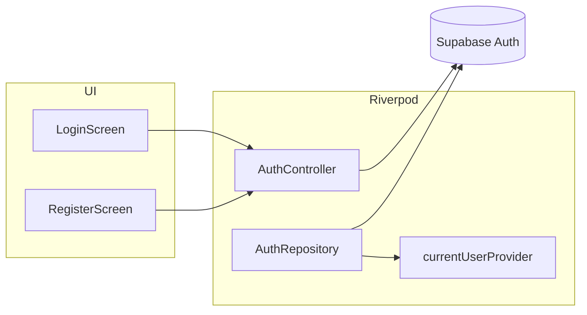

# Feature design doc — Authentication

> **Scope:** **Supabase Auth** (email / password): **sign-up**, **sign-in**, **sign-out**, **password reset** and **resend verification** helpers, **Riverpod** **`AuthRepository`** + **`currentUserProvider`** + **`AuthController`**, screens **`LoginScreen`** / **`RegisterScreen`**, and **`AuthWrapper`** (session → Home vs Login). **OAuth / social login** is not implemented in the referenced code paths.

---

## 0. Document control

| Field | Value |
|-------|--------|
| **Feature name (canonical)** | **Authentication** |
| **Short slug** | `authentication` |
| **Doc version** | `0.1` |
| **Last updated** | `2026-04-03` |
| **Owner / maintainer** | `[TBD]` |
| **Reviewers (default)** | Anyone changing `AuthController`, Supabase auth config, or login/register UX |
| **Status of this doc** | `Draft` |

---

## 1. Summary

### 1.1 One-line purpose

Authenticate users with **Supabase** using **email and password**, expose session to the UI via **Riverpod**, and hook **RevenueCat** and **timezone** init on sign-up / sign-in where applicable.

### 1.2 Elevator pitch

**`AuthRepository`** wraps **`Supabase.auth`**: it emits an initial **`AuthState`** from the current session, forwards **`onAuthStateChange`**, and on **`signOut`** calls **`_supabase.auth.signOut()`** then **manually** emits **`signedOut`** (workaround for stream timing). **`currentUserProvider`** is a **`StreamProvider<User?>`** derived from that stream. **`AuthController`** implements **`signUp`** (direct **`auth.signUp`** + background **`TimezoneService.initializeUserTimezone`**), **`signIn`** (**`signInWithPassword`** + **`PremiumService.logIn(userId)`**), **`signOut`** (**`PremiumService.logOut`**, **`authRepository.signOut`**, **`invalidate(premiumProvider)`**). **`LoginScreen`** uses **`authControllerProvider`** for sign-in, clears **`DataSyncFlagService`** on success, and maps exceptions to **ERRAUTH\*** snackbars. **`RegisterScreen`** uses **`authController.signUp`** with **`display_name`** / **`gender`** in **`user_metadata`**. **`AuthWrapper`** shows **`HomeScreen`** if **`currentUserProvider`** has a user, else **`LoginScreen`**; loading shows **`AuthLoadingScreen`**.

**`AuthService`** (static) mirrors sign-in / sign-up / sign-out / reset / resend with **`ErrorLoggingService`** (**ERRSYS124–127**); **`signIn`** additionally throws if **`emailConfirmedAt`** is null. It is **not** the primary path for login UI (screens use **`AuthController`**); keep in sync or consolidate to avoid drift.

### 1.3 In scope / out of scope

| In scope | Out of scope |
|----------|----------------|
| `auth_service.dart`, `auth_provider.dart`, `login_screen.dart`, `register_screen.dart`, `auth_wrapper.dart` | **App shell & routing** — splash → first screen (see **App shell** doc) |
| Email/password flows | **PIN / privacy lock** — separate feature |
| | **Profile logout** pipeline — **Profile & settings** |

---

## 2. Product & UX

### 2.1 User-facing surfaces

- **Login** — email, password, forgot password (**`resetPasswordForEmail`** inline), link to **Register**.
- **Register** — name, email, password, confirm, gender; success dialog → verify email.
- **AuthWrapper** — loading spinner + “Loading…” while **`currentUserProvider`** resolves.

### 2.2 UX principles & constraints

- Login errors map to **ERRAUTH001–010** (and registration **ERRAUTH011+**) with **SnackbarUtils** helpers.
- **Email verification** expected for full access; **`AuthService.signIn`** enforces **`emailConfirmedAt`** — **`AuthController.signIn`** does **not** duplicate that check (rely on Supabase / server messages).

### 2.3 Related product docs

- `bc/CHANGE-SYSTEM/feature-list.md` — **Authentication**
- **Premium & paywall** — **`logIn` / `logOut`**
- **Timezone** — **`initializeUserTimezone`** on sign-up
- **User data & preferences** — profile load after session

---

## 3. Technical architecture

### 3.1 Stack & layers

| Layer | Details |
|-------|---------|
| **Auth** | `supabase_flutter` — `signInWithPassword`, `signUp`, `signOut`, `resetPasswordForEmail`, `resend` OTP |
| **State** | Riverpod — `authRepositoryProvider`, `currentUserProvider`, `authControllerProvider` |

### 3.2 Key modules & file paths

```
lib/services/auth_service.dart
lib/providers/auth_provider.dart
lib/screens/login_screen.dart
lib/screens/register_screen.dart
lib/screens/auth_wrapper.dart
```

### 3.3 Data model (feature-specific)

| Concept | Role |
|---------|------|
| **`User`** | Supabase auth user (`id`, `email`, metadata) |
| **Sign-up metadata** | `display_name`, `gender` in **`data`** map |
| **Session** | `AuthState` in repository stream |

### 3.4 External dependencies

- **Supabase project** — Auth settings (confirm email, password rules)
- **Env** — `SUPABASE_URL`, `SUPABASE_ANON_KEY` in **`main.dart`**

### 3.5 Platform notes

- Same flow on Android / iOS; deep links for **password reset** depend on Supabase redirect URL config.

### 3.6 Functions & methods (code map)

#### 3.6.1 AuthRepository

| Symbol | Role |
|--------|------|
| Constructor | Initial **`AuthState`** from **`currentSession`**; subscribe **`onAuthStateChange`** |
| `authStateChanges` | Broadcast stream |
| `signOut` | **`auth.signOut()`** + manual **`signedOut`** emit |

#### 3.6.2 AuthController

| Symbol | Role |
|--------|------|
| `signUp` | **`auth.signUp`** + timezone background init; **ERRSYS130** on failure |
| `signIn` | **`signInWithPassword`** + **`PremiumService.logIn`**; **ERRSYS131** |
| `signOut` | **`PremiumService.logOut`**, **`authRepository.signOut`**, **`invalidate(premiumProvider)`**; **ERRSYS132** |

#### 3.6.3 AuthService (static)

| Symbol | Role |
|--------|------|
| `signIn` | **`signInWithPassword`** + unverified email **Exception**; **ERRSYS124** |
| `signUp` | **`signUp`** + timezone; **ERRSYS125** |
| `signOut` | **`PremiumService.logOut`** + **`auth.signOut`**; **ERRSYS126** |
| `resetPassword` / `resendVerification` | **ERRSYS127** (both use same code in catch) |

#### 3.6.4 Screens

| Symbol | Role |
|--------|------|
| `LoginScreen._login` | **`authController.signIn`**, **`DataSyncFlagService.clearLastFetchDate`**, ERRAUTH mapping |
| `RegisterScreen._register` | **`authController.signUp`**, verification dialog |
| `AuthWrapper.build` | **`currentUserProvider`** → Home / Login / loading |

### 3.7 Variables, constants & configuration keys

| Code | Typical context |
|------|-----------------|
| ERRSYS124–127 | **`AuthService`** operations |
| ERRSYS130–132 | **`AuthController`** operations |
| ERRSYS162 | Timezone init failure (sign-up) |
| ERRSYS183 | Login **`clearLastFetchDate`** failure |
| ERRAUTH001–010 | Login UI mapping |
| ERRAUTH011+ | Registration UI mapping |

### 3.8 Core logic & behaviour

#### 3.8.1 Sign-in (UI path)

1. Validate form → **`AuthController.signIn`**.
2. On success: clear **last fetch date** (prefetch behaviour), snackbar success; **navigation** follows **`currentUserProvider`** (e.g. via parent **`AuthWrapper`** or splash stack — app-dependent).

#### 3.8.2 Sign-up

1. **`auth.signUp`** with metadata.
2. Background **`initializeUserTimezone`** (non-blocking).
3. Dialog: user must verify email (Supabase email template).

#### 3.8.3 Sign-out (from Profile)

- Prefer **Profile** doc: uses **`authControllerProvider.signOut`** after local cleanup — not duplicated here.

### 3.9 State management

| Provider | Role |
|----------|------|
| `authRepositoryProvider` | Singleton **`AuthRepository`** |
| `currentUserProvider` | **`StreamProvider<User?>`** — session user |
| `authControllerProvider` | **`AuthController`** — imperative auth |

---

## 4. Boundaries & coupling

### 4.1 Upstream

- **Supabase** Auth service availability and RLS (for **`users`** etc. after sign-up).

### 4.2 Downstream

- **Premium** — **`logIn`** / **`logOut`**
- **Timezone** — init on sign-up
- **Entire app** — **`currentUserProvider`** gates content

### 4.3 Shared hotspots

- **`AuthService`** vs **`AuthController`** duplication — changing rules (e.g. email verification) should be applied in **one** place or documented.

---

## 5. Change control alignment

### 5.1 Default `primary_feature`

**Authentication** for auth API, screens, or **`AuthRepository`** stream behaviour.

### 5.2 Risk class

**High** — affects access to the whole app and data isolation.

---

## 6. Operations & quality

### 6.1 Observability

- **`ErrorLoggingService`** on failures; login/register map **ERRAUTH\*** for user-facing copy.

### 6.2 Security & privacy

- Passwords never logged; store **session** per Supabase defaults.
- Rate limiting is **server-side**; client maps **429** / rate strings to **ERRAUTH017** etc. on register.

---

## 7. Testing strategy

### 7.1 Manual

1. Register → receive email → verify → sign in.
2. Sign in unverified user — expect error path consistent with Supabase settings.
3. Sign out → **`currentUser`** null → Login.
4. Forgot password → email received (Supabase project configured).

---

## 8. Releases & migration

- Supabase **Auth** provider settings (e.g. require email confirmation) affect UX without app code.

---

## 9. Documentation & support

| Issue | Note |
|-------|------|
| Stuck on loading | **`currentUserProvider`** / **`AuthRepository`** stream |
| Premium wrong after login | Ensure **`PremiumService.logIn`** ran (**`AuthController.signIn`**) |

---

## 10. Glossary

| Term | Definition |
|------|------------|
| **`AuthState`** | Supabase event + session snapshot |

---

## 11. Open questions & decisions

### 11.1 Open questions

1. Consolidate **`AuthService`** into **`AuthController`** or delete unused static API.
2. Add **`emailConfirmedAt`** check to **`AuthController.signIn`** to match **`AuthService`**.

### 11.2 Decisions

| Date | Decision | Rationale |
|------|----------|-----------|
| `2026-04-03` | Document **`AuthRepository`** manual **signedOut** emit | Matches `auth_provider.dart` |

---

## 12. Appendix

### 12.1 References

- `lib/services/auth_service.dart`
- `lib/providers/auth_provider.dart`
- `lib/screens/login_screen.dart`
- `lib/screens/register_screen.dart`
- `lib/screens/auth_wrapper.dart`
- `bc/CHANGE-SYSTEM/feature-doc-template.md`

### 12.2 Diagram



### 12.3 Changelog of *this* doc

| Version | Date | Notes |
|---------|------|-------|
| `0.1` | `2026-04-03` | Initial |
