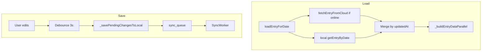

# Feature design doc — Diary entries (core)

> **Scope:** **One row per user per calendar day** (`entry_date`), **local-first SQLite** with **sync queue**, **server merge** on load, **debounced batch saves** from the editor, and **related satellite tables** (affirmations, priorities, meals, gratitude, self-care, shower/bath, tomorrow notes).  
> **Canonical name** (feature list): **Diary entries (core)** — distinct from **Home & calendar**, **History & recent**, **AI / insights**, and **Sync, DB & connectivity** (this doc references them).

---

## 0. Document control

| Field | Value |
|-------|--------|
| **Feature name (canonical)** | **Diary entries (core)** |
| **Short slug** | `diary-entries-core` |
| **Doc version** | `0.1` |
| **Last updated** | `2026-04-03` |
| **Owner / maintainer** | `[TBD]` |
| **Reviewers (default)** | Anyone changing `Entry`, `EntryService`, `EntryNotifier`, `LocalEntryService` upsert paths, or merge logic in `loadEntryForDate` |
| **Status of this doc** | `Draft` |

---

## 1. Summary

### 1.1 One-line purpose

Create, read, update, and persist **daily diary entries** and **structured sections** per entry, using **local date** as the key, **offline-capable** storage, and **background sync** to Supabase.

### 1.2 Elevator pitch

The user writes on **`NewDiaryScreen`** for a selected **local calendar day**. State lives in **`entryProvider`** (`EntryState`). Edits are **optimistic** and **debounced (3s)** into a **single batch** that writes to **`LocalEntryService`**, enqueues **`sync_queue`** rows, invalidates list/summary providers, runs **grace** and **streak** side effects, then **`SyncWorker.processSyncQueue()`**. On load, **`EntryService.loadEntryForDate`** fetches **cloud first when online**, merges with **local** using **`updated_at`** (ties → server), and builds **`EntryData`** by joining all related tables.

### 1.3 In scope / out of scope

| In scope | Out of scope |
|----------|----------------|
| `Entry` + related models in `entry_models.dart` | **AI analysis** rows (`entry_insights`, server jobs) — see AI / Supabase AI features |
| `EntryService`, `LocalEntryService` CRUD + queue | **Full sync protocol** (`SupabaseSyncService`, `SyncWorker` internals) — see Sync feature |
| `EntryNotifier`, debounced batch save, `forceImmediateSave` | **Home calendar UI**, **History** presentation — consume entries |
| `entries` + `entry_*` SQLite tables | **Attachments** table (FK to entries) unless you touch entry CRUD |
| 60-day local retention (`cleanupOldEntries`) | **Export** pipelines |

---

## 2. Product & UX

### 2.1 User-facing surfaces

- **Primary screen:** `new_diary_screen.dart` — loads `entryProvider` for the selected date; calls `update*`, `loadEntry`, `forceImmediateSave` where needed.
- **Entry points:** Bottom nav **Write** / home navigation to diary for **today** or chosen date.
- **Journeys:** Open day → load merged data → edit fields → auto-save after debounce → background sync; app background → **`forceImmediateSave`** via lifecycle.

### 2.2 UX principles & constraints

- **Date semantics:** `entry_date` is **date-only** (local `DateTime` with year/month/day). No timezone shift on the stored date string (see `Entry.toSupabaseJson` comment).
- **Default mood:** New entries get **`moodScore: 3`** when created in `_getOrCreateEntry`.
- **Offline:** Reads/writes work against SQLite; sync when online.
- **Performance:** Batch debounce reduces write churn; 3s delay documented in code.

### 2.3 Related product docs

- `bc/CHANGE-SYSTEM/feature-list.md` — **Diary entries (core)**
- `bc/Project3/tables_queries.md` — Postgres **`entries`** and **`entry_*`** definitions (source of truth for remote schema)

---

## 3. Technical architecture

### 3.1 Stack & layers

| Layer | Details |
|-------|---------|
| **Client** | Flutter, Riverpod |
| **Domain** | `Entry`, `EntryData`, section models (`EntryAffirmations`, …) |
| **Persistence** | SQLite via `DatabaseManager` / `LocalEntryService` |
| **Remote** | Supabase `entries` + child tables; fetch via `SupabaseSyncService.fetchEntryFromCloud` |
| **Sync** | `sync_queue` + `SyncWorker` |

### 3.2 Key modules & file paths

```
lib/
  models/entry_models.dart           # Entry, EntryData building blocks, JSON adapters
  services/entry_service.dart        # loadEntryForDate, save*, getOrCreateEntry, cache
  services/database/local_entry_service.dart   # SQLite + sync_queue enqueue
  providers/entry_provider.dart      # EntryNotifier, entryProvider, batch save
  screens/new_diary_screen.dart      # Main editor UI
  providers/data_providers.dart      # entriesProvider (FutureProvider.family)
  services/data_fetch_service.dart   # fetchEntries for lists (used by entriesProvider)
```

### 3.3 Data model (feature-specific)

#### 3.3.1 Core entity — `Entry`

| Field | Role |
|-------|------|
| `id` | UUID (client-generated on create) |
| `userId` | Owner |
| `entryDate` | Local calendar day |
| `diaryText` | Free text |
| `moodScore` | 1–5 |
| `tags` | List (JSON in SQLite; array in Postgres) |
| `createdAt` / `updatedAt` | Merge + sync |
| `isSynced` / `lastSyncAt` | Local flags |

#### 3.3.2 Related tables (one row per `entry_id` unless noted)

| Local table | Model | Notes |
|-------------|-------|--------|
| `entry_affirmations` | `EntryAffirmations` | JSON list in SQLite `TEXT` |
| `entry_priorities` | `EntryPriorities` | |
| `entry_meals` | `EntryMeals` | water_cups 0–8 in Postgres CHECK |
| `entry_gratitude` | `EntryGratitude` | `grateful_items` JSONB remote |
| `entry_self_care` | `EntrySelfCare` | Booleans (SQLite 0/1) |
| `entry_shower_bath` | `EntryShowerBath` | |
| `entry_tomorrow_notes` | `EntryTomorrowNotes` | |

**Postgres** (`tables_queries.md`): `entries` includes **`source`**, **`is_backdated`** — not present on the Dart **`Entry`** model today; sync layer may map or ignore. Confirm when changing migrations.

#### 3.3.3 Local SQLite schema (snapshot)

`entries`: `id`, `user_id`, `entry_date`, `diary_text`, `mood_score`, `tags` (TEXT), timestamps, `is_synced`, `last_sync_at` — see `database_manager.dart`.

### 3.4 External dependencies

- **Packages:** `uuid`, `sqflite`, `intl`, Riverpod, Supabase client (via sync)
- **Env:** Standard Supabase (no entry-specific secrets)

### 3.5 Platform notes

- **Date:** Always normalize with `DateTime(y, m, d)` before storing/querying.

### 3.6 Functions & methods (code map)

#### 3.6.1 Entry points & orchestration

| Symbol | File | Role |
|--------|------|------|
| `EntryNotifier.loadEntry` | `entry_provider.dart` | Loads `EntryService.loadEntryForDate` → fills `EntryState` |
| `EntryNotifier.updateDiaryText` / `updateAffirmations` / … | same | Optimistic state + pending batch |
| `EntryNotifier._executeBatchSave` | same | Persist + invalidate + grace + streak + `SyncWorker` |
| `EntryNotifier.forceImmediateSave` | same | Flush debounce (lifecycle) |
| `EntryService.loadEntryForDate` | `entry_service.dart` | Cloud fetch → local merge → `EntryData` |
| `EntryService._getOrCreateEntry` / `getOrCreateEntry` | same | UUID entry, cache `userId+date` |
| `EntryService.clearEntryCache` | same | Invalidate cache on date/user change |

#### 3.6.2 Services & repositories

| Symbol | File | Notes |
|--------|------|--------|
| `LocalEntryService.getEntryByDate` / `upsertEntry` | `local_entry_service.dart` | Inserts + `_addToSyncQueue` |
| `LocalEntryService.getAffirmations` … `getTomorrowNotes` | same | Loaded in parallel in `EntryService._buildEntryDataParallel` |
| `LocalEntryService.getFullEntryForSync` | same | Full payload for sync worker |
| `SupabaseSyncService.fetchEntryFromCloud` | `supabase_sync_service.dart` | Used when online in `loadEntryForDate` |

#### 3.6.3 Widgets / screens

| Location | Role |
|----------|------|
| `new_diary_screen.dart` | Binds UI to `entryProvider` |

#### 3.6.4 Backend / Edge

| Location | Purpose |
|----------|---------|
| Postgres `entries`, `entry_*` | Remote storage; RLS per product policy |

### 3.7 Variables, constants & configuration keys

#### 3.7.1 Constants & timers

| Name | Meaning |
|------|---------|
| Batch debounce | `3000` ms in `_scheduleBatchSave` |

#### 3.7.2 SQLite tables / queue

| Name | Purpose |
|------|---------|
| `entries`, `entry_affirmations`, … | See §3.3 |
| `sync_queue` | Enqueued on each upsert via `LocalEntryService` |

#### 3.7.3 Error codes (sample)

| Code | Context |
|------|---------|
| ERRSYS186 | Cloud fetch failed during load (continues local) |
| ERRSYS187 | `loadEntryForDate` failure |
| ERRDB010–ERRDB017 | Local upsert failures (per entity) |
| ERRDATA260 | Batch save exception |
| ERRDATA270–ERRDATA277 | Per-entity failures inside `_savePendingChangesToLocal` |
| ERRDATA016 | Load failure in provider (user message) |
| ERRDATA204 | `entriesProvider` fetch failure |

### 3.8 Core logic & behaviour

#### 3.8.1 Load path (happy path)

1. If **online**, try **`fetchEntryFromCloud`** for `userId` + **date-only**.
2. Read **local** row by date.
3. **Merge:** If cloud exists: newer `updatedAt` wins; if equal, **server row** is written locally and used; if local newer, keep local (will sync).
4. If **no cloud**, use local or **null** (empty state).
5. Build **`EntryData`** with **parallel** fetches of all `entry_*` tables.

#### 3.8.2 Save path (happy path)

1. User edits → **`EntryState`** updated optimistically; pending fields stored.
2. **`syncStatusProvider.setSyncing()`**.
3. After **3s** quiet period, **`_executeBatchSave`** runs (or immediately via **`forceImmediateSave`**).
4. Resolve or **create** `Entry` for the date.
5. **`_savePendingChangesToLocal`**: `upsertEntry` + conditional upserts for each pending section.
6. **`entriesProvider`**, **`homeSummaryProvider`**, **`recentEntriesProvider`** invalidated.
7. **`_batchTrackGraceTasks`** (diary text, affirmations, gratitude, meals as self-care signal, etc.).
8. **`_checkGapsAndRecalculateStreak`**.
9. **`SyncWorker().processSyncQueue()`**.
10. **`setSaved`** on sync status; clear pending.

#### 3.8.3 Business rules & invariants

- **One entry per user per `entry_date`** enforced by app logic (lookup by date before create).
- **`updatedAt`** drives merge ordering with server.
- **`isSynced: false`** on local writes flags need to push via queue.

#### 3.8.4 Edge cases & failure modes

| Scenario | Behaviour |
|----------|-----------|
| Offline load | Local-only merge; no cloud |
| Cloud fetch throws | Log ERRSYS186; continue with local |
| Partial batch save failure | Per-entity ERRDATA27x; may continue other sections |
| App background | `forceImmediateSave` tries to flush debounced work |

#### 3.8.5 Entry cache (`EntryService`)

In-memory **`_entryCache`** keyed by `userId` + `yyyy-MM-dd` to avoid repeated creates; **`clearEntryCache`** on date navigation or logout flows (callers must use).

### 3.9 State management

| Provider | File | Holds |
|----------|------|--------|
| `entryProvider` | `entry_provider.dart` | `EntryState` — full day + loading/error |
| `entriesProvider` | `data_providers.dart` | `FutureProvider.family` — `List<Entry>` for date range queries |

---

## 4. Boundaries & coupling

### 4.1 Upstream

- **Authentication** — `userId` from Supabase session.
- **Connectivity** — `ConnectivityService` for cloud-first load.

### 4.2 Downstream

- **Streaks & grace** — `EntryNotifier` calls grace + streak after batch save.
- **Home summary / recent entries** — invalidated after save.
- **Sync** — all upserts enqueue work for `SyncWorker`.
- **App lifecycle** — `forceImmediateSave` on pause/detach.

### 4.3 Shared hotspots

- **`LocalEntryService.upsert*`** — every feature that writes entries touches sync queue semantics.
- **`loadEntryForDate`** — changing merge rules affects multi-device consistency.

---

## 5. Change control alignment

### 5.1 `primary_feature`

Use **Diary entries (core)** for model, `EntryService`, `EntryNotifier`, `NewDiaryScreen` write paths, and local entry tables.

### 5.2 Approver

Match **Diary entries (core)** for CRUD and editor behaviour; **Sync, DB & connectivity** if only queue/sync transport changes without domain rules.

### 5.3 CTASK expectations

- **Migration** changing `entries` / `entry_*` columns → CTASK + QA on **sync** and **offline**.
- **Merge logic** change → CTASK with **two-device** test notes.

### 5.4 Risk class

**High** — core user data; regressions affect integrity and streaks.

---

## 6. Operations & quality

### 6.1 Feature flags

None specific.

### 6.2 Observability

- Structured error codes listed in §3.7.3.

### 6.3 Performance & limits

- Debounce reduces write frequency; very large `diary_text` may affect SQLite row size — monitor if adding attachments elsewhere.

### 6.4 Security & privacy

- **RLS** on Supabase for `entries` — product policy; diary text is sensitive PII.

---

## 7. Testing strategy

### 7.1 Manual critical paths

1. New day → create entry → verify SQLite row + queue.
2. Edit multiple fields within 3s → single batch save.
3. Background app → pending edits flush (`forceImmediateSave`).
4. Online: edit on device A; open same day on device B → merge respects `updated_at`.
5. Offline: edits queue; online → `SyncWorker` drains.

### 7.2 Automated

| Type | Location |
|------|----------|
| Unit | `[TBD]` — merge helper, date normalization |
| Integration | `[TBD]` — sqlite + notifier with fake services |

### 7.3 Regression triggers

Touch **`loadEntryForDate`**, **`_executeBatchSave`**, or **`LocalEntryService.upsertEntry`** → run full manual matrix + streak/grace smoke.

---

## 8. Releases & migration

### 8.1 User-visible

Call out when adding fields (e.g. new section) or changing default mood.

### 8.2 Data migrations

- **SQLite:** `DatabaseManager` migrations for new columns/tables.
- **Postgres:** align with `tables_queries.md` / migrations; sync mapping must be updated.

### 8.3 Rollback

Revert service + provider together; bad migrations may require restore from backup.

---

## 9. Documentation & support

### 9.1 User-facing

Copy in `new_diary_screen` for empty states and errors.

### 9.2 FAQ

| Issue | Note |
|-------|------|
| Lost edits | Check debounce + lifecycle save; sync queue errors in logs (ERRDATA260) |

---

## 10. Glossary

| Term | Definition |
|------|------------|
| **EntryData** | In-memory bundle: `Entry` + optional section models |
| **Date-only** | `DateTime` normalized to local calendar day |

---

## 11. Open questions & decisions

### 11.1 Open questions

1. Map **`source`** / **`is_backdated`** in Dart + sync if product needs them on mobile.
2. **`EntryService.saveDiaryText`** exists but has **no call sites** outside its definition — remove, wire for a non-batch path, or document as reserved.

### 11.2 Decisions

| Date | Decision | Rationale |
|------|----------|-----------|
| `2026-04-03` | Initial doc from code | Reflects `EntryService` merge + `EntryNotifier` batch |

---

## 12. Appendix

### 12.1 References

- `lib/models/entry_models.dart`
- `lib/services/entry_service.dart`
- `lib/services/database/local_entry_service.dart`
- `lib/providers/entry_provider.dart`
- `bc/Project3/tables_queries.md` (`public.entries`, `entry_*`)
- `bc/CHANGE-SYSTEM/feature-doc-template.md`

### 12.2 Diagram (load + save)



### 12.3 Changelog of *this* doc

| Version | Date | Notes |
|---------|------|-------|
| `0.1` | `2026-04-03` | Initial |
