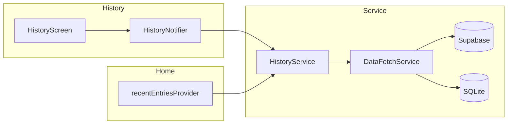

# Feature design doc — History & recent

> **Scope:** **History tab** — browse past entries by **list** or **calendar**, **mood filter** (with online pagination into older months), **lazy AI insight** fetch per entry; **Recent entries** — **top 5** newest rows across **current + previous month** for **Home**. Shared stack: **`HistoryService`** + **`DataFetchService`** JOIN reads (local or remote).

---

## 0. Document control

| Field | Value |
|-------|--------|
| **Feature name (canonical)** | **History & recent** |
| **Short slug** | `history-recent` |
| **Doc version** | `0.1` |
| **Last updated** | `2026-04-03` |
| **Owner / maintainer** | `[TBD]` |
| **Reviewers (default)** | Anyone changing `HistoryService`, `HistoryNotifier`, `HistoryScreen` list/calendar/mood flows, or `recentEntriesProvider` |
| **Status of this doc** | `Draft` |

---

## 1. Summary

### 1.1 One-line purpose

Present **past diary days** as **`HistoryEntry`** (entry + joined sections, optional **`HistoryDailyInsight`**), with **month-scoped loading**, **calendar mood dots**, and a **compact recent list** on Home.

### 1.2 Elevator pitch

**`HistoryScreen`** initializes **`loadCurrentMonth()`** (current + previous month, full JOIN payload) then **`loadCalendarMoodData()`** — offline builds **`moodMap`** / **`monthsWithEntries`** from loaded rows; online merges a **long-range** mood map from **`getMoodMapAndMonthsWithEntries`** (single lightweight select). Users switch **list vs calendar**, filter by **mood** (debounced); older matching rows load via **`getEntriesByMood`** when online. **`recentEntriesProvider`** reuses **`getEntriesForMonth`** twice, merges, sorts, **`take(5)`** — used by **`HomeScreen`**, not History.

### 1.3 In scope / out of scope

| In scope | Out of scope |
|----------|----------------|
| `history_screen.dart`, `history_provider.dart`, `history_service.dart`, `recent_entries_provider.dart` | **Editing** entries — **Diary entries (core)** / `NewDiaryScreen` |
| `HistoryEntry`, `HistoryDailyInsight` in `history_entry_model.dart` | **Analytics** charts / period switching |
| JOIN hydration for `entry_*` satellites | **Supabase Edge** AI pipeline |
| `fetchInsightForEntry` + `EntryInsightStorageHelper` | **RLS policies** (document in DB docs) |

---

## 2. Product & UX

### 2.1 User-facing surfaces

- **History (`HistoryScreen`):** `_viewMode` **list** | **calendar**; optional **mood** filter; **Load more** months (online); tap date → resolve entry (`getEntryByDate`); expand card → **lazy** insight load via **`HistoryService.fetchInsightForEntry`**.
- **Home:** **Recent entries** section — **`recentEntriesProvider`** (5 cards).
- **Offline:** Month bodies from **SQLite** (`useLocalOnly: true`); mood filter pagination and “load older month” require **online** (snackbar copy).

### 2.2 UX principles & constraints

- **Newest-first** ordering after merges.
- **Null mood** in calendar map defaults to **3** (`_buildMoodMap`) for display consistency.
- **Connectivity:** Listener refreshes calendar mood data when network returns (**ERRHIST015** on listener failure).

### 2.3 Related product docs

- `bc/CHANGE-SYSTEM/feature-list.md` — **History & recent**
- `bc/Project3/tables_queries.md` — `entries`, `entry_*`, `entry_insights`

---

## 3. Technical architecture

### 3.1 Stack & layers

| Layer | Details |
|-------|---------|
| **UI** | `HistoryScreen` (~2.6k lines), `TableCalendar`, responsive tokens |
| **State** | `historyProvider` → `HistoryNotifier` / `HistoryState` |
| **Data** | `HistoryService` → `DataFetchService` (preferred) or direct **Supabase** select |

### 3.2 Key modules & file paths

```
lib/
  screens/history_screen.dart
  providers/history_provider.dart
  providers/recent_entries_provider.dart
  services/history_service.dart
  models/history_entry_model.dart
  services/data_fetch_service.dart     # fetchEntriesWithJoins, fetchEntriesByMoodWithJoins, fetchEntriesWithSelect
  services/entry_insight_storage_helper.dart   # local insight cache
```

### 3.3 Data model (feature-specific)

| Type | Role |
|------|------|
| `HistoryEntry` | `Entry` + optional `insight` + `entry_*` sections; computed `wordCount`, previews |
| `HistoryDailyInsight` | AI row subset for history UI |
| `HistoryState` | `entries`, `loadedMonths`, `moodMap`, `monthsWithEntries`, mood-filter pagination flags, loading/error |

### 3.4 External dependencies

- **Supabase:** `entries`, `entry_*`, `entry_insights` (insight path)
- **connectivity_plus** — History screen subscription
- **table_calendar** — calendar view

### 3.5 Platform notes

N/A beyond standard Flutter networking.

### 3.6 Functions & methods (code map)

#### 3.6.1 Entry points & orchestration

| Symbol | File | Role |
|--------|------|------|
| `HistoryNotifier.loadCurrentMonth` | `history_provider.dart` | Loads **current + previous** month; builds initial `moodMap` from those entries |
| `HistoryNotifier.loadCalendarMoodData` | same | Offline: from `state.entries`; online: **`getMoodMapAndMonthsWithEntries`** |
| `HistoryNotifier.loadPreviousMonth` | same | **Online only** — append month by `monthKey` |
| `HistoryNotifier.getEntryByDate` | same | Offline: search **loaded** list only; else **`HistoryService.getEntryByDate`** |
| `HistoryNotifier.loadMoodFilteredEntries` | same | **Online** — **`getEntriesByMood`** with pagination (`limit` 30) |
| `recentEntriesProvider` | `recent_entries_provider.dart` | Two months → sort → **top 5** |

#### 3.6.2 Services

| Symbol | File | Notes |
|--------|------|--------|
| `HistoryService.getEntriesForMonth` | `history_service.dart` | `DataFetchService.fetchEntriesWithJoins` or Supabase nested select; **`insight: null`** in list |
| `HistoryService.getEntryByDate` | same | Single-day JOIN |
| `HistoryService.fetchInsightForEntry` | same | Local cache → Supabase `entry_insights` `status=success` → persist local |
| `HistoryService.getEntriesByMood` | same | Requires **`DataFetchService`** (`fetchEntriesByMoodWithJoins`) |
| `HistoryService.getMoodMapAndMonthsWithEntries` | same | **`fetchEntriesWithSelect`** `entry_date, mood_score` (~10y window) |

#### 3.6.3 Backend / Edge

| Location | Purpose |
|----------|---------|
| Postgres tables | Source for remote paths; local SQLite mirrors via sync |

### 3.7 Variables, constants & configuration keys

#### 3.7.1 Pagination / limits

| Name | Value | Meaning |
|------|-------|---------|
| Mood filter batch | `30` | `getEntriesByMood` page size |
| Recent entries | `5` | `take(5)` |
| Mood map online range | ~**10 years** back | `getMoodMapAndMonthsWithEntries` startDate |

#### 3.7.2 Error codes (representative)

| Code | Area |
|------|------|
| ERRHIST001–002 | Month/day fetch |
| ERRHIST004 | Insight fetch |
| ERRHIST005–007, 010–015 | Provider / calendar / connectivity |
| ERRHIST011–013 | Mood filter / mood map fetch |
| ERRDATA207 | `recent_entries_provider` |

### 3.8 Core logic & behaviour

#### 3.8.1 Initial load

1. `loadCurrentMonth` → `getEntriesForMonth` ×2 (current, previous), `useLocalOnly: !isOnline`.
2. Merge, sort desc, update `loadedMonths`, `moodMap`, `monthsWithEntries` (from loaded rows only initially).
3. `loadCalendarMoodData` → if online, replace/augment with **full** mood map + **all months** that have entries (from server select).

#### 3.8.2 Mood filter

- Counts from **`moodMap`** (total per mood); list shows **`_filteredEntries`** from **`state.entries`**.
- If **total > loaded** for a mood, **`loadMoodFilteredEntries`** runs (debounced 300ms from UI) — fetches rows **before** “skip until” date (excludes last two months already in memory).

#### 3.8.3 Insights

- List/detail rows **do not** embed insights by default; **`fetchInsightForEntry`** runs when user action requests it — **local-first**, then network.

#### 3.8.4 Edge cases

| Scenario | Behaviour |
|----------|-----------|
| `DataFetchService` null + `useLocalOnly` | `getEntriesForMonth` returns **[]** |
| `getEntriesByMood` with null `DataFetchService` | **[]** |
| Recent entries error | **[]** + ERRDATA207 |

### 3.9 State management

| Provider | File | Holds |
|----------|------|--------|
| `historyProvider` | `history_provider.dart` | `HistoryState` |
| `recentEntriesProvider` | `recent_entries_provider.dart` | `FutureProvider<List<HistoryEntry>>` |

---

## 4. Boundaries & coupling

### 4.1 Upstream

- **Auth** — `userId` from Supabase.
- **DataFetchService** — JOIN and mood queries; **required** for mood filter and mood map helper.
- **Sync** — local DB must be populated for offline History.

### 4.2 Downstream

- **Home** depends on **`recentEntriesProvider`** only.
- **AI** — `entry_insights` read path for insights card expansion.

### 4.3 Shared hotspots

- **`fetchEntriesWithJoins`** — change impacts History, DataFetch tests, and sync assumptions.
- **`history_screen.dart`** size — high-risk for merge conflicts.

---

## 5. Change control alignment

### 5.1 `primary_feature`

**History & recent** for provider, service, History UI, and recent entries provider.

### 5.2 Approver

Match **History & recent** for behavioural changes; **Sync, DB & connectivity** if only `DataFetchService` transport changes without History UX.

### 5.3 CTASK expectations

- **New column** in JOIN payloads → migration + History parsing + QA.
- **Mood map** query change → CTASK with online/offline matrix.

### 5.4 Risk class

**High** — large surface area, offline/online branching, user-facing history.

---

## 6. Operations & quality

### 6.1 Feature flags

None.

### 6.2 Observability

ERRHIST* / ERRDATA207 as listed.

### 6.3 Performance

- **10-year** mood select can be heavy — monitor query time and indexes on `entries(user_id, entry_date)`.
- History screen file is very large — consider split widgets in future (out of scope for this doc).

### 6.4 Security & privacy

Diary text and insights are sensitive; RLS must scope by `user_id`.

---

## 7. Testing strategy

### 7.1 Manual critical paths

1. Online: History loads 2 months + full calendar mood dots.
2. Offline: 2 months from SQLite; mood filter shows snackbar if more data needed.
3. Load older month (online) appends list + `loadedMonths`.
4. Recent entries on Home: max 5, newest first.
5. Expand insight: local miss → network → local store.

### 7.2 Automated

| Type | Location |
|------|----------|
| Unit | `[TBD]` — `_buildMoodMap`, month key parsing |

### 7.3 Regression triggers

Touch **`HistoryService.getEntriesForMonth`** or **`DataFetchService.fetchEntriesWithJoins`** → re-run History + Home recent.

---

## 8. Releases & migration

### 8.1 User-visible

Note when changing mood filter rules or recent-entry window.

### 8.2 Data migrations

Align `entry_insights` shape with `HistoryDailyInsight` mapping.

---

## 9. Documentation & support

### 9.1 User-facing

Snackbars for offline mood filter; **“History refreshed”** on reconnect.

### 9.2 FAQ

| Issue | Note |
|-------|------|
| Calendar missing old dots offline | Full mood map only from loaded months offline; online refresh fills |

---

## 10. Glossary

| Term | Definition |
|------|------------|
| **HistoryEntry** | Entry + joined sections for list/cards |
| **monthKey** | `yyyy-MM` string for pagination |

---

## 11. Open questions & decisions

### 11.1 Open questions

1. Split **`history_screen.dart`** into smaller widgets for maintainability?
2. Should **recent entries** window match **History**’s two months exactly (currently yes) or use a rolling 30 days?

### 11.2 Decisions

| Date | Decision | Rationale |
|------|----------|-----------|
| `2026-04-03` | Initial doc from code | Reflects JOIN + mood + recent split |

---

## 12. Appendix

### 12.1 References

- `lib/services/history_service.dart`
- `lib/providers/history_provider.dart`
- `lib/providers/recent_entries_provider.dart`
- `lib/screens/history_screen.dart`
- `bc/CHANGE-SYSTEM/feature-doc-template.md`

### 12.2 Diagram (data flow)



### 12.3 Changelog of *this* doc

| Version | Date | Notes |
|---------|------|-------|
| `0.1` | `2026-04-03` | Initial |
