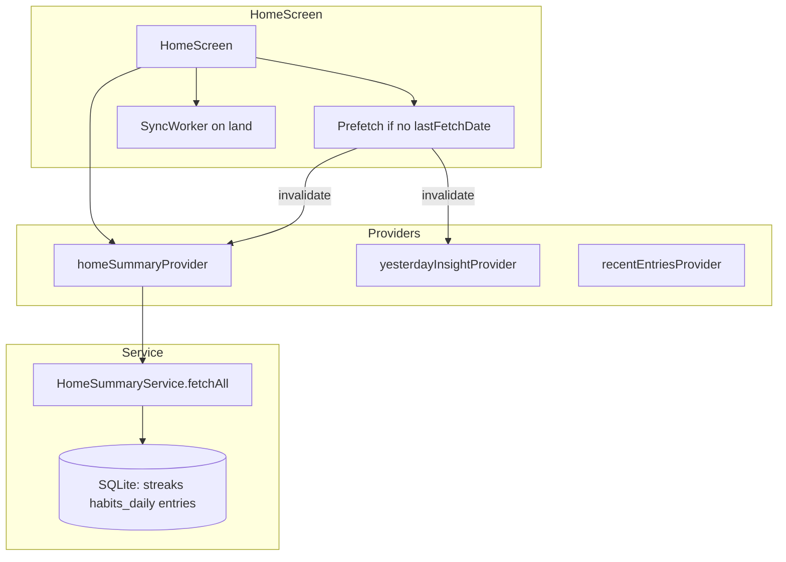

# Feature design doc — Home & calendar

> **Scope:** **Home tab** dashboard (`HomeScreen`): greeting, **streak** (local `streaks` + fallback), **today progress**, **this-week metrics** (derived from **local entries** for the current week window), **yesterday insight** card, **recent entries**, **post-login prefetch**, and **sync on land**.  
> **Calendar *widgets*** (`MiniCalendarWidget`, `WeekChipsCarousel`, `MonthChipsCarousel`) live in the codebase under this feature area in **`feature-list.md`** but are **used on the Analytics screen** for week/month navigation — not on Home today. Home exposes a **calendar *period*** only via **“This Week”** metrics (Sunday-start week, local DB).

---

## 0. Document control

| Field | Value |
|-------|--------|
| **Feature name (canonical)** | **Home & calendar** |
| **Short slug** | `home-calendar` |
| **Doc version** | `0.1` |
| **Last updated** | `2026-04-03` |
| **Owner / maintainer** | `[TBD]` |
| **Reviewers (default)** | Anyone changing `HomeScreen`, `HomeSummaryService.fetchAll`, or prefetch-on-home behaviour |
| **Status of this doc** | `Draft` |

---

## 1. Summary

### 1.1 One-line purpose

Show a **personalized Home dashboard** with **streak**, **today’s task/water progress**, **week-to-date stats**, **AI yesterday insight**, and **recent entries**, backed by **local SQLite** (with **`DataFetchService`** for today’s habits/entry when online) and **invalidated** after prefetch or entry saves.

### 1.2 Elevator pitch

After auth, **`HomeScreen`** loads **`userDataProvider`** and may run **`DataPrefetchService`** (first session / no `lastFetchDate`) to merge profile, settings, streaks, **60 days** of entries + joins, yesterday insight, and **habits_daily** rebuild — then **`invalidate(homeSummaryProvider)`** and **`yesterdayInsightProvider`**. The visible **date header** uses **device-local “today”** (formatted). **`homeSummaryProvider`** calls **`HomeSummaryService.fetchAll`**, which in parallel loads **streak** from local **`streaks`**, **today** from **`habits_daily` + `entries` + `entry_meals`** (via `DataFetchService` when constructed with it), and **weekly** from **`_calculateCurrentWeekFromLocal`** (avg mood, avg cups, self-care rate, consistency). **StreakMotivationService** supplies copy under the streak card. **Calendar UI components** (table calendar dialog, week/month chip carousels) are **shared widgets** primarily wired in **`analytics_screen.dart`**.

### 1.3 In scope / out of scope

| In scope | Out of scope |
|----------|----------------|
| `home_screen.dart`, `HomeSummaryService`, `home_summary_provider.dart` (extra providers), `home_summary_models.dart` | **Diary editor** — `NewDiaryScreen` (linked from Home only) |
| `homeSummaryProvider` in `data_providers.dart` | **Full analytics** charts — `analytics_screen.dart` (uses week/month widgets) |
| `MiniCalendarWidget`, `week_chips_carousel.dart`, `month_chips_carousel.dart` (ownership / reuse) | **History list** implementation — see History feature |
| Post-login **prefetch** block inside `HomeScreen` | **`DataFetchService`** / **`DataPrefetchService`** internals — cross-feature |
| **`recentEntriesProvider`** consumption on Home | **Recent entries** provider implementation details |

---

## 2. Product & UX

### 2.1 User-facing surfaces

- **Route:** Bottom nav **Home** (index `0`) → `HomeScreen`.
- **Blocks:** Formatted **today** date + greeting; **Current / Best streak** card (values prefer `homeSummaryProvider.streak`, else `userStatsProvider`); **Start Today’s Entry** → `NewDiaryScreen`; **Yesterday’s insight** (`YesterdayInsightCard`); **This Week** metric cards (mood, water, self-care, consistency); **Recent entries** list.
- **Loading:** Skeleton while `userData` loading or first-time **prefetch** running (`_needsFetch && !_prefetchComplete`).

### 2.2 UX principles & constraints

- **Week definition:** **`HomeSummaryService`** uses a **Sunday-based** week start (see §3.8).
- **Today progress:** **4 tasks** counted in UI (`tasksCompletedCount`: diary, affirmations, gratitude, self-care count > 0).
- **Grace / streak details:** Tap streak area → dialog with **`GraceSystemInfoCard`**.

### 2.3 Related product docs

- `bc/CHANGE-SYSTEM/feature-list.md` — **Home & calendar**

---

## 3. Technical architecture

### 3.1 Stack & layers

| Layer | Details |
|-------|---------|
| **UI** | Flutter, Riverpod, `ResponsiveBody` / `ResponsiveInfo` |
| **Summary** | `HomeSummaryService` → `HomeSummary` model |
| **Data** | Local SQLite (`streaks`, `habits_daily`, `entries`, `entry_meals`, `entry_self_care`), optional **`DataFetchService`** for online-aware habits/entry rows |

### 3.2 Key modules & file paths

```
lib/
  screens/home_screen.dart
  services/home_summary_service.dart
  services/data_prefetch_service.dart          # called from Home on first land
  services/data_sync_flag_service.dart         # lastFetchDate
  services/sync/sync_worker.dart               # processSyncQueue on land
  providers/data_providers.dart                # homeSummaryProvider
  providers/home_summary_provider.dart         # aiInsightProvider, recentInsightsProvider, yesterdayInsightProvider
  models/home_summary_models.dart
  widgets/mini_calendar_widget.dart
  widgets/week_chips_carousel.dart
  widgets/month_chips_carousel.dart
  widgets/yesterday_insight_card.dart
  services/streak_motivation_service.dart
```

### 3.3 Data model (feature-specific)

| Model | Role |
|-------|------|
| `HomeSummary` | Optional `StreakSummary`, `TodayProgressSummary`, `WeeklySnapshotSummary` |
| `StreakSummary` | `current`, `longest`, `freezeCredits`, `gracePiecesTotal` from **`streaks`** |
| `TodayProgressSummary` | Booleans + counts + `waterCups` from habits + meals |
| `WeeklySnapshotSummary` | `moodAvg`, `cupsAvg`, `selfCareRate`, `consistency`; `topTopics` / `highlights` / `moodDelta` **null** from local path |

### 3.4 External dependencies

- **Supabase:** Auth user for providers; prefetch hits remote via `DataFetchService`
- **Packages:** `intl`, `table_calendar` (mini calendar widget), Riverpod

### 3.5 Platform notes

- **Date math** uses **local** `DateTime` (no UTC conversion for “today” labels).

### 3.6 Functions & methods (code map)

#### 3.6.1 Entry points & orchestration

| Symbol | File | Role |
|--------|------|------|
| `HomeScreen.initState` | `home_screen.dart` | `_loadUserData`, `_triggerSyncIfFromSplash` |
| `_runPrefetchAndWait` | same | First-login data merge + `invalidate` home + yesterday |
| `_triggerSyncOnLand` | same | `SyncWorker().processSyncQueue()` |
| `HomeSummaryService.fetchAll` | `home_summary_service.dart` | Parallel streak / today / weekly |
| `_fetchStreak` | same | Read **`streaks`** table |
| `_fetchTodayProgress` | same | `DataFetchService` path vs raw SQLite fallback |
| `_calculateCurrentWeekFromLocal` | same | Week metrics from `getEntriesInRange` + meals + self-care |
| `homeSummaryProvider` | `data_providers.dart` | `HomeSummaryService(dataFetchService: …).fetchAll` |

#### 3.6.2 Widgets (calendar kit — primary consumer)

| Widget | File | Primary use |
|--------|------|-------------|
| `MiniCalendarWidget` | `mini_calendar_widget.dart` | **Analytics:** week picker dialog (`TableCalendar`) |
| `WeekChipsCarousel` | `week_chips_carousel.dart` | **Analytics:** horizontal week chips |
| `MonthChipsCarousel` | `month_chips_carousel.dart` | **Analytics:** horizontal month chips |

#### 3.6.3 Backend / Edge

N/A for Home layout; data ultimately from **Postgres** via sync/prefetch into SQLite.

### 3.7 Variables, constants & configuration keys

#### 3.7.1 Prefetch / flags

| Concept | Role |
|---------|------|
| `DataSyncFlagService.getLastFetchDate` / `setLastFetchDate` | Gate **one-time** prefetch after login |
| Prefetch window | **60 days** of entries (`sixtyDaysAgo` → `today`) |

#### 3.7.2 Error codes (sample)

| Code | Context |
|------|---------|
| ERRSYS151 | `_safeFetch` wrapper in `fetchAll` |
| ERRSYS152–155 | Streak / today / weekly / local week calc |
| ERRSYS184–185 | Home prefetch failures |
| ERRDATA206 | `homeSummaryProvider` top-level catch |
| ERRUI001 | `MonthChipsCarousel` init (defensive) |

### 3.8 Core logic & behaviour

#### 3.8.1 Week start (`fetchAll`)

```dart
final thisWeekStart = now.subtract(
  Duration(days: now.weekday == 7 ? 0 : now.weekday),
);
```

Dart **`weekday`**: Mon=1 … Sun=7. Subtracting **`weekday`** days from the current date yields **Sunday** of the current week (Sunday uses `0` subtract).

#### 3.8.2 Weekly local calculation

- **`daysElapsed`:** from `weekStart` through **today** (inclusive).
- **Entries:** `LocalEntryService.getEntriesInRange(userId, weekStartOnly, todayOnly)`.
- **Mood avg:** mean of non-null `moodScore`.
- **Cups avg:** sum of `water_cups` over entries’ meals / `daysElapsed`.
- **Self-care rate:** sum of completed self-care toggles / `(daysElapsed * 10)`.
- **Consistency:** `entries.length / daysElapsed`, clamped 0–1.

#### 3.8.3 Today progress

- With **`DataFetchService`:** `fetchHabitsForDate`, `fetchEntryByDate` (local-only when offline).
- Else: read **`habits_daily`** and **`entries`** directly from SQLite; **water** from **`entry_meals`**.

#### 3.8.4 `homeSummaryProvider` lifetime

Implemented as **`FutureProvider.autoDispose`** in `data_providers.dart` (despite an older comment elsewhere saying “NOT autoDispose”). Disposal timing affects caching; treat as **autoDispose** in reviews.

#### 3.8.5 Edge cases

| Scenario | Behaviour |
|----------|-----------|
| Empty weekly entries | `_calculateCurrentWeekFromLocal` returns **null** → UI shows **0.0** placeholders where coded |
| Provider error | `homeSummaryProvider` returns **empty** `HomeSummary` after ERRDATA206 |

### 3.9 State management

| Provider | File | Role |
|----------|------|------|
| `homeSummaryProvider` | `data_providers.dart` | `HomeSummary` for streak/today/weekly |
| `userDataProvider` | `user_data_provider.dart` | Profile + loading gate |
| `userStatsProvider` | (user data related) | Fallback streak if summary missing |
| `recentEntriesProvider` | `recent_entries_provider.dart` | Recent list on Home |
| `yesterdayInsightProvider` | `home_summary_provider.dart` | Yesterday card (local-first) |
| `graceSystemProvider` | `grace_system_provider.dart` | Streak card grace UI |

---

## 4. Boundaries & coupling

### 4.1 Upstream

- **Authentication** — user id for all fetches.
- **Sync / prefetch** — populates SQLite before summary reads.
- **Streaks table** — maintained by streak / entry flows.

### 4.2 Downstream

- **New diary** navigation from Home.
- **Analytics** reuses calendar widgets; changes to chip APIs affect both.

### 4.3 Shared hotspots

- **`HomeSummaryService`** — any change to week boundaries or metrics affects Home **and** perceived consistency with Analytics.
- **`DataPrefetchService`** invoked from Home — failures logged ERRSYS184/185.

---

## 5. Change control alignment

### 5.1 `primary_feature`

**Home & calendar** for `HomeScreen` layout, `HomeSummaryService`, and the three carousel/calendar widgets. **Analytics (in-app)** if editing only `analytics_screen` period selectors without touching service layer.

### 5.2 Approver

Match **Home & calendar** for dashboard and summary service changes.

### 5.3 CTASK expectations

- Changing **week start** or **metric formulas** → CTASK + QA on Home **and** Analytics consistency.
- Prefetch contract change → coordinate with **Sync, DB & connectivity** / **User data**.

### 5.4 Risk class

**Medium** — highly visible; logic errors show wrong streaks or weekly stats.

---

## 6. Operations & quality

### 6.1 Feature flags

None.

### 6.2 Observability

- Error codes in §3.7.2; debug **notification** / **local DB** buttons on Home app bar (remove before production if undesired).

### 6.3 Performance

- `fetchAll` uses **`Future.wait`** for three branches; weekly path may N+1 query meals/self-care per entry — watch if entry count grows.

### 6.4 Security & privacy

Dashboard displays **user display name** and **stats**; same RLS assumptions as underlying tables.

---

## 7. Testing strategy

### 7.1 Manual critical paths

1. Cold start logged in → Home shows greeting + streak + prefetch completes.
2. First install → prefetch runs once → `lastFetchDate` set.
3. Edit diary → return Home → `homeSummaryProvider` refresh after invalidation from entry flow.
4. Offline → today progress falls back to SQLite paths.
5. Analytics: week/month chips + mini calendar still navigate periods.

### 7.2 Automated

| Type | Location |
|------|----------|
| Unit | `[TBD]` — `_calculateCurrentWeekFromLocal` with fake DB |

### 7.3 Regression triggers

Change **`HomeSummaryService`** or **prefetch** → retest Home loading skeleton, streak numbers, This Week cards.

---

## 8. Releases & migration

### 8.1 User-visible

Call out changes to **weekly metrics** or **streak display** in release notes.

### 8.2 Data migrations

If **`habits_daily`** or **`streaks`** schema changes, update **`HomeSummaryService`** readers.

---

## 9. Documentation & support

### 9.1 User-facing

Strings in `HomeScreen` and `StreakMotivationService`.

### 9.2 FAQ

| Issue | Note |
|-------|------|
| Wrong week stats | Confirm Sunday week start vs user expectation |
| Calendar widgets “missing” on Home | By design — see §1; use **Analytics** tab |

---

## 10. Glossary

| Term | Definition |
|------|------------|
| **This Week** | Sunday–today window for local aggregates on Home |
| **Prefetch** | First-land merge of remote data into SQLite via `DataPrefetchService` |

---

## 11. Open questions & decisions

### 11.1 Open questions

1. Move **week/month/calendar** widgets to a shared folder or document **Analytics** as co-owner?
2. Align **`homeSummaryProvider.autoDispose`** comment with code or switch to non–autoDispose if caching is desired.

### 11.2 Decisions

| Date | Decision | Rationale |
|------|----------|-----------|
| `2026-04-03` | Doc reflects **Analytics** as consumer of calendar widgets | `grep` shows no use in `home_screen.dart` |

---

## 12. Appendix

### 12.1 References

- `lib/screens/home_screen.dart`
- `lib/services/home_summary_service.dart`
- `lib/providers/data_providers.dart`
- `lib/screens/analytics_screen.dart` (calendar widgets)
- `bc/CHANGE-SYSTEM/feature-doc-template.md`

### 12.2 Diagram (Home data flow)



### 12.3 Changelog of *this* doc

| Version | Date | Notes |
|---------|------|-------|
| `0.1` | `2026-04-03` | Initial |
