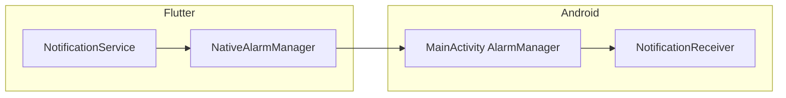

# Feature design doc — Notifications & alarms

> **Scope:** **Local reminders** via **`flutter_local_notifications`**, **Android `AlarmManager`** (Kotlin **`NotificationReceiver`** + **`NativeAlarmManager`** method channel), **`android_alarm_manager_plus`** for **isolate** test callbacks, **SharedPreferences** for user schedule + alarm metadata, **10-day rolling window** scheduling, and **cloud sync** of reminder fields through **`UserPreferenceSyncService`**. **Profile & settings** UI owns copy; this doc covers **scheduling engine** and **platform glue**.

---

## 0. Document control

| Field | Value |
|-------|--------|
| **Feature name (canonical)** | **Notifications & alarms** |
| **Short slug** | `notifications-alarms` |
| **Doc version** | `0.1` |
| **Last updated** | `2026-04-03` |
| **Owner / maintainer** | `[TBD]` |
| **Reviewers (default)** | Anyone changing `NotificationService.scheduleFutureWindow`, Android `AlarmManager` / `NotificationReceiver`, or `UserPreferenceSyncService` reminder payload |
| **Status of this doc** | `Draft` |

---

## 1. Summary

### 1.1 One-line purpose

Deliver **time-based diary reminders** (morning insight, +6h streak nudge, bedtime) on a **user-configured day/time** pattern, persisting settings locally and optionally **syncing** `user_settings` to Supabase.

### 1.2 Elevator pitch

**`NotificationService`** (singleton) reads **`NotificationSettings`** from **SharedPreferences** (`morningTime`, `activeDays` Mon=1…Sun=7, `notificationsEnabled`). On **`initialize()`** it sets up **`flutter_local_notifications`**, creates Android channel **`diary_reminders`**, and calls **`scheduleFutureWindow()`** (next **10** days). Alarms are scheduled through **`NativeAlarmManager.scheduleAlarm`**, which invokes native **`MainActivity`** code using **`setExactAndAllowWhileIdle`**, firing **`NotificationReceiver`** to post a system notification. **`updateNotificationSettings`** cancels the window, clears shown notifications, reschedules, and calls **`UserPreferenceSyncService.syncNotificationSettingsToCloud`**. **`GraceSystemService`** may call **`rescheduleBasedOnHabits`** after habit changes. **`checkAndResetDailyStatus`** runs on app start to detect a **new calendar day** and refresh today’s schedule.

### 1.3 In scope / out of scope

| In scope | Out of scope |
|----------|----------------|
| `notification_service.dart`, `native_alarm_manager.dart`, `notification_test_screen.dart` | **Marketing / push** from FCM (not present here) |
| Android **`MainActivity.kt`** / **`NotificationReceiver.kt`** / **`BootReceiver`** (refs) | **Exact alarm policy** negotiation with OEM battery savers — operational only |
| Top-level **`@pragma('vm:entry-point')`** callbacks for **`AndroidAlarmManager.oneShotAt`** tests | **iOS parity** for native exact alarms — `NativeAlarmManager` is Android channel–based |

---

## 2. Product & UX

### 2.1 User-facing surfaces

- **Settings** — pick morning time, active weekdays, master enable (`settings_screen.dart`).
- **Dev / QA** — **`NotificationTestScreen`** — load settings, **`scheduleAllNotifications`**, immediate test, 1‑minute AlarmManager test.

### 2.2 UX principles & constraints

- **Permission:** `Permission.notification` requested on startup (`requestPermissions` from `main.dart` after `initialize`).
- **Bedtime notification:** Fixed **23:00** local wall time for the scheduled **day** (see §3.8).
- **Message copy:** Rotating pools (**10** title/body pairs per category), index = **day-of-epoch mod 10**.

### 2.3 Related product docs

- `bc/CHANGE-SYSTEM/feature-list.md` — **Notifications & alarms**
- `bc/CHANGE-SYSTEM/features-docs/User-data-&-preferences.md` — **`user_settings`** sync
- `bc/CHANGE-SYSTEM/features-docs/Streaks-&-grace.md` — **`rescheduleBasedOnHabits`**

---

## 3. Technical architecture

### 3.1 Stack & layers

| Layer | Details |
|-------|---------|
| **Client (Flutter)** | `flutter_local_notifications`, `permission_handler`, `shared_preferences`, `android_alarm_manager_plus` |
| **Android native** | `AlarmManager`, `BroadcastReceiver` → `NotificationCompat` |
| **Persistence** | SharedPreferences (settings + per-alarm metadata); **`user_settings`** row for remote mirror |

### 3.2 Key modules & file paths

```
lib/services/notification_service.dart
lib/services/native_alarm_manager.dart
lib/screens/notification_test_screen.dart
lib/main.dart                          # AndroidAlarmManager.initialize, NotificationService.initialize
android/.../MainActivity.kt            # MethodChannel com.zen.diaryapp/native_alarm
android/.../NotificationReceiver.kt
```

### 3.3 Data model (feature-specific)

| Concept | Storage / shape |
|---------|------------------|
| **`NotificationSettings`** | `morningTime`, `activeDays`, `notificationsEnabled` |
| **Alarm IDs** | Base IDs **1001** (morning), **1002** (+3h legacy callback), **1003** (+6h), **2001** (bedtime); **per-day** ID = `base + daysSinceEpoch * 10` |
| **Alarm metadata** | Keys `alarm_{notificationId}_{yyyy-MM-dd}_{time|title|body}` in SharedPreferences |
| **Remote mirror** | `user_settings.reminder_*` via **`UserPreferenceSyncService`** |

### 3.4 External dependencies

- **Packages:** `flutter_local_notifications`, `permission_handler`, `shared_preferences`, `android_alarm_manager_plus`, `supabase_flutter` (user id for diary checks)

### 3.5 Platform notes

- **Android:** Primary target; **`SCHEDULE_EXACT_ALARM`** / OEM limits may affect reliability — verify manifest and Play policy.
- **iOS:** Local notifications plugin initialized; **`NativeAlarmManager`** uses a **MethodChannel** implemented in **`MainActivity`** only — **non-Android** `invokeMethod` fails → **`scheduleAlarm` returns false** (errors logged as **ERRSYS151** / **152**).

### 3.6 Functions & methods (code map)

#### 3.6.1 Entry points & orchestration

| Symbol | File | Role |
|--------|------|------|
| `NotificationService.initialize` | `notification_service.dart` | Prefs, FLN init, channel, **`scheduleFutureWindow`** |
| `NotificationService.scheduleFutureWindow` / `scheduleAllNotifications` | same | 10-day scheduling pipeline |
| `NotificationService.updateNotificationSettings` | same | Persist prefs → cancel → reschedule → **sync** |
| `NotificationService.checkAndResetDailyStatus` | same | Day rollover → reset flags → **`_rescheduleTodayNotifications`** |
| `NotificationService.rescheduleBasedOnHabits` | same | Called from **grace** when habits change |
| `NativeAlarmManager.scheduleAlarm` / `cancelAlarm` | `native_alarm_manager.dart` | Method channel to Kotlin |

#### 3.6.2 Top-level callbacks (AndroidAlarmManager isolates)

| Callback | Role |
|----------|------|
| `showTestNotificationCallback` | Test id **9997** |
| `showMorningReminder1Callback` … `showBedtimeReminderCallback` | FLN **`show`** from background isolate (**1001–1003**, **2001** message pools) |

#### 3.6.3 Android native

| Symbol | Location | Purpose |
|--------|----------|---------|
| `scheduleAlarm` / `cancelAlarm` | `MainActivity.kt` | `AlarmManager` + `PendingIntent` → **`NotificationReceiver`** |
| `onReceive` | `NotificationReceiver.kt` | Build notification on **`diary_reminders`** channel |

### 3.7 Variables, constants & configuration keys

#### 3.7.1 Constants

| Name | Meaning |
|------|---------|
| `_futureDays` | **10** — rolling horizon |
| `_alarmDayMultiplier` | **10** — ID spacing per day |
| `morningReminder1Id` … `bedtimeReminderId` | **1001**, **1002**, **1003**, **2001** |

#### 3.7.2 SharedPreferences keys (`NotificationStorageKeys`)

| Key | Purpose |
|-----|---------|
| `notification_morning_time` + `_hour` / `_minute` | Morning anchor time |
| `notification_active_days` | Weekday list as strings |
| `notification_enabled` | Master toggle |
| `today_morning_completed` / `today_bedtime_completed` | Legacy completion flags (reset path) |
| `last_reset_date` | Calendar-day detection |

### 3.8 Core logic & behaviour

#### 3.8.1 `scheduleFutureWindow` (happy path)

1. Load settings; if disabled → return after cancel.
2. **`_clearLegacyAlarmMetadata`** + **`cancelFutureWindow`** (cancel prior native alarms in window).
3. For each of **10** days, if **weekday ∈ activeDays**:
   - **Today only:** if **`habits_daily.wrote_entry`** indicates diary done → **skip +6h** for today.
   - Else schedule **`_scheduleFollowUpReminderForDate`** (+**6h** from morning anchor). **Skip** if +6h already passed today, or if within **3h** of **23:00** bedtime guard.
   - Schedule **`_scheduleBedtimeNotificationForDate`** at **23:00** (message set depends on whether diary completed **today** when `targetDate` is today).
4. **`_scheduleTomorrowMorningIfEntryExists`:** if user wrote diary **today**, schedule **1001** for **tomorrow** morning (only if tomorrow is an active day).

**Note:** **`_scheduleMorningNotificationsForDate`** (1001) is used for **tomorrow** when today’s entry exists — not for every day in the 10-day loop in the current code path.

#### 3.8.2 `rescheduleBasedOnHabits` / `_rescheduleTodayNotifications`

- If diary completed today: **`cancelFollowUpReminder`** (+6h), **`_scheduleTomorrowMorningIfEntryExists`**.
- Bedtime for **today** is (re)scheduled regardless.

#### 3.8.3 Diary completion source

- **`_isDiaryCompletedToday`** reads local **`habits_daily`** for **today** and **`wrote_entry`** (bool/int tolerant).

#### 3.8.4 **1002 (+3h)** status

- **Top-level** `showMorningReminder2Callback` and **cancel** paths for **1002** exist; the current **`scheduleFutureWindow`** implementation schedules **1001** (conditional), **1003** (+6h), and **2001** (bedtime). Treat **1002** as **legacy / reserved** unless a future change reintroduces +3h scheduling.

### 3.9 State management

| Mechanism | Holds |
|-----------|--------|
| `NotificationService.notificationStream` | `NotificationResponse` from FLN taps |
| SharedPreferences | Settings + alarm metadata |

---

## 4. Boundaries & coupling

### 4.1 Upstream

- **Auth** — `currentUser?.id` for habit checks; missing user → low-severity log (**ERRSYS158**).
- **SQLite `habits_daily`** — “diary written today” gate.

### 4.2 Downstream

- **User data & preferences** — **`UserPreferenceSyncService.syncNotificationSettingsToCloud`** on settings change.
- **Sync** — `user_settings` row enqueued for remote upsert.

### 4.3 Shared hotspots

- **`notification_service.dart`** is large (~1.6k lines) — prefer small, testable extractions when changing scheduling rules.

---

## 5. Change control alignment

### 5.1 Default `primary_feature`

**Notifications & alarms** for scheduling, permissions, Android native, or reminder copy pools.

### 5.2 Risk class

**Medium** — behaviour is time-sensitive and OEM-dependent; schema changes need sync alignment.

---

## 6. Operations & quality

### 6.1 Observability (selected error codes)

| Code | Context |
|------|---------|
| ERRSYS031 | `initialize` failure |
| ERRSYS032 / 033 | Permission denied / exception |
| ERRSYS034 | `scheduleFutureWindow` exception |
| ERRSYS036 / 037 / 038 | Cancel / daily reset failures |
| ERRSYS061 / 062 | Test notification failures |
| ERRSYS134 | Sync after settings update |
| ERRSYS151 / 152 | Native schedule failure |
| ERRSYS157 | `rescheduleBasedOnHabits` |
| ERRSYS158 | Missing user id when scheduling |
| ERRSYS162 | Title/body list length mismatch |
| ERRSYS171 | `cancelFutureWindow` |
| ERRSYS188 | Tomorrow morning schedule |
| ERRSYS189 | Cancel follow-up |

### 6.2 Security & privacy

- Reminder content is **generic motivational copy**; no entry text in notifications by default.

---

## 7. Testing strategy

### 7.1 Manual critical paths

1. Grant permission → change time → verify native alarm metadata keys and notification at expected time.
2. Write diary today → +6h cancels; tomorrow morning schedules if active day.
3. Disable notifications → **`cancelFutureWindow`** + no new schedules.
4. **`NotificationTestScreen`** — immediate + 1‑minute **`AndroidAlarmManager.oneShotAt`**.

### 7.2 Regression triggers

- Any change to **`habits_daily`** schema or **morning/bedtime** rules → retest **`scheduleFutureWindow`** and **grace reschedule**.

---

## 8. Releases & migration

- Preference keys are stable; changing them requires **migration** or **default** handling in **`getNotificationSettings`**.

---

## 9. Documentation & support

### 9.1 FAQ

| Issue | Note |
|-------|------|
| No alarm on iOS | Confirm **`NativeAlarmManager`** is Android-only; may need alternate scheduling on iOS. |
| Alarm at wrong time | Verify **local timezone** vs **`TimeOfDay`** (no UTC conversion in prefs). |

---

## 10. Glossary

| Term | Definition |
|------|------------|
| **Future window** | Next **10** calendar days from “today” used for batch scheduling |
| **Active days** | `weekday` 1–7 (Mon–Sun) subset |

---

## 11. Open questions & decisions

### 11.1 Open questions

1. Reintroduce **+3h (1002)** in **`scheduleFutureWindow`** or remove dead callback/cancel paths?
2. **iOS** strategy: FLN **`zonedSchedule`** vs native?

### 11.2 Decisions

| Date | Decision | Rationale |
|------|----------|-----------|
| `2026-04-03` | Doc reflects **23:00** bedtime and **+6h** follow-up from code | Matches `notification_service.dart` |

---

## 12. Appendix

### 12.1 References

- `lib/services/notification_service.dart`
- `android/app/src/main/kotlin/com/zen/diaryapp/MainActivity.kt`
- `android/app/src/main/kotlin/com/zen/diaryapp/NotificationReceiver.kt`
- `bc/CHANGE-SYSTEM/feature-doc-template.md`

### 12.2 Diagram



### 12.3 Changelog of *this* doc

| Version | Date | Notes |
|---------|------|-------|
| `0.1` | `2026-04-03` | Initial |
