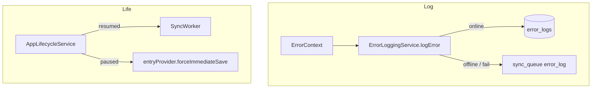

# Feature design doc — Observability & lifecycle

> **Scope:** **Client error telemetry** via **`ErrorLoggingService`** (Supabase **`error_logs`** + offline **`sync_queue`** **`error_log`**), **`ErrorContext`** / **`ErrorSeverity`**, and **app lifecycle** handling in **`AppLifecycleService`** (`WidgetsBindingObserver`): **resume** → sync queue + privacy auto-lock check; **paused/detached** → **force entry save** + auto-lock placeholder. **Cross-cutting** — almost every feature logs through this path.

---

## 0. Document control

| Field | Value |
|-------|--------|
| **Feature name (canonical)** | **Observability & lifecycle** |
| **Short slug** | `observability-lifecycle` |
| **Doc version** | `0.1` |
| **Last updated** | `2026-04-03` |
| **Owner / maintainer** | `[TBD]` |
| **Reviewers (default)** | Anyone changing `ErrorLoggingService.logError` payload / `error_logs` schema, or `AppLifecycleService` lifecycle side effects |
| **Status of this doc** | `Draft` |

---

## 1. Summary

### 1.1 One-line purpose

**Capture structured errors** to the server (or queue them for later) without crashing the app, and run **critical hooks** when the app **resumes** or goes to **background** (sync, draft save, privacy lock).

### 1.2 Elevator pitch

**`ErrorLoggingService.logError`** enriches **`ErrorContext`** with **`userId`**, generated **`sessionId`**, placeholder **screen stack** / **sync status**, merges **`_collectErrorContext`** (timestamp, hard-coded **`app_version` `1.0.0`**, platform, simplified **`device_info`**, stub **`user_actions`**, **`network_status`**: `'unknown'`). If **`connectivity_plus`** reports online, inserts into **`error_logs`**; on failure or offline, **`LocalEntryService.addToSyncQueue`** with **`entityType: 'error_log'`** for **`SyncWorker`**. **Severity** helpers **`logCriticalError` / `logHighError` / `logMediumError` / `logLowError`** delegate to **`logError`** (or legacy parameter path). **Never throws** from the logging path.

**`AppLifecycleService`** registers **`WidgetsBindingObserver`**. **`resumed`:** **`SyncWorker.processSyncQueue()`**, **`privacyLockProvider.notifier.checkAutoLock()`**. **`paused` / `detached`:** **`entryProvider.notifier.forceImmediateSave()`** (if **`ProviderContainer`** available), **`_startAutoLockTimer`** (placeholder). Errors → **ERRSYS022** (force save), **ERRSYS021** (outer catch).

### 1.3 In scope / out of scope

| In scope | Out of scope |
|----------|----------------|
| `error_logging_service.dart`, `app_lifecycle_service.dart`, `models/error_models.dart` | **Crash analytics** (Firebase Crashlytics, etc.) — not integrated here |
| **`error_logs`** insert + **`error_log`** queue | **Dashboards / alerting** — operational |
| Lifecycle: sync + entry flush + privacy hooks | **Exact** iOS/Android background execution limits |

---

## 2. Product & UX

### 2.1 User-facing surfaces

- **None direct** — observability is invisible unless surfaced via snackbars elsewhere.

### 2.2 UX principles & constraints

- Logging **must not** break user flows (**try/catch** swallows internal failures; debug **print** only in **`kDebugMode`**).

### 2.3 Related product docs

- `bc/CHANGE-SYSTEM/feature-list.md` — **Observability & lifecycle**
- **Sync, DB & connectivity** — **`error_log`** queue processing

---

## 3. Technical architecture

### 3.1 Stack & layers

| Layer | Details |
|-------|---------|
| **Logging** | `supabase_flutter` insert, `connectivity_plus` online check |
| **Queue** | `LocalEntryService` → **`sync_queue`** |
| **Lifecycle** | Flutter `WidgetsBindingObserver`, Riverpod **`ProviderContainer`** |

### 3.2 Key modules & file paths

```
lib/services/error_logging_service.dart
lib/services/app_lifecycle_service.dart
lib/models/error_models.dart
lib/main.dart                    # AppLifecycleService startObserving / dispose
lib/services/sync/sync_worker.dart   # drains error_log queue
```

### 3.3 Data model (feature-specific)

#### 3.3.1 `error_logs` (remote)

Payload from **`ErrorContext.toJson()`** plus merged **`error_context`** map:

| Field (JSON key) | Source |
|------------------|--------|
| `error_code`, `error_message`, `stack_trace` | **`ErrorContext`** |
| `error_severity` | String (**CRITICAL** … **LOW**) |
| `created_at` | Timestamp |
| `user_id`, `session_id`, `screen_stack`, `retry_count`, `sync_status` | Optional |
| `error_context` | Nested diagnostics + **`_collectErrorContext`** merge |

#### 3.3.2 `sync_queue` (offline)

- **`entity_type`:** **`error_log`**
- **`operation`:** **`insert`**
- **`data`:** same payload shape as insert

### 3.4 External dependencies

- **Packages:** `supabase_flutter`, `connectivity_plus`, `flutter/foundation.dart`

### 3.5 Platform notes

- **`dart:io` `Platform`** in **`ErrorLoggingService`** — **web** builds may need conditional stubs if this service runs on web.

### 3.6 Functions & methods (code map)

#### 3.6.1 ErrorLoggingService

| Symbol | Role |
|--------|------|
| `logError` | Main path: enrich → merge context → online insert or queue |
| `logCriticalError` / `logHighError` / `logMediumError` / `logLowError` | Severity wrappers + legacy overloads |
| `_logErrorLegacy` | Builds **`ErrorContext`** from string params |
| `_isOnline` | `Connectivity().checkConnectivity()` — any non-**none** → online |
| `_addErrorLogToSyncQueue` | **`entityType: 'error_log'`** |

#### 3.6.2 AppLifecycleService

| Symbol | Role |
|--------|------|
| `startObserving` / `stopObserving` | Add/remove **`WidgetsBindingObserver`** |
| `didChangeAppLifecycleState` | Switch on **`resumed`**, **`paused`**, **`detached`**, etc. |
| `_checkPrivacyLockAutoLock` | **`privacyLockProvider.notifier.checkAutoLock()`** |
| `_startAutoLockTimer` | Placeholder (comment: future timer) |
| `dispose` | **`stopObserving`** |

#### 3.6.3 ErrorContext / ErrorSeverity

| Symbol | Role |
|--------|------|
| `ErrorContext.create` / `fromException` / `copyWith` / `toJson` | Structured logging |
| `ErrorSeverity` | **critical**, **high**, **medium**, **low** |

### 3.7 Variables, constants & configuration keys

| Name | Meaning |
|------|---------|
| Stub **`screen_stack`** | `current_screen: 'Unknown'` — comment: navigation tracking TBD |
| Stub **`sync_status`** | `'unknown'` |
| **`app_version`** in context | Hard-coded **`1.0.0`** in **`_collectErrorContext`** |
| **ERRSYS021** | Uncaught exception in lifecycle handler |
| **ERRSYS022** | Exception during **`forceImmediateSave`** on pause/detach |

### 3.8 Core logic & behaviour

#### 3.8.1 Logging pipeline

1. Caller supplies **`ErrorContext`** (or legacy strings).
2. Fill **`userId`**, **`sessionId`**, screen/sync placeholders.
3. Merge **`_collectErrorContext`** into **`error_context`**.
4. If online → **`error_logs.insert`**; catch → queue. If offline → queue.
5. Queue failures are **swallowed** (never throw).

#### 3.8.2 Lifecycle pipeline

| State | Actions |
|-------|---------|
| **resumed** | **`processSyncQueue`**, **`checkAutoLock`** |
| **paused** / **detached** | **`forceImmediateSave`** (entry), **`_startAutoLockTimer`** |
| **inactive** / **hidden** | No-op in current code |

#### 3.8.3 `ProviderContainer` wiring (**main.dart**)

- **`startObserving(container: _container)`** is invoked from **`_initializeServices`** while **`_container`** is still **null** (it is set later in **`build`** via **`ProviderScope.containerOf`**). As a result, **`_container`** inside **`AppLifecycleService`** may remain **null**, so **`forceImmediateSave`**, **`_checkPrivacyLockAutoLock`**, and **`_startAutoLockTimer`** branches that depend on it **do not run**. **Treat as a known integration gap** until **`startObserving`** is called again with a non-null container or the service reads the container another way.

### 3.9 State management

- **None** for errors — static service.
- Lifecycle uses **`ProviderContainer?`** optional reference.

---

## 4. Boundaries & coupling

### 4.1 Upstream

- **Auth** — **`userId`** for logs when session exists.
- **Sync** — queue processor must handle **`error_log`** inserts server-side.

### 4.2 Downstream

- **All features** that call **`ErrorLoggingService`**.
- **Entry (core)** — **`forceImmediateSave`** on background.
- **Privacy lock** — auto-lock checks.

### 4.3 Shared hotspots

- **`error_code`** taxonomy (e.g. **ERR\***) — grep before adding duplicates.

---

## 5. Change control alignment

### 5.1 Default `primary_feature`

**Observability & lifecycle** for logging transport, schema, or lifecycle behaviour.

### 5.2 Risk class

**Medium** — logging changes can spam DB or drop events; lifecycle changes risk **data loss** if save hooks break.

---

## 6. Operations & quality

### 6.1 Observability (meta)

- Filter Supabase **`error_logs`** by **`error_code`**, **`user_id`**, **`created_at`**.
- Queue depth: inspect **`sync_queue`** for **`entity_type = error_log`**.

### 6.2 Performance

- Full **`_collectErrorContext`** on every log — keep maps small.
- Online check per log — acceptable for error frequency; batching not implemented.

### 6.3 Security & privacy

- **`error_message`** may contain exception text — avoid logging secrets (call-site discipline).

---

## 7. Testing strategy

### 7.1 Manual

1. Airplane mode → trigger **`logHighError`** → row in **`sync_queue`** → online → **`SyncWorker`** pushes **`error_logs`**.
2. Lifecycle: background app with dirty entry → verify save behaviour once **`ProviderContainer`** wiring is fixed.

### 7.2 Regression triggers

- Change **`error_logs`** table → update **`ErrorContext.toJson`** / RLS policies.

---

## 8. Releases & migration

- **`error_logs`** schema migrations must match insert payload.

---

## 9. Documentation & support

| Issue | Note |
|-------|------|
| No logs in dashboard | Check RLS, insert failure, offline queue |
| Lifecycle save never runs | See §3.8.3 **`ProviderContainer`** null issue |

---

## 10. Glossary

| Term | Definition |
|------|------------|
| **ErrorContext** | Canonical struct for one log event |

---

## 11. Open questions & decisions

### 11.1 Open questions

1. Call **`startObserving(container: …)`** after **`ProviderScope`** is available, or inject **`Ref`** via another pattern?
2. Replace stub **screen stack** / **network_status** with real **`navigatorKey`** / **`ConnectivityService`**?
3. Unify **`app_version`** with **`package_info_plus`**.

### 11.2 Decisions

| Date | Decision | Rationale |
|------|----------|-----------|
| `2026-04-03` | Document **`ProviderContainer`** null lifecycle gap | Matches `main.dart` + `AppLifecycleService` code |

---

## 12. Appendix

### 12.1 References

- `lib/services/error_logging_service.dart`
- `lib/services/app_lifecycle_service.dart`
- `lib/models/error_models.dart`
- `bc/CHANGE-SYSTEM/features-docs/sync-DB-&-connectivity.md`
- `bc/CHANGE-SYSTEM/feature-doc-template.md`

### 12.2 Diagram



### 12.3 Changelog of *this* doc

| Version | Date | Notes |
|---------|------|-------|
| `0.1` | `2026-04-03` | Initial |
