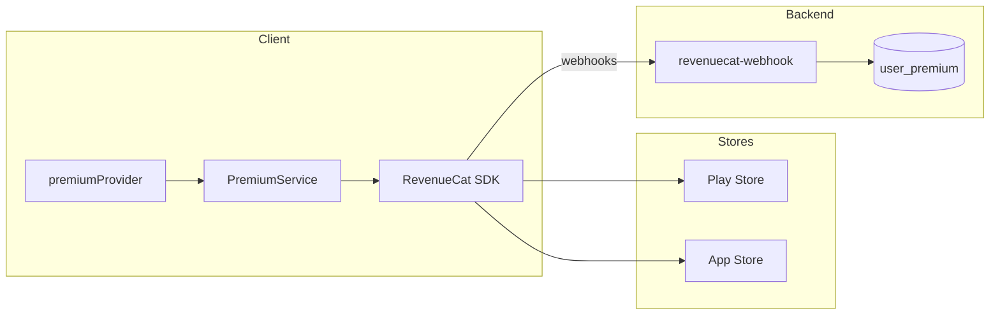

# Feature design doc — Premium & paywall

> **Scope:** **RevenueCat** (`purchases_flutter`) for **entitlement `premium`**, **`PremiumService`** lifecycle, **`premiumProvider`** (client truth for UI), **`PaywallContent`** / **`PremiumScreen`**, and **Supabase Edge** **`revenuecat-webhook`** mirroring subscription state into **`user_premium`** (server-side; **not** read by the Flutter app today). Premium **gates** **Analytics** (weekly/monthly) when online.

---

## 0. Document control

| Field | Value |
|-------|--------|
| **Feature name (canonical)** | **Premium & paywall** |
| **Short slug** | `premium-paywall` |
| **Doc version** | `0.1` |
| **Last updated** | `2026-04-03` |
| **Owner / maintainer** | `[TBD]` |
| **Reviewers (default)** | Anyone changing `PremiumService`, `premiumProvider`, RevenueCat dashboard mapping, or `revenuecat-webhook` + `user_premium` schema |
| **Status of this doc** | `Draft` |

---

## 1. Summary

### 1.1 One-line purpose

Let users **subscribe** via store IAP (RevenueCat), expose **`premium`** entitlement to the app for **feature gating**, and **mirror** subscription events to **Postgres** for backend/analytics use.

### 1.2 Elevator pitch

**`PremiumService.configure()`** runs in **`main()`** after **`.env`** load, using **platform-specific API keys** (`REVENUECAT_ANDROID_KEY` / `REVENUECAT_IOS_KEY` or fallback **`REVENUECAT_API_KEY`**). After Supabase auth, **`PremiumService.logIn(supabaseUserId)`** binds **RevenueCat `app_user_id`** to the same id (required for webhook correlation). **`premiumProvider`** loads **`CustomerInfo`**, resolves **`entitlements.active['premium']`**, and applies **expiry + billing-issue** rules. **`PaywallContent`** loads the **default** offering (or **`offerings.current`** / id **`default`**), lists **`availablePackages`**, and handles **purchase** and **restore**. **`PremiumScreen`** shows either the paywall or **Premium Active** details. **RevenueCat** sends webhooks to **`supabase/functions/revenuecat-webhook`**, which **upserts `user_premium`** with idempotency on **`last_event_id`**.

### 1.3 In scope / out of scope

| In scope | Out of scope |
|----------|----------------|
| `premium_service.dart`, `premium_provider.dart`, `premium_screen.dart`, `paywall_content.dart` | **Store listing** copy, pricing, tax — App Store / Play Console |
| `revenuecat-webhook/index.ts` | **Server features** that consume `user_premium` (none wired in Dart yet) |
| Client-side **isPremium** for UI gates | **Refunds/chargeback** handling beyond RevenueCat events |

---

## 2. Product & UX

### 2.1 User-facing surfaces

- **Profile → Premium** — full **`PremiumScreen`** (paywall or active state).
- **Analytics (weekly/monthly)** — when **online**, non-premium users see **`PaywallContent`** with **`compactBottomGap: true`** (sits above bottom nav).
- **Restore purchases** — on paywall; success refreshes **`premiumProvider`**.

### 2.2 UX principles & constraints

- If **no API key**, **`configure`** no-ops → **premium disabled** (all checks false).
- Empty offerings → **“No plans available at the moment.”**
- **Manage subscription** on active screen → snackbar pointing to **device Settings → Subscriptions** (deep link TODO in code).

### 2.3 Related product docs

- `bc/CHANGE-SYSTEM/feature-list.md` — **Premium & paywall**
- `bc/PAYMENT-FEATURE/` — setup notes (referenced in code comments)

---

## 3. Technical architecture

### 3.1 Stack & layers

| Layer | Details |
|-------|---------|
| **Client** | Flutter, `purchases_flutter`, `flutter_riverpod` |
| **Billing** | RevenueCat → Google Play / App Store |
| **Backend** | Supabase Edge Function + table **`user_premium`** |

### 3.2 Key modules & file paths

```
lib/services/premium_service.dart
lib/providers/premium_provider.dart
lib/screens/premium_screen.dart
lib/widgets/paywall_content.dart
lib/main.dart                          # PremiumService.configure()
lib/providers/auth_provider.dart       # logIn / logOut + invalidate premiumProvider
lib/services/auth_service.dart         # logOut → PremiumService.logOut
lib/screens/splash_screen.dart         # PremiumService.logIn after load
supabase/functions/revenuecat-webhook/index.ts
```

### 3.3 Data model (feature-specific)

| Entity / table | Role |
|----------------|------|
| **RevenueCat `CustomerInfo`** | Runtime source for **`premiumProvider`** |
| **Entitlement id** | **`premium`** (constant `_entitlementId`) |
| **Offering** | **`default`** preferred when **`current`** is null |
| **`user_premium`** (Postgres) | `user_id`, `is_premium`, `premium_expires_at`, `grace_period_expires_at`, `entitlement_id`, `product_id`, `store`, `last_event_id`, `source`, `updated_at` — **written by webhook only** in this repo |

### 3.4 External dependencies

- **Packages:** `purchases_flutter`
- **Services:** RevenueCat SDK, RevenueCat dashboard (products, entitlements, webhook URL + secret)
- **Env / secrets (names only):** `REVENUECAT_ANDROID_KEY`, `REVENUECAT_IOS_KEY`, `REVENUECAT_API_KEY`; Edge: `REVENUECAT_WEBHOOK_SECRET`, `SUPABASE_URL`, `SUPABASE_SERVICE_ROLE_KEY`

### 3.5 Platform notes

- **Android / iOS:** Separate public SDK keys; **`Platform.isAndroid` / `isIOS`** in **`_getApiKey`**.
- **Desktop/web:** Falls back to **`REVENUECAT_API_KEY`**; purchase flows may be unsupported — **`canMakePayments`** guards UI.

### 3.6 Functions & methods (code map)

#### 3.6.1 PremiumService

| Symbol | Role |
|--------|------|
| `configure` | `Purchases.configure`, log level info |
| `logIn` / `logOut` | `Purchases.logIn` / `logOut` |
| `getCustomerInfo` | Cache-backed customer info |
| `isPremium` | Shortcut: active entitlement **`premium`** |
| `getOfferings` / `getCurrentOffering` | Default offering + packages |
| `purchasePackage` | `Purchases.purchasePackage`; cancel → null |
| `restorePurchases` | `Purchases.restorePurchases` |
| `invalidateCache` | After restore |
| `canMakePayments` | Pre-purchase guard |

#### 3.6.2 premiumProvider

| Symbol | Role |
|--------|------|
| `FutureProvider.autoDispose<PremiumState>` | No user → `isPremium: false`; **`ref.keepAlive()`** when user exists |
| **`PremiumState.isPremium`** | See §3.8.2 |
| **`premiumExpiresAt` / `productId`** | From active **`premium`** entitlement |

#### 3.6.3 UI

| Widget | Role |
|--------|------|
| `PremiumScreen` | Switches paywall vs **`_PremiumDetailsContent`** |
| `PaywallContent` | Benefits list, package picker, purchase/restore, responsive layout |

#### 3.6.4 Edge — `revenuecat-webhook`

| Step | Purpose |
|------|---------|
| `Authorization` vs `REVENUECAT_WEBHOOK_SECRET` | Optional but recommended |
| Parse `event.app_user_id`, `event.id`, `event.type`, `entitlement_ids`, `expiration_at_ms` |
| Skip if **user** not in **`users`** |
| Skip duplicate **`last_event_id`** |
| **Grant** types: `INITIAL_PURCHASE`, `RENEWAL`, `PRODUCT_CHANGE`, `TEST` |
| **Revoke** on `EXPIRATION` (note: `CANCELLATION` keeps access until period end per RevenueCat — not mapped as revoke in snippet) |
| **`upsert`** `user_premium` | `onConflict: user_id` |

### 3.7 Variables, constants & configuration keys

| Name | Meaning |
|------|---------|
| `_entitlementId` | **`premium`** |
| `_defaultOfferingId` | **`default`** |
| `ERRPREMIUM001`–`ERRPREMIUM008` | configure, logIn, logOut, isPremium, offerings, purchase, restore, getCustomerInfo |

### 3.8 Core logic & behaviour

#### 3.8.1 Purchase flow

1. User selects **`Package`** from **`Offering.availablePackages`** (defaults to first).
2. **`canMakePayments`** → else error snackbar.
3. **`purchasePackage`** → **`CustomerInfo`**; **`premiumProvider`** invalidated.
4. Cancelled purchase → **null** (no error snackbar from service).

#### 3.8.2 `premiumProvider` **isPremium** rule

From **`entitlements.active['premium']`**:

- If **expiration** string missing or empty → **`isPremium: true`** (treat as active / non-expiring in client logic).
- Else parse **`expirationDate`**:
  - If **after now** → **true**.
  - If **before now** → **true only if** **`billingIssueDetectedAt != null`** (grace / billing retry window per RevenueCat); otherwise **false**.

#### 3.8.3 Webhook **hasPremium** (server)

- **`grantEvents`** includes **`TEST`**; **`TEST`** may have null **`entitlement_ids`** — still premium when event type matches.
- **`EXPIRATION`** clears expiry fields and sets revoke path in handler logic.

#### 3.8.4 Client vs server truth

- **UI gating** uses **RevenueCat SDK** only (`premiumProvider`).
- **`user_premium`** is for **backend** consistency / future use — **no Dart `user_premium` reads** in `lib/` at doc time.

### 3.9 State management

| Provider | Holds |
|----------|--------|
| `premiumProvider` | `PremiumState`: `isPremium`, `customerInfo`, loading implicit in AsyncValue |

---

## 4. Boundaries & coupling

### 4.1 Upstream

- **Authentication** — **`logIn`** / **`logOut`** must align with session; **`splash_screen`** also calls **`logIn`**.
- **`.env`** — keys must match RevenueCat project.

### 4.2 Downstream

- **Analytics (in-app)** — premium required for main weekly/monthly UI when online.
- **Future server features** — may read **`user_premium`**; keep webhook events aligned with client entitlement id **`premium`**.

### 4.3 Shared hotspots

- Changing **entitlement identifier** requires **RevenueCat dashboard**, **Dart `_entitlementId`**, **webhook** `entitlement_ids` checks, and **`PaywallContent`** restore check (`'premium'` string).

---

## 5. Change control alignment

### 5.1 Default `primary_feature`

**Premium & paywall** for any IAP, webhook, or `user_premium` migration.

### 5.2 Risk class

**High** for revenue — test purchases, webhook idempotency, and entitlement rules before release.

---

## 6. Operations & quality

### 6.1 Observability

- **ERRPREMIUM\*** codes in **`PremiumService`**.
- Edge function logs **`RevenueCat webhook error`** on 500.

### 6.2 Security & privacy

- **Webhook:** Protect with **`REVENUECAT_WEBHOOK_SECRET`**; do not expose service role.
- **PII:** RevenueCat links **`app_user_id`** to Supabase UUID — no email in payload by default.

---

## 7. Testing strategy

### 7.1 Manual

1. Sandbox purchase → **`premiumProvider`** true → Analytics unlocked.
2. Restore on fresh install → entitlement restored.
3. Revoke/expiry (sandbox) → UI shows paywall when rules say non-premium.
4. Webhook: send test event → **`user_premium`** row updated, duplicate **`event.id`** skipped.

### 7.2 Regression triggers

- Upgrade **`purchases_flutter`** → run full purchase/restore matrix.

---

## 8. Releases & migration

- **`user_premium`** schema changes → coordinated migration + webhook deploy.
- New **offering** id → update **`getCurrentOffering`** if not using **`current`**.

---

## 9. Documentation & support

| Issue | Note |
|-------|------|
| Premium always false | Check **API keys**, **configure** called, **logIn** after auth |
| Webhook 401 | Match **Authorization** header to secret in RevenueCat |
| `user_premium` empty | **User must exist** in **`users`** before webhook upsert |

---

## 10. Glossary

| Term | Definition |
|------|------------|
| **app_user_id** | RevenueCat customer id — set to **Supabase user id** |
| **Offering / Package** | RevenueCat objects for subscription products |

---

## 11. Open questions & decisions

### 11.1 Open questions

1. Should **server** `user_premium.is_premium` drive any client path (e.g. fraud recovery), or stay SDK-only?
2. Replace hard-coded **`'premium'`** strings with a single const exported from **`premium_service.dart`**.

### 11.2 Decisions

| Date | Decision | Rationale |
|------|----------|-----------|
| `2026-04-03` | Doc reflects SDK-first gating | Matches `lib/` usage |

---

## 12. Appendix

### 12.1 References

- `lib/services/premium_service.dart`
- `lib/providers/premium_provider.dart`
- `supabase/functions/revenuecat-webhook/index.ts`
- `bc/CHANGE-SYSTEM/feature-doc-template.md`

### 12.2 Diagram



### 12.3 Changelog of *this* doc

| Version | Date | Notes |
|---------|------|-------|
| `0.1` | `2026-04-03` | Initial |
