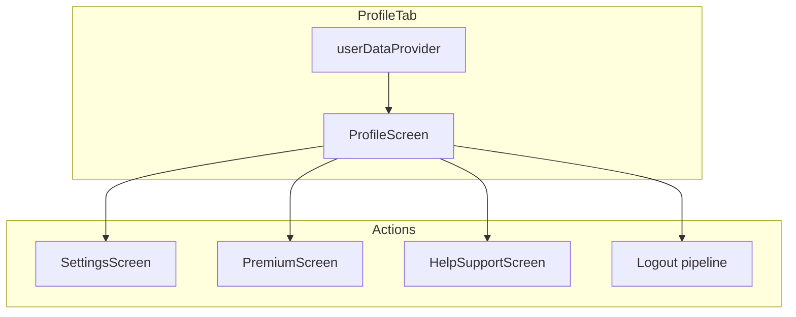

# Feature design doc — Profile & settings

> **Scope:** **Profile** hub (`ProfileScreen`) — identity, stats, premium entry, privacy lock, help, **logout orchestration** — and **Settings** (`SettingsScreen`) — **notifications**, **theme**, **grace system** summary, **legal** links, **delete account** placeholder. Implementation **delegates** to other features (user data, premium, notifications, theme, grace, privacy lock); this doc maps **UI composition** and **navigation** only.

---

## 0. Document control

| Field | Value |
|-------|--------|
| **Feature name (canonical)** | **Profile & settings** |
| **Short slug** | `profile-settings` |
| **Doc version** | `0.1` |
| **Last updated** | `2026-04-03` |
| **Owner / maintainer** | `[TBD]` |
| **Reviewers (default)** | Anyone changing `ProfileScreen` logout sequence, `SettingsScreen` notification save path, or bottom-nav entry for Profile |
| **Status of this doc** | `Draft` |

---

## 1. Summary

### 1.1 One-line purpose

Provide a **profile dashboard** (read-only stats + links) and a **settings** screen to adjust **reminders**, **theme**, and **grace** visibility, with **logout** that clears local data and auth session in a defined order.

### 1.2 Elevator pitch

**`ProfileScreen`** is the **4th tab** (`AppBottomNavigationBar` index **3**). It **`watch`es** **`userDataProvider`** for **`UserData`**: avatar, name, email, stats (entries, streaks, grace days card), and displays **Premium** via **`premiumProvider`** → navigates to **`PremiumScreen`**. **Settings & Actions** push **`SettingsScreen`**, toggle **Privacy Lock** (PIN setup or disable), and open **Help & Support**. **Logout** runs **`UserDataCleanupService.clearUserData`**, **`DataSyncFlagService.clearLastFetchDate`**, clears **`userDataProvider`**, disables **privacy lock**, then **`authControllerProvider.signOut`**, and replaces stack with **`LoginScreen`**. **`SettingsScreen`** loads/saves **`NotificationService`** settings, opens a **theme** dialog bound to **`themeProvider`**, embeds **grace** read-only UI via **`graceSystemProvider`**, and links to **Terms** / **Privacy Policy**.

### 1.3 In scope / out of scope

| In scope | Out of scope |
|----------|----------------|
| `profile_screen.dart`, `settings_screen.dart` | **Account deletion** — button present; implementation **TODO** |
| Layout, navigation, logout **ordering** | **`UserDataCleanupService`** / **`DataFetchService`** internals — **Sync / User data** |
| Wiring to providers listed below | **Premium** purchase flow, **Notification** scheduling math |

---

## 2. Product & UX

### 2.1 User-facing surfaces

- **Profile tab** — stats cards, premium row, personal info, preferences summary, settings link, privacy lock, help, logout, version string **1.0.0**.
- **Settings** (stack push from Profile) — sections **Notifications**, **Appearance** (theme), **Journaling** (grace), **About** (version, terms, privacy), **Delete Account** (destructive style; not implemented).

### 2.2 UX principles & constraints

- Profile shows **loading / error / empty** states for **`userDataProvider`** with **Retry** / **Load Profile**.
- **Privacy Lock** ON → **`PinSetupScreen`**; OFF → **`disablePrivacyLock()`** with failure snackbar.
- **Settings** comment notes **Font Size / Paper Style** were removed from this screen (handled elsewhere if at all).

### 2.3 Related product docs

- `bc/CHANGE-SYSTEM/feature-list.md` — **Profile & settings**
- **User data & preferences**, **Premium & paywall**, **Notifications & alarms**, **Theme & diary UI prefs**, **Privacy, PIN & lock**, **Streaks & grace**, **Support & legal** — delegated behaviour

---

## 3. Technical architecture

### 3.1 Stack & layers

| Layer | Details |
|-------|---------|
| **UI** | Flutter `ConsumerWidget` / `ConsumerStatefulWidget`, **`ResponsiveBody`**, **`ResponsiveTokens`** |
| **State** | Riverpod: **`userDataProvider`**, **`premiumProvider`**, **`graceSystemProvider`**, **`privacyLockProvider`**, **`themeProvider`**, **`authControllerProvider`** |

### 3.2 Key modules & file paths

```
lib/screens/profile_screen.dart
lib/screens/settings_screen.dart
```

**Pulled in (not owned):** `user_data_provider.dart`, `premium_provider.dart`, `grace_system_provider.dart`, `privacy_lock_provider.dart`, `theme_provider.dart`, `auth_provider.dart` / `authControllerProvider`, `notification_service.dart`, `premium_screen.dart`, `settings_screen.dart`, `help_support_screen.dart`, `pin_setup_screen.dart`, `terms_screen.dart`, `privacy_policy_screen.dart`, `user_data_cleanup_service.dart`, `data_sync_flag_service.dart`, `bottom_navigation_bar.dart`.

### 3.3 Data model (feature-specific)

| Concept | Source |
|---------|--------|
| Display name, email, avatar, timezone | **`UserData`** from **`userDataProvider`** |
| Stats | **`userData.stats`** (`entries_count`, streak fields) |
| Theme / language labels in Profile | **`userData.preferences`** map (may not match live **`themeProvider`** — display-only) |
| Reminder UI state | Local **`SettingsScreen`** state synced via **`NotificationService`** |

### 3.4 External dependencies

- None unique — standard Flutter + Riverpod + app services.

### 3.5 Platform notes

- **Logout** uses **`Navigator.pushAndRemoveUntil`** to **`LoginScreen`** — full stack reset.

### 3.6 Functions & methods (code map)

#### 3.6.1 ProfileScreen

| Symbol | Role |
|--------|------|
| `build` | **`graceSystemProvider.notifier.initialize(user.id)`** post-frame when user non-null |
| `_buildProfileContent` | Layout: stats, premium, sections, actions |
| `_buildPremiumSection` | **`premiumProvider`** → tap → **`PremiumScreen`**; **`invalidate(premiumProvider)`** on return |
| `_showLogoutDialog` / `_performLogout` | See §3.8.3 |

#### 3.6.2 SettingsScreen

| Symbol | Role |
|--------|------|
| `_loadNotificationSettings` | **`NotificationService.instance.getNotificationSettings()`** |
| `_saveNotificationSettings` | **`updateNotificationSettings`** with **`NotificationSettings`** |
| `_showThemeDialog` | **`themeProvider.notifier.setThemeMode`** |
| `_buildGraceSystemSection` | **`graceSystemProvider`** + optional **`initialize`** post-frame |
| `_showDeleteAccountDialog` | **TODO** — no backend call |

### 3.7 Variables, constants & configuration keys

| Name | Meaning |
|------|---------|
| Bottom nav **currentIndex: 3** | Profile tab |
| App version display | Hard-coded **1.0.0** in both screens (keep in sync manually or with package_info later) |

### 3.8 Core logic & behaviour

#### 3.8.1 Profile happy path

1. **`userDataProvider`** loads **`UserData`** (elsewhere — splash/home).
2. Render stats from **`stats`** map; grace card from **`graceSystemProvider`**.
3. User taps **Settings** → **`MaterialPageRoute(SettingsScreen)`**.

#### 3.8.2 Settings notification save

- Any toggle/time/day change calls **`_saveNotificationSettings`**, which persists through **`NotificationService.updateNotificationSettings`** (scheduling + **UserPreferenceSyncService** — see Notifications / User data docs).

#### 3.8.3 Logout sequence (`_performLogout`)

1. Blocking **CircularProgressIndicator** dialog.
2. **`userId`** from Supabase **before** sign-out.
3. **`UserDataCleanupService.clearUserData(userId)`** — errors logged **ERRSYS168**, logout continues.
4. **`DataSyncFlagService.clearLastFetchDate()`** — **ERRSYS169** on failure.
5. **`userDataProvider.clearUserData()`**.
6. **`privacyLockProvider.disablePrivacyLock()`**.
7. **`authControllerProvider.signOut()`** (includes **PremiumService.logOut** per auth provider).
8. Dismiss progress, **`pushAndRemoveUntil`** → **`LoginScreen`**.

On top-level failure: still attempts cleanup, logs **ERRAUTH041**, snackbar **Logout failed (ERRAUTH041)**, then navigates to login.

### 3.9 State management

| Provider | Used on Profile | Used on Settings |
|----------|-----------------|------------------|
| `userDataProvider` | Yes | No |
| `premiumProvider` | Yes | No |
| `graceSystemProvider` | Yes | Yes |
| `privacyLockProvider` | Yes | No |
| `themeProvider` | Display only (preferences string) | Yes (dialog) |
| `NotificationService` | No | Yes |

---

## 4. Boundaries & coupling

### 4.1 Upstream

- **Authentication** — session required for meaningful profile data.
- **User data & preferences** — **`userDataProvider`** content shape.

### 4.2 Downstream

- **Premium**, **Help & Support**, **Terms**, **Privacy**, **PIN setup** — navigated from Profile/Settings.
- **Logout** triggers **local DB cleanup** and **sync flags** — affects next login prefetch.

### 4.3 Shared hotspots

- Changing **logout order** affects **privacy**, **SQLite**, and **auth** — test full flow.
- **Version string** duplicated — consider single source (**`package_info_plus`**) in a future change.

---

## 5. Change control alignment

### 5.1 Default `primary_feature`

**Profile & settings** for navigation/layout/logout/delete-account UX; **Authentication** if only **`signOut`** contract changes.

### 5.2 Risk class

**Medium** — logout touches **all local user data**; mistakes cause data leaks or stuck sessions.

---

## 6. Operations & quality

### 6.1 Observability

- **ERRSYS168** — cleanup on logout  
- **ERRSYS169** — `clearLastFetchDate`  
- **ERRAUTH041** — logout exception path  

### 6.2 Security & privacy

- **Privacy Lock** entry point lives on Profile; actual crypto/PIN in **Privacy, PIN & lock** feature.

---

## 7. Testing strategy

### 7.1 Manual critical paths

1. Profile loads → stats match **`userData`**.
2. Settings → change reminder → alarms reschedule (verify in Notifications feature).
3. Logout → local data cleared, login screen, re-login prefetch behaves as designed.
4. Premium row → **PremiumScreen** → return invalidates premium state.

### 7.2 Regression triggers

- Any change to **`authControllerProvider.signOut`** or **`UserDataCleanupService`** → full logout QA.

---

## 8. Releases & migration

- **Delete Account**: when implemented, align with **Supabase** deletion policy and **store** requirements; update this doc.

---

## 9. Documentation & support

| Issue | Note |
|-------|------|
| Theme on Profile doesn’t match app | Profile **preferences** may be stale vs **`themeProvider`** — verify product intent |

---

## 10. Glossary

| Term | Definition |
|------|------------|
| **Settings (screen)** | In-app **Settings** route, not OS Settings |

---

## 11. Open questions & decisions

### 11.1 Open questions

1. Unify **Profile** theme display with **`themeProvider`** / **`user_profiles`**?
2. Implement **Delete Account** end-to-end (Edge Function + local wipe)?

### 11.2 Decisions

| Date | Decision | Rationale |
|------|----------|-----------|
| `2026-04-03` | Doc reflects **Settings** grace section + Profile **grace** card | Both use **`graceSystemProvider`** |

---

## 12. Appendix

### 12.1 References

- `lib/screens/profile_screen.dart`
- `lib/screens/settings_screen.dart`
- `bc/CHANGE-SYSTEM/feature-doc-template.md`

### 12.2 Diagram



### 12.3 Changelog of *this* doc

| Version | Date | Notes |
|---------|------|-------|
| `0.1` | `2026-04-03` | Initial |
