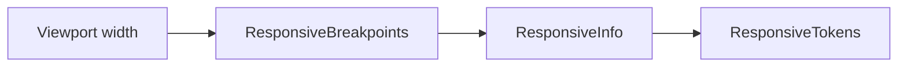

# Feature design doc — Responsive UI kit

> **Scope:** **Width-based breakpoints** (`compact` / `medium` / `expanded`), **`ResponsiveInfo`** (size + breakpoint), **`ResponsiveTokens`** (spacing, padding, max content width, grid/chart sizes), layout helpers (**`ResponsiveBody`**, **`ResponsiveScaffold`**, **`ResponsiveWrapRow`**, **`ResponsiveChartBox`**, **`ResponsiveAppBarActions`**), and **grid delegates** for sliver grids. **Design-system layer** only — no business logic.

---

## 0. Document control

| Field | Value |
|-------|--------|
| **Feature name (canonical)** | **Responsive UI kit** |
| **Short slug** | `responsive-ui-kit` |
| **Doc version** | `0.1` |
| **Last updated** | `2026-04-03` |
| **Owner / maintainer** | `[TBD]` |
| **Reviewers (default)** | Anyone changing `breakpoints.dart` thresholds or `ResponsiveTokens` numeric scale |
| **Status of this doc** | `Draft` |

---

## 1. Summary

### 1.1 One-line purpose

Give screens a **single, consistent way** to adapt padding, spacing, max readable width, and some layouts to **phone vs tablet vs wide** using **logical width** from `MediaQuery` / `LayoutBuilder`.

### 1.2 Elevator pitch

**`ResponsiveBreakpoints`** maps **viewport width** to **`ResponsiveBreakpoint`**: **&lt; 600** → **compact**, **&lt; 900** → **medium**, else **expanded**. **`ResponsiveInfo`** bundles **width**, **height**, and breakpoint, built via **`ResponsiveInfo.of(context)`** or **`ResponsiveInfo.fromConstraints`** (for **`LayoutBuilder`**). **`info.value(compact: …, medium: …, expanded: …)`** picks the right value with fallback **compact → medium → expanded**. **`ResponsiveTokens`** centralizes **spacing (XS–L)**, **screen padding**, **`maxContentWidth`**, **`gridMinTileWidth`**, **`chartHeight`**. **`ResponsiveBody`** centers content, applies **max width** + **padding**, optional **SafeArea**, **SingleChildScrollView**, **Scrollbar**. **`ResponsiveWrapRow`** uses **Wrap** on compact and **Row** on medium/expanded. **`ResponsiveChartBox`** fixes chart height per breakpoint (or **`AspectRatio`**). **`ResponsiveAppBarActions`** swaps **full** vs **compact** action lists.

### 1.3 In scope / out of scope

| In scope | Out of scope |
|----------|----------------|
| `lib/ui/responsive/*.dart` | **Theme** colors/typography — `lib/theme/` |
| Breakpoints + tokens + listed widgets | **Accessibility** overrides (text scale) — not specialized here |
| | **Platform** adaptive (Cupertino) — separate concern |

---

## 2. Product & UX

### 2.1 User-facing surfaces

- **Indirect:** Any screen using **`ResponsiveBody`** / tokens (e.g. **Help & Support**, **Paywall**, **Analytics**, **Profile** patterns).

### 2.2 UX principles & constraints

- **Readable line length:** **`maxContentWidth`** caps centered columns (520 / 720 / 840 dp by breakpoint).
- **Touch targets** are not enforced here — follow Material guidelines in feature UIs.

### 2.3 Related product docs

- `bc/CHANGE-SYSTEM/feature-list.md` — **Responsive UI kit**

---

## 3. Technical architecture

### 3.1 Stack & layers

| Layer | Details |
|-------|---------|
| **Flutter** | `MediaQuery`, `LayoutBuilder`, `Scaffold`, sliver grids |

### 3.2 Key modules & file paths

```
lib/ui/responsive/breakpoints.dart
lib/ui/responsive/responsive_info.dart
lib/ui/responsive/responsive_tokens.dart
lib/ui/responsive/responsive_body.dart
lib/ui/responsive/responsive_grid.dart
lib/ui/responsive/responsive_wrap.dart
lib/ui/responsive/responsive_chart_box.dart
lib/ui/responsive/responsive_app_bar_actions.dart
```

### 3.3 Data model (feature-specific)

| Concept | Value |
|---------|--------|
| **compactMaxWidth** | **600** |
| **mediumMaxWidth** | **900** |
| **maxContentWidth** | **520** / **720** / **840** (compact / medium / expanded) |

### 3.4 External dependencies

- **None** beyond Flutter SDK.

### 3.5 Platform notes

- Breakpoints use **logical pixels** (same as `MediaQuery.sizeOf` width).

### 3.6 Functions & methods (code map)

#### 3.6.1 Breakpoints

| Symbol | Role |
|--------|------|
| `ResponsiveBreakpoints.fromWidth` | Width → enum |
| `ResponsiveBreakpoints.of(context)` | **`MediaQuery.sizeOf`** width |
| `isCompact` / `isMedium` / `isExpanded` | Booleans |

#### 3.6.2 ResponsiveInfo

| Symbol | Role |
|--------|------|
| `ResponsiveInfo.of` | Full screen size + breakpoint |
| `ResponsiveInfo.fromConstraints` | For nested **`LayoutBuilder`** (uses finite **maxWidth** / **maxHeight** or fallback) |
| `value<T>(compact, medium?, expanded?)` | Breakpoint-specific value with fallback chain |

#### 3.6.3 ResponsiveTokens

| Symbol | Typical use |
|--------|-------------|
| `spacingXs` … `spacingL` | 4–8 / 8–12 / 12–20 / 20–32 dp |
| `screenPadding` / `screenPaddingHorizontal` / `screenPaddingVertical` | Page gutters |
| `maxContentWidth` | **`ConstrainedBox`** in **`ResponsiveBody`** |
| `gridMinTileWidth` | **`SliverGridDelegateWithMaxCrossAxisExtent`** |
| `chartHeight` | Default chart vertical size |

#### 3.6.4 Widgets

| Widget | Role |
|--------|------|
| **`ResponsiveBody`** | Align + **maxWidth** + padding + optional scroll/safe area |
| **`ResponsiveScaffold`** | **`Scaffold`** whose body is **`ResponsiveBody`** |
| **`ResponsiveWrapRow`** | **Wrap** if compact, else **Row** |
| **`ResponsiveChartBox`** | **`SizedBox` height** from tokens or **`AspectRatio`** |
| **`ResponsiveAppBarActions`** | Choose **`compactActions`** vs **`regularActions`** |

#### 3.6.5 responsive_grid.dart

| Symbol | Role |
|--------|------|
| `responsiveGridDelegate` | **`SliverGridDelegateWithMaxCrossAxisExtent`** + spacing |
| `responsiveCardCrossAxisCount` | **4** if expanded else **2** |
| `responsiveCardGridDelegate` | **`SliverGridDelegateWithFixedCrossAxisCount`** + aspect ratio per breakpoint |

### 3.7 Variables, constants & configuration keys

- All numbers are **compile-time constants** in source files — no remote config.

### 3.8 Core logic & behaviour

#### 3.8.1 ResponsiveBody layout order

1. **`LayoutBuilder`** → **`ResponsiveInfo.fromConstraints`**
2. **`Align`** → **`ConstrainedBox(maxWidth)`** → **`Padding`**
3. Optionally wrap: **`SingleChildScrollView`** → **`Scrollbar`** → **`SafeArea`** (outermost last in code — **SafeArea** wraps after scroll in implementation)

**Note:** In **`ResponsiveBody.build`**, **`SafeArea`** wraps the outermost widget when enabled, so structure is: **[SafeArea → Scrollbar → ScrollView → content]** when all flags true.

#### 3.8.2 ResponsiveWrapRow

- **compact:** **`Wrap`** with **`spacingS`**-based gaps.
- **medium / expanded:** single **Row** (no wrap) — callers must avoid overflow or use **`Flexible`** children.

### 3.9 State management

- **Stateless** — no Riverpod inside the kit.

---

## 4. Boundaries & coupling

### 4.1 Upstream

- **None** — pure UI utilities.

### 4.2 Downstream

- **All features** that import `lib/ui/responsive/...`.

### 4.3 Shared hotspots

- Changing **600 / 900** thresholds affects **every** `ResponsiveInfo.of` consumer — regression-test **Analytics**, **Paywall**, **Profile**-style layouts.

---

## 5. Change control alignment

### 5.1 Default `primary_feature`

**Responsive UI kit** when changing breakpoints/tokens/widgets in `lib/ui/responsive/`.

### 5.2 Risk class

**Low** for small token tweaks; **medium** if breakpoint boundaries shift (layout reflow across app).

---

## 6. Operations & quality

### 6.1 Performance

- **`LayoutBuilder`** per **`ResponsiveBody`** — normal cost; avoid nesting many **`ResponsiveBody`** unnecessarily.

### 6.2 Testing

- Golden tests per breakpoint optional; manual resize on tablet emulator recommended when touching tokens.

---

## 7. Testing strategy

### 7.1 Manual

1. Rotate / resize window: **compact ↔ medium ↔ expanded** at **600** and **900** widths.
2. **`ResponsiveWrapRow`**: verify **Row** does not overflow on medium with long children.

---

## 8. Releases & migration

- Token changes need **visual QA** only — no DB migrations.

---

## 9. Documentation & support

| Issue | Note |
|-------|------|
| Content too narrow on tablet | Check **`maxContentWidth`** override on **`ResponsiveBody`** |
| Grid wrong columns | **`responsiveCardCrossAxisCount`** is **2** unless **expanded** (**4**) |

---

## 10. Glossary

| Term | Definition |
|------|------------|
| **Breakpoint** | **compact** / **medium** / **expanded** from width rules |

---

## 11. Open questions & decisions

### 11.1 Open questions

1. Consider **`MediaQuery.textScaler`** / **bold text** in token scale for a11y.
2. Should **medium** and **expanded** both use **Row** in **`ResponsiveWrapRow`**, or **Wrap** for medium when children are many?

### 11.2 Decisions

| Date | Decision | Rationale |
|------|----------|-----------|
| `2026-04-03` | Doc matches current numeric constants | From source files |

---

## 12. Appendix

### 12.1 References

- `lib/ui/responsive/`
- `bc/CHANGE-SYSTEM/feature-doc-template.md`

### 12.2 Diagram



### 12.3 Changelog of *this* doc

| Version | Date | Notes |
|---------|------|-------|
| `0.1` | `2026-04-03` | Initial |
