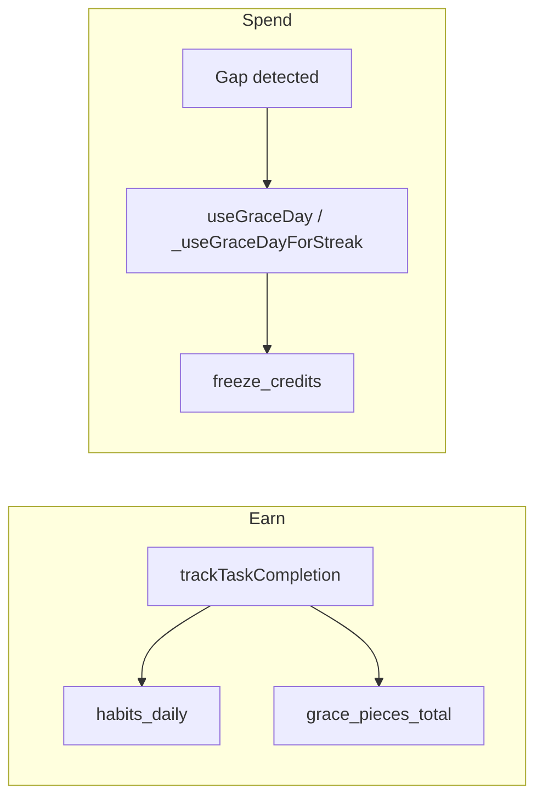

# Feature design doc — Streaks & grace

> **Scope:** **Current / longest streak** stored in local **`streaks`** (synced remotely), **grace pieces** earned from daily **habits** (`habits_daily`), conversion to **grace days** (cap **5**), **automatic streak recalculation** with **gap + grace** rules (`UserDataService.calculateStreakWithGrace` / `recalculateStreak`), Riverpod **`streakProvider`** + **`graceSystemProvider`**, UI **`GraceSystemInfoCard`**, and **motivational copy** (`StreakMotivationService`). Tightly coupled to **Diary entries (core)** batch save (grace tracking + gap check).

---

## 0. Document control

| Field | Value |
|-------|--------|
| **Feature name (canonical)** | **Streaks & grace** |
| **Short slug** | `streaks-grace` |
| **Doc version** | `0.1` |
| **Last updated** | `2026-04-03` |
| **Owner / maintainer** | `[TBD]` |
| **Reviewers (default)** | Anyone changing `GraceSystemService`, `UserDataService.calculateStreakWithGrace` / `recalculateStreak`, `EntryNotifier._checkGapsAndRecalculateStreak`, or `streaks` / `habits_daily` schema |
| **Status of this doc** | `Draft` |

---

## 1. Summary

### 1.1 One-line purpose

Track **journaling streaks** and a **grace economy**: completing daily tasks earns **pieces** toward **grace days** that can **absorb missed days** so the streak does not reset when rules allow.

### 1.2 Elevator pitch

Each day, up to **four** task types (**diary**, **affirmations**, **gratitude**, **self_care**) contribute **0.5 pieces** each (**max 2.0 / day**). **`grace_pieces_total`** in **`streaks`** accumulates (with today’s delta handled against **`today_grace_pieces`** to avoid double-counting). **10 pieces ⇒ 1 grace day**, **display cap 5** grace days (`getGraceStatus`). **`GraceSystemNotifier.trackTaskCompletion`** delegates to **`GraceSystemService.trackTaskCompletion`**, updates **`habits_daily`** + **`streaks`**, enqueues **sync**, may **reschedule notifications**, then refreshes **`streakProvider`** and invalidates **`homeSummaryProvider`**.

After diary batch save, **`UserDataService.recalculateStreak`** (coalesced) runs **`calculateStreakWithGrace`**, and **`_checkGapsAndRecalculateStreak`** may consume **`GraceSystemService.useGraceDay`** when **`last_entry_date`** lags calendar days and enough **`freeze_credits`** exist — else streak **reset** to 0 locally.

**`StreakMotivationService`** picks a **stable-per-day** message from streak-range buckets (hash of streak + date).

### 1.3 In scope / out of scope

| In scope | Out of scope |
|----------|----------------|
| `streak_provider.dart`, `grace_system_provider.dart` | **Premium** gating of grace (unless product adds it later) |
| `grace_system_service.dart`, `streak_motivation_service.dart` | **Notification** scheduling internals — see Notifications feature |
| `UserDataService` streak / grace helpers | **Full sync** of `streaks` row — see Sync feature |
| `grace_system_info_card.dart` | **Settings** “grace system” toggle UI text — parent is Settings/Profile |
| `LocalEntryService.addStreakToSyncQueue` | **Postgres** `streaks` remote schema — `tables_queries` / migrations |

---

## 2. Product & UX

### 2.1 User-facing surfaces

- **Home:** Streak numbers (also from **`homeSummaryProvider`** local read), motivation line, grace snippet on streak card.
- **Profile / Settings:** **`GraceSystemInfoCard`** in dialogs / sections; **`graceSystemProvider`** initialized with user id.
- **Copy:** `StreakMotivationService.getMotivationalMessage(currentStreak)` — varies by **streak band** and **calendar day**.

### 2.2 UX principles & constraints

- **Grace days** shown as **min(floor(pieces/10), 5)** in **`getGraceStatus`** (derived; **`freeze_credits`** is also updated in several paths — see §3.8.4).
- **Progress bar** uses **`pieces_today` / 2.0** → `progress_percentage`.

### 2.3 Related product docs

- `bc/CHANGE-SYSTEM/feature-list.md` — **Streaks & grace**
- **Diary entries (core)** — batch save hooks

---

## 3. Technical architecture

### 3.1 Stack & layers

| Layer | Details |
|-------|---------|
| **Persistence** | SQLite `streaks`, `habits_daily` |
| **Domain** | Piece math, gap detection, streak persistence |
| **State** | `StreakNotifier`, `GraceSystemNotifier` |
| **Sync** | `addStreakToSyncQueue` after streak-changing writes |

### 3.2 Key modules & file paths

```
lib/
  providers/streak_provider.dart
  providers/grace_system_provider.dart
  services/grace_system_service.dart
  services/streak_motivation_service.dart
  services/user_data_service.dart          # calculateStreakWithGrace, recalculateStreak, _useGraceDayForStreak, _persistStreak
  providers/entry_provider.dart              # _batchTrackGraceTasks, _checkGapsAndRecalculateStreak
  widgets/grace_system_info_card.dart
```

### 3.3 Data model (feature-specific)

#### 3.3.1 `streaks` (local — key columns)

| Column | Role |
|--------|------|
| `user_id` | PK |
| `current`, `longest` | Streak counts |
| `last_entry_date` | Last day any habit task counted (ISO date string) — **grace logic** |
| `freeze_credits` | Grace days reservoir (decremented when grace **used**) |
| `grace_pieces_total` | Running total of pieces (with today’s net adjustment in `trackTaskCompletion`) |
| `today_date`, `today_*`, `today_grace_pieces` | Same-day bookkeeping / rollover edge case |

#### 3.3.2 `habits_daily`

Per-day flags: `wrote_entry`, `filled_affirmations`, `filled_gratitude`, `self_care_completed_count`, `grace_pieces_earned`.

### 3.4 External dependencies

- **`uuid`** — new `habits_daily` row id
- **Local notifications** — reschedule after habit updates (ERRSYS159 swallowed to medium log)

### 3.5 Platform notes

Date comparisons use **local** `DateTime` date parts.

### 3.6 Functions & methods (code map)

#### 3.6.1 Grace system

| Symbol | File | Role |
|--------|------|--------|
| `GraceSystemService.getGraceStatus` | `grace_system_service.dart` | Derives `grace_days_available`, `pieces_today`, `progress_percentage`, etc. |
| `GraceSystemService.trackTaskCompletion` | same | Updates `habits_daily`, recomputes **0.5 × tasks**, updates `streaks` totals, **`addStreakToSyncQueue`**, notifications |
| `GraceSystemService.useGraceDay` | same | Decrements grace (used from notifier / legacy paths) |
| `GraceSystemNotifier.trackTaskCompletion` | `grace_system_provider.dart` | Wraps service + refresh + **`streakProvider.refresh`** + **`homeSummaryProvider` invalidate** |
| `GraceSystemNotifier.useGraceDay` | same | Same refresh pattern |

#### 3.6.2 Streak provider

| Symbol | File | Role |
|--------|------|------|
| `StreakNotifier.initialize` | `streak_provider.dart` | Reads `streaks` + `getGraceStatus` into **`StreakState`** |
| `StreakNotifier.recalculate` | same | **`UserDataService.recalculateStreak`** + `refresh` |

#### 3.6.3 UserDataService (streak engine)

| Symbol | File | Role |
|--------|------|------|
| `calculateStreakWithGrace` | `user_data_service.dart` | **Core** streak + grace consumption when user **did not** complete today / gap scenarios |
| `recalculateStreak` | same | **Coalesced** re-entry; early exit if `last_entry_date` is **today or future**; else `calculateStreakWithGrace` |
| `_useGraceDayForStreak` | same | Decrement **`freeze_credits`**, queue sync |
| `_calculateStreakFromTodayHabits` | same | (Called from grace flow — new streak value from habits) |

#### 3.6.4 Entry integration

| Symbol | File | Role |
|--------|------|------|
| `_batchTrackGraceTasks` | `entry_provider.dart` | Maps pending edits → **`graceSystemProvider.trackTaskCompletion`** |
| `_checkGapsAndRecalculateStreak` | same | **`daysDiff`** vs `last_entry_date`; **`useGraceDay`** loops or **reset** `current` |

#### 3.6.5 Copy

| Symbol | File | Role |
|--------|------|--------|
| `StreakMotivationService.getMotivationalMessage` | `streak_motivation_service.dart` | Deterministic daily message from streak range |

### 3.7 Variables, constants & configuration keys

#### 3.7.1 Constants (`GraceSystemService`)

| Name | Value | Meaning |
|------|-------|---------|
| `PIECES_PER_TASK` | `0.5` | Per completed task type |
| `PIECES_PER_DAY` | `2.0` | 4 × 0.5 |
| `PIECES_PER_GRACE_DAY` | `10.0` | Pieces needed per grace day |
| `MAX_GRACE_DAYS` | `5` | Cap on **displayed** grace days from pieces |

#### 3.7.2 Task type strings (`trackTaskCompletion`)

`affirmations`, `gratitude`, `diary`, `self_care`

#### 3.7.3 Error codes (sample)

| Code | Area |
|------|------|
| ERRDATA120–127 | Grace status / tracking / helpers |
| ERRDATA123–126 | Grace notifier |
| ERRSYS119, ERRSYS121, ERRSYS157, ERRSYS159, ERRSYS170 | Streak calc / recalc |
| ERRDATA261 | Batch grace tracking failure (logged, save continues) |
| ERRDATA280 | Gap check failure |
| ERRSYS159 | Notification reschedule after habits |

### 3.8 Core logic & behaviour

#### 3.8.1 Earning pieces

1. Ensure **`habits_daily`** row for date; update boolean/count columns for task.
2. Sum **0.5** for each of the four categories satisfied.
3. Write **`grace_pieces_earned`** on `habits_daily`.
4. Adjust **`grace_pieces_total`** on **`streaks`**: subtract previous **`today_grace_pieces`**, add new today pieces (prevents double-count across edits same day).
5. Set **`freeze_credits`** from **`floor(newTotal / 10)`** clamped to **MAX_GRACE_DAYS** in this update path (see code — aligns “credits” with piece-derived days).

#### 3.8.2 `calculateStreakWithGrace` (simplified)

- If **any** task completed **today** → persist streak from **`_calculateStreakFromTodayHabits`**, **`last_entry_date = today`**.
- If **no** activity today: compare **`last_entry_date`** to **today**; handle **missed 1 day** (yesterday) with grace; **missed multiple days** with multiple grace spends if **`freeze_credits`** sufficient; else **streak → 0**.

#### 3.8.3 `recalculateStreak` coalescing

- **`_recalcInProgress`** / **`_recalcQueued`** prevent thundering herd; queued user gets **`Future.microtask`** retry.

#### 3.8.4 `freeze_credits` vs pieces

- **`getGraceStatus`** computes **`grace_days_available`** from **`grace_pieces_total`**, not from **`freeze_credits`** alone.
- **`useGraceDay`** and **`_useGraceDayForStreak`** decrement **`freeze_credits`**.
- **`trackTaskCompletion`** overwrites **`freeze_credits`** from **piece-derived** grace days — keep changes consistent to avoid drift bugs.

#### 3.8.5 Motivation hash

`hashCode` of `"$streak-$year-$month-$day"` picks index into range list — stable for the day.

### 3.9 State management

| Provider | File | Holds |
|----------|------|--------|
| `streakProvider` | `streak_provider.dart` | `StreakState` — counts + grace fields |
| `graceSystemProvider` | `grace_system_provider.dart` | `GraceSystemState` — UI-oriented grace metrics |

---

## 4. Boundaries & coupling

### 4.1 Upstream

- **`habits_daily`** populated from **entry batch** grace tracking + grace service.
- **Synced `streaks`** row from server (prefetch) merges into local DB.

### 4.2 Downstream

- **Home summary** invalidated when grace/streak refresh.
- **Notifications** may reschedule on habit updates.

### 4.3 Shared hotspots

- **`UserDataService.calculateStreakWithGrace`** — any edit affects all streak displays.
- **`entry_provider`** batch path — primary **automatic** grace + gap handling.

---

## 5. Change control alignment

### 5.1 `primary_feature`

**Streaks & grace** for piece rules, streak math, providers, and info card.

### 5.2 Approver

Match **Streaks & grace**; **Sync, DB & connectivity** if only queue payload changes.

### 5.3 CTASK expectations

- Changing **PIECES_PER_*** or **MAX_GRACE_DAYS** → CTASK + QA matrix (multi-day gaps, same-day edits).
- **DB migration** on `streaks` → CTASK + backfill plan.

### 5.4 Risk class

**High** — gamification + user emotion; math bugs are very visible.

---

## 6. Operations & quality

### 6.1 Feature flags

`grace_system_enabled` exists in **user_settings** (sync) — verify gating in Settings if product disables grace.

### 6.2 Observability

ERRDATA*, ERRSYS* listed above.

### 6.3 Performance

`recalculateStreak` coalescing reduces duplicate work; avoid extra DB round-trips in hot paths.

### 6.4 Security & privacy

Streaks are user-specific metadata; still protect via auth + RLS on server.

---

## 7. Testing strategy

### 7.1 Manual critical paths

1. Complete 0→4 tasks → pieces 0→2, progress 100%.
2. Miss one day with 1+ grace → streak preserved; **`freeze_credits`** / totals consistent.
3. Miss more days than grace → streak resets path in **`_checkGapsAndRecalculateStreak`**.
4. Same-day multiple edits → pieces don’t double-count (`today_grace_pieces` logic).
5. **`StreakNotifier.recalculate`** after data changes updates UI.

### 7.2 Automated

| Type | Location |
|------|----------|
| Unit | `[TBD]` — piece sum, `getGraceStatus` clamp, motivation range |

### 7.3 Regression triggers

Touch **`calculateStreakWithGrace`** or **`trackTaskCompletion`** → full streak + grace manual suite.

---

## 8. Releases & migration

### 8.1 User-visible

Note changes to **piece rates**, **grace cap**, or **task types**.

### 8.2 Data migrations

Align `streaks` / `habits_daily` columns with services.

---

## 9. Documentation & support

### 9.1 User-facing

`GraceSystemInfoCard` explains grace days; motivation strings in **`StreakMotivationService`**.

### 9.2 FAQ

| Issue | Note |
|-------|------|
| Grace days don’t match pieces | Check **`freeze_credits`** vs piece-derived display — see §3.8.4 |

---

## 10. Glossary

| Term | Definition |
|------|------------|
| **Grace piece** | 0.5 per qualifying daily task, max 2/day |
| **Grace day** | 10 pieces → 1 day of streak protection (cap 5 displayed) |

---

## 11. Open questions & decisions

### 11.1 Open questions

1. Single source of truth: **`freeze_credits`** vs **`grace_pieces_total`** for “days available” — consolidate?
2. Should **`self_care`** in grace tracking align exactly with **`EntryNotifier`** pending meals vs **`EntrySelfCare`** toggles (duplicate track paths)?

### 11.2 Decisions

| Date | Decision | Rationale |
|------|----------|-----------|
| `2026-04-03` | Initial doc from code | Captures services + entry batch integration |

---

## 12. Appendix

### 12.1 References

- `lib/services/grace_system_service.dart`
- `lib/services/user_data_service.dart` (streak sections)
- `lib/providers/entry_provider.dart` (grace + gap)
- `bc/CHANGE-SYSTEM/feature-doc-template.md`

### 12.2 Diagram (earn → spend)



### 12.3 Changelog of *this* doc

| Version | Date | Notes |
|---------|------|-------|
| `0.1` | `2026-04-03` | Initial |
