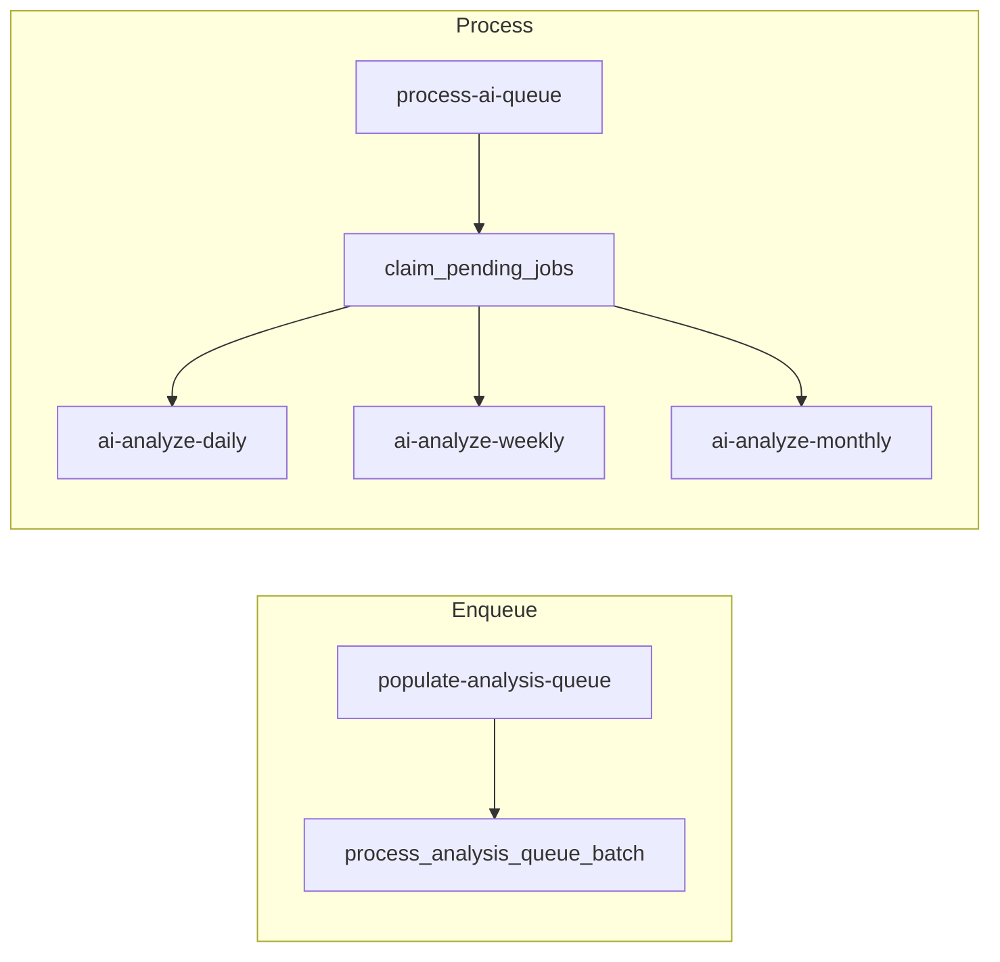

# Feature design doc — Supabase AI & queue

> **Scope:** **Supabase Edge Functions** for **OpenAI-backed** daily / weekly / monthly analysis, **`analysis_queue` job orchestration** (`process-ai-queue`, `populate-analysis-queue`), **Postgres RPCs** (`process_analysis_queue_batch`, `claim_pending_jobs`), shared **`ai_error_logger`** → **`ai_errors_log`**, and **AI-related migrations** (e.g. `007_super_logic_optimization.sql`). **Client Flutter code** is covered under **AI insights (client)** / **Analytics (in-app)**. **`revenuecat-webhook`** lives under `supabase/functions/` but belongs to **Premium & paywall** — not this feature.

---

## 0. Document control

| Field | Value |
|-------|--------|
| **Feature name (canonical)** | **Supabase AI & queue** |
| **Short slug** | `supabase-ai-queue` |
| **Doc version** | `0.1` |
| **Last updated** | `2026-04-03` |
| **Owner / maintainer** | `[TBD]` |
| **Reviewers (default)** | Anyone changing Edge functions in `ai-analyze-*`, `process-ai-queue`, `populate-analysis-queue`, `_shared/ai_error_logger.ts`, or RPCs touching `analysis_queue` |
| **Status of this doc** | `Draft` |

---

## 1. Summary

### 1.1 One-line purpose

**Enqueue** eligible analysis work into **`analysis_queue`**, **claim** jobs atomically, **invoke** the correct **Deno Edge function** per type (**daily / weekly / monthly**), **persist** results to **`entry_insights`**, **`weekly_insights`**, **`monthly_insights`**, and **log failures** to **`ai_errors_log`**.

### 1.2 Elevator pitch

**`populate-analysis-queue`** calls Postgres **`process_analysis_queue_batch()`**, which **inserts** new rows into **`analysis_queue`** (daily / weekly / monthly) with **eligibility timing** (documented in migration comments — e.g. **process_after** semantics tied to **`next_retry_at`** / user timezone for daily). **`process-ai-queue`** uses **`claim_pending_jobs(p_batch_size)`** (default batch **20**), loads **user timezones** from **`users`**, then **`supabase.functions.invoke`**s **`ai-analyze-daily`**, **`ai-analyze-weekly`**, or **`ai-analyze-monthly`** with the job payload. Successful runs mark jobs **`completed`**; transient failures increment **`attempts`** and return to **`pending`** until **`max_attempts`** (default **3**), then **`failed`**. **Self-healing** resets jobs stuck in **`processing`** > **10 minutes**. **Recursive** self-invoke of **`process-ai-queue`** drains remaining eligible work (depth cap **50** batches).

### 1.3 In scope / out of scope

| In scope | Out of scope |
|----------|----------------|
| `supabase/functions/ai-analyze-daily`, `ai-analyze-weekly`, `ai-analyze-monthly` | **Prompt engineering** detail — treat as implementation inside each `index.ts` |
| `supabase/functions/process-ai-queue`, `populate-analysis-queue` | **Flutter** `AIService` — **AI insights (client)** |
| `supabase/functions/_shared/ai_error_logger.ts` | **RevenueCat** webhook — `revenuecat-webhook/` |
| `supabase/migrations/*` AI/queue RPCs (e.g. **007**) | **Non-AI** tables unless touched by same migration |

---

## 2. Product & UX

### 2.1 User-facing surfaces

**Indirect:** Users see generated copy in **Home yesterday card**, **Analytics**, **History** — all **downstream** of successful **`entry_insights` / `weekly_insights` / `monthly_insights`** rows (`status = success`).

### 2.2 UX principles & constraints

- **Daily** analysis requires **complete entry** per **`check_entry_completion`** RPC and **minimum diary length** (e.g. **50** chars in **`ai-analyze-daily`**).
- **Idempotency:** If an insight row already exists with **`status = success`**, analyzers **short-circuit** with success message.

### 2.3 Related product docs

- `bc/CHANGE-SYSTEM/feature-list.md` — **Supabase AI & queue**
- `bc/Project3/tables_queries.md` — **`analysis_queue`**, **`ai_errors_log`**, **`entry_insights`**

---

## 3. Technical architecture

### 3.1 Stack & layers

| Layer | Details |
|-------|---------|
| **Runtime** | Deno (Supabase Edge Functions) |
| **Data** | Postgres + Supabase JS client (**service role** in functions) |
| **LLM** | OpenAI API (`OPENAI_API_KEY` env) |
| **Orchestration** | `analysis_queue` + RPCs + `functions.invoke` |

### 3.2 Key modules & file paths

```
supabase/functions/
  ai-analyze-daily/index.ts
  ai-analyze-weekly/index.ts
  ai-analyze-monthly/index.ts
  process-ai-queue/index.ts
  populate-analysis-queue/index.ts
  _shared/ai_error_logger.ts
supabase/migrations/
  007_super_logic_optimization.sql   # process_analysis_queue_batch, claim_pending_jobs, indexes
  (other migrations may touch AI tables)
```

### 3.3 Data model (feature-specific)

#### 3.3.1 `analysis_queue` (from `tables_queries.md`)

| Column | Role |
|--------|------|
| `analysis_type` | `daily` \| `weekly` \| `monthly` |
| `target_date` | Anchor date |
| `entry_id` | Daily jobs |
| `week_start` / `month_start` | Weekly / monthly jobs |
| `status` | `pending` \| `processing` \| `completed` \| `failed` |
| `attempts` / `max_attempts` | Retry control |
| `next_retry_at` | Eligibility / process-after (see migrations) |

#### 3.3.2 Output tables (written by analyzers)

- **`entry_insights`** — daily
- **`weekly_insights`** — weekly
- **`monthly_insights`** — monthly

#### 3.3.3 `ai_errors_log`

Inserted by **`logAIError`** with **`error_code`**, **`edge_function_name`**, **`failed_at_step`**, severity inference, etc.

### 3.4 External dependencies

- **Env (Edge):** `SUPABASE_URL`, `SUPABASE_SERVICE_ROLE_KEY`, **`OPENAI_API_KEY`**
- **Optional:** `ENVIRONMENT` / `DENO_ENV` for logging context

### 3.5 Platform notes

- **Timeouts:** Batch size **20** chosen vs Edge **400s** limit; recursion capped.
- **CORS:** `*` on these functions (standard Supabase pattern).

### 3.6 Functions & methods (code map)

#### 3.6.1 Edge Functions — orchestration

| Function | Role |
|----------|------|
| **`populate-analysis-queue`** | `supabase.rpc('process_analysis_queue_batch')` — returns counts of jobs created |
| **`process-ai-queue`** | `claim_pending_jobs` → loop → `invoke` analyzer → update `analysis_queue` → optional self-invoke |

#### 3.6.2 Edge Functions — analyzers

| Function | Input body | Key behaviour |
|----------|------------|----------------|
| **`ai-analyze-daily`** | `entry_id`, `user_id` | Skip if insight exists; load entry + sections; **`check_entry_completion`**; min text length; OpenAI; upsert **`entry_insights`** |
| **`ai-analyze-weekly`** | `user_id`, `week_start` (YYYY-MM-DD) | Skip if **`weekly_insights`** exists; aggregate week entries; OpenAI; write **`weekly_insights`** |
| **`ai-analyze-monthly`** | `user_id`, `month_start` | Skip if **`monthly_insights`** exists; aggregate month; OpenAI; write **`monthly_insights`** |

#### 3.6.3 Shared

| Symbol | File | Role |
|--------|------|------|
| `logAIError` | `_shared/ai_error_logger.ts` | Insert **`ai_errors_log`**; classify error type / severity |

#### 3.6.4 Postgres RPCs (see migrations)

| RPC | Role |
|-----|------|
| **`process_analysis_queue_batch`** | Create queue jobs from entries / weekly / monthly windows per super-logic |
| **`claim_pending_jobs(p_batch_size)`** | Atomic claim → **`processing`** |

### 3.7 Variables, constants & configuration keys

#### 3.7.1 `process-ai-queue` constants

| Name | Value | Meaning |
|------|-------|---------|
| `BATCH_SIZE` | `20` | Jobs per invocation |
| `MAX_RECURSION_DEPTH` | `50` | Max self-invoke batches |
| `ACTIVE_PROCESSING_THRESHOLD` | `30` | Skip cron if too many **`processing`** (recent) |
| Stuck threshold | **10 min** | Reset **`processing`** → **`pending`** |

#### 3.7.2 Error codes (representative)

| Code | Source |
|------|--------|
| ERRQUEUE_POPULATE_001–003 | `populate-analysis-queue` |
| ERRQUEUE_PROCESS_002–004 | `process-ai-queue` |
| (Per-function codes) | Inside `ai-analyze-*` via `logAIError` |

### 3.8 Core logic & behaviour

#### 3.8.1 Job processing flow

1. **Claim** eligible pending jobs (DB filters **`next_retry_at`** / process-after vs `NOW()`).
2. For each job, **`invoke`** matching analyzer with **`service role`**.
3. If response **`success !== false`** → **`completed`** (or **skipped** for validation-style messages).
4. Else → increment attempts; **`pending`** retry or **`failed`** at max.

#### 3.8.2 Validation “skip” path

Messages containing **incomplete**, **already exists**, **too short** → job marked **`completed`** with **`error_message`** to **avoid infinite retries**.

#### 3.8.3 Recursive drain

If **`processed > 0 || failed > 0`** and pending eligible work remains → **`process-ai-queue`** invoked with **`recursive: true`**, **`batch_number + 1`**.

#### 3.8.4 Edge cases

| Scenario | Behaviour |
|----------|-----------|
| User timezone fetch fails | Claimed jobs reset to **`pending`**, error logged |
| Max recursion | Returns success with `processed: 0` message |

### 3.9 State management

N/A (server-side). **Cron** triggers are typically configured in **Supabase Dashboard** (not committed in repo `config.toml` except **revenuecat-webhook** JWT rule).

---

## 4. Boundaries & coupling

### 4.1 Upstream

- **`entries`** and related `entry_*` tables must exist for daily context.
- **`users.timezone`** used when processing jobs (for analyzers / queue logic per migration).

### 4.2 Downstream

- **Client** reads only **`success`** rows.
- **Analytics** reads **`weekly_insights` / `monthly_insights`**.

### 4.3 Shared hotspots

- **`process_analysis_queue_batch`** — any change affects **when** jobs appear.
- **`claim_pending_jobs`** — race-safety critical.

---

## 5. Change control alignment

### 5.1 `primary_feature`

**Supabase AI & queue** for Edge + Postgres queue pipeline; **AI / insights (client)** only if adjusting **read** contracts.

### 5.2 Approver

Match **Supabase AI & queue**; involve **DB** reviewer for RPC/migration changes.

### 5.3 CTASK expectations

- **OpenAI model / prompt / schema** change → CTASK + **QA** on sample weeks/months.
- **RPC** change → migration CTASK + **rollback** plan.

### 5.4 Risk class

**High** — cost (OpenAI), user trust (insights), queue backlog if misconfigured.

---

## 6. Operations & quality

### 6.1 Feature flags

None in repo; use Supabase **secrets** and Dashboard schedules.

### 6.2 Observability

- **`ai_errors_log`** rows from **`logAIError`**
- Console logs prefixed **`[PROCESS]`**, **`[QUEUE]`** in Edge functions

### 6.3 Performance & limits

- Batch size + recursion prevent single-invocation overload.
- Monitor **`analysis_queue`** depth and **`failed`** rate.

### 6.4 Security & privacy

- **Service role** in Edge — never expose to client.
- Diary text sent to **OpenAI** — covered by privacy policy / DPA.

---

## 7. Testing strategy

### 7.1 Manual / staging

1. Insert synthetic **`entries`** → run **`populate-analysis-queue`** → verify **`analysis_queue`** rows.
2. Run **`process-ai-queue`** → confirm **`entry_insights`** / weekly / monthly rows and job **`completed`**.
3. Force analyzer failure → **`attempts`** increments → eventual **`failed`**.
4. Verify **`check_entry_completion`** rejects incomplete entries.

### 7.2 Automated

| Type | Location |
|------|----------|
| Integration | `[TBD]` — Deno tests against local Supabase |

### 7.3 Regression triggers

Touch **`claim_pending_jobs`** or **`process-ai-queue`** loop → full queue dry-run in staging.

---

## 8. Releases & migration

### 8.1 Deploy order

1. **Migrations** (RPCs, indexes).
2. **Secrets** (`OPENAI_API_KEY`).
3. **Edge functions** deploy.
4. **Cron** schedules for `populate-*` and `process-*`.

### 8.2 Rollback

Revert function deployment; DB rollback only with migration down plan.

---

## 9. Documentation & support

### 9.1 Runbooks

- **Queue stuck:** Check **`processing`** > 10m reset path; **`failed`** jobs in **`analysis_queue`**; **`ai_errors_log`**.
- **Costs spike:** Review OpenAI usage + batch sizes.

### 9.2 FAQ

| Issue | Note |
|-------|------|
| No insights in app | Check **`status`** in output tables and **`ai_errors_log`** |

---

## 10. Glossary

| Term | Definition |
|------|------------|
| **Super logic** | Migration comment naming for **`process_after`** / eligibility in **`007_*`** |
| **Claim** | Atomic move **`pending` → `processing`** for a batch |

---

## 11. Open questions & decisions

### 11.1 Open questions

1. Document **exact cron** schedules (Dashboard) in internal wiki?
2. Should **`process-ai-queue`** JWT verification be tightened (currently service/cron pattern)?

### 11.2 Decisions

| Date | Decision | Rationale |
|------|----------|-----------|
| `2026-04-03` | Initial doc from Edge + migration 007 | Baseline architecture |

---

## 12. Appendix

### 12.1 References

- `supabase/functions/process-ai-queue/index.ts`
- `supabase/functions/populate-analysis-queue/index.ts`
- `supabase/functions/ai-analyze-daily/index.ts` (entry completion + OpenAI)
- `supabase/migrations/007_super_logic_optimization.sql`
- `bc/Project3/tables_queries.md` — `analysis_queue`, `ai_errors_log`
- `bc/CHANGE-SYSTEM/feature-doc-template.md`

### 12.2 Diagram (queue pipeline)



### 12.3 Changelog of *this* doc

| Version | Date | Notes |
|---------|------|-------|
| `0.1` | `2026-04-03` | Initial |
