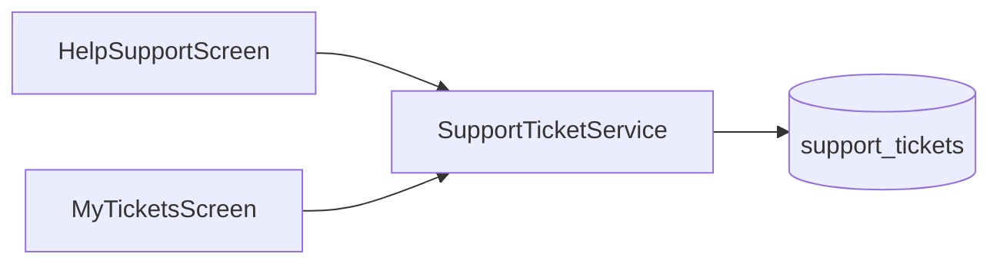

# Feature design doc — Support & legal

> **Scope:** **In-app support tickets** (Supabase **`support_tickets`** via **`SupportTicketService`**), **Help & Support** form UI (**`HelpSupportScreen`**), **My Tickets** history (**`MyTicketsScreen`**), and **static legal copy** in **`TermsScreen`** / **`PrivacyPolicyScreen`**. No third-party helpdesk SaaS — tickets are rows in Postgres with RLS expected on the server.

---

## 0. Document control

| Field | Value |
|-------|--------|
| **Feature name (canonical)** | **Support & legal** |
| **Short slug** | `support-legal` |
| **Doc version** | `0.1` |
| **Last updated** | `2026-04-03` |
| **Owner / maintainer** | `[TBD]` |
| **Reviewers (default)** | Anyone changing `support_tickets` schema, `SupportTicketService` insert/select, or legal screen copy |
| **Status of this doc** | `Draft` |

---

## 1. Summary

### 1.1 One-line purpose

Let signed-in users **submit support tickets** with category, subject, and message (stored in **Supabase** with device metadata), **list their past tickets**, and read **Terms of Service** and **Privacy Policy** text shipped in the app.

### 1.2 Elevator pitch

**`HelpSupportScreen`** hosts a **form**: category (**bug**, **feature**, **question**, **feedback**, **other**), subject, message, validation, and **`SupportTicketService.submitTicket`**. On success, an **AlertDialog** shows the **`ticket_number`** (from DB trigger) and **OK** pops the dialog **and** the screen (returns to Profile). The app bar **history** icon opens **`MyTicketsScreen`**, which calls **`getUserTickets`** and lists tickets with a **draggable bottom sheet** for details. **Terms** and **Privacy** are **long-form static** `Column` content in dedicated screens (**effective date** shown as October 30, 2025 in current copy). **`SupportTicket`** / **`TicketStatus`** live in **`utility_models.dart`**.

### 1.3 In scope / out of scope

| In scope | Out of scope |
|----------|----------------|
| `support_ticket_service.dart`, `help_support_screen.dart`, `my_tickets_screen.dart`, `terms_screen.dart`, `privacy_policy_screen.dart` | **Admin / CRM** UI for staff replying to tickets |
| `SupportTicket` model | **Email** delivery to support team — requires separate automation unless trigger/webhook exists server-side |
| Client insert + list for **own** `user_id` | **Legal review** sign-off — product/compliance process |

---

## 2. Product & UX

### 2.1 User-facing surfaces

- **Profile → Help & Support** — form + link to **My Tickets** (app bar).
- **Settings → About** — **Terms of Service**, **Privacy Policy** (`MaterialPageRoute`).
- **Success copy** — “We will respond within **24–48 hours**” (dialog).

### 2.2 UX principles & constraints

- **Auth required** — unauthenticated submit returns error from service; screen assumes logged-in use from Profile.
- **Subject** max **100** chars, **message** max **2000** chars (enforced in service + form validators on screen).
- **App version** sent as hard-coded **`1.0.0`** in **`SupportTicketService`** (should stay aligned with release discipline or **`package_info`** later).

### 2.3 Related product docs

- `bc/CHANGE-SYSTEM/feature-list.md` — **Support & legal**
- `bc/Project3/tables_queries.md` — **`support_tickets`** (if listed)

---

## 3. Technical architecture

### 3.1 Stack & layers

| Layer | Details |
|-------|---------|
| **Client** | Flutter, **`supabase_flutter`** |
| **Backend** | Supabase table **`support_tickets`** |
| **Legal** | In-widget strings (no remote CMS) |

### 3.2 Key modules & file paths

```
lib/services/support_ticket_service.dart
lib/screens/help_support_screen.dart
lib/screens/my_tickets_screen.dart
lib/screens/terms_screen.dart
lib/screens/privacy_policy_screen.dart
lib/models/utility_models.dart    # SupportTicket, TicketStatus
```

### 3.3 Data model (feature-specific)

| Column / field | Role |
|----------------|------|
| `user_id` | Current Supabase auth user |
| `category` | `bug` \| `feature` \| `question` \| `feedback` \| `other` |
| `subject`, `message` | User text |
| `email` | From `auth.user.email` |
| `app_version` | Sent as `1.0.0` |
| `device_info` | JSON: `platform`, `version` (OS), `is_debug` |
| `status` | Insert **`open`** |
| `ticket_number` | **Not** set by client — **DB trigger** generates (per code comment) |

### 3.4 External dependencies

- **Supabase** — PostgREST insert/select on **`support_tickets`**

### 3.5 Platform notes

- **`dart:io` `Platform`** used for device info — **web** build may need conditional imports if this screen is ever enabled on web (not addressed in current service).

### 3.6 Functions & methods (code map)

#### 3.6.1 SupportTicketService

| Symbol | Role |
|--------|------|
| `submitTicket` | Validates → insert → `.select(...).single()` → **`SupportTicket`** |
| `getUserTickets` | `.from('support_tickets').select('*').eq('user_id', user.id).order('created_at', desc)` |

#### 3.6.2 Screens

| Symbol | File | Role |
|--------|------|------|
| `HelpSupportScreen` | `help_support_screen.dart` | Form, submit, success dialog (**double pop** on OK) |
| `MyTicketsScreen` | `my_tickets_screen.dart` | List + **`_showTicketDetails`** bottom sheet |
| `TermsScreen` | `terms_screen.dart` | Static sections (`_Section` widget) |
| `PrivacyPolicyScreen` | `privacy_policy_screen.dart` | Static sections + bullets |

### 3.7 Variables, constants & configuration keys

| Name | Meaning |
|------|---------|
| Category **values** | Must match DB check constraint if any — keep in sync with **`_categories`** in Help screen |
| **ERRSYS122** | `submit_ticket` failure |
| **ERRSYS123** | `fetch_user_tickets` failure |
| **ERRSYS124** | `HelpSupportScreen` submit exception |
| **ERRSYS125** | `MyTicketsScreen` load exception |

### 3.8 Core logic & behaviour

#### 3.8.1 Submit (happy path)

1. User selects category, fills subject/message.
2. **`submitTicket`** inserts row; **`ticket_number`** returned in select.
3. Dialog shows number; user taps **OK** → **`Navigator.pop` ×2** (closes dialog and Help screen).

#### 3.8.2 My Tickets

- Loads on **`initState`**; pull-to-refresh / retry patterns — verify in file if present (primary path is initial load).
- Detail UI shows **Open** vs **Closed** badge from **`TicketStatus`**.

#### 3.8.3 Legal screens

- **Immutable** copy in Dart until edited and released in a new app version.
- **Effective** date string at top — update when policy changes.

### 3.9 State management

- **StatefulWidget** local state for form and ticket list — **no** dedicated Riverpod provider for tickets.

---

## 4. Boundaries & coupling

### 4.1 Upstream

- **Authentication** — must have **`currentUser`** for submit/list.

### 4.2 Downstream

- **Support ops** — depends on **Supabase** access or export to pick up **`support_tickets`** rows.
- **Profile & settings** — navigation entry points only.

### 4.3 Shared hotspots

- **`utility_models.SupportTicket`** — shared type; changes affect parsing from **`getUserTickets`**.

---

## 5. Change control alignment

### 5.1 Default `primary_feature`

**Support & legal** for tickets table, service, or legal text; **Observability** only if changing error codes globally.

### 5.2 Risk class

**Low–medium** — legal text is user-facing and may have **regulatory** implications; schema mistakes can block inserts.

---

## 6. Operations & quality

### 6.1 Observability

- Failed operations log **ERRSYS122–125** with context.

### 6.2 Security & privacy

- **RLS** should restrict **`support_tickets`** so users **only** read/insert own rows (verify in Supabase).
- **Diagnostics** in **`device_info`** exclude diary content by design.

---

## 7. Testing strategy

### 7.1 Manual

1. Submit ticket → row in Supabase, **`ticket_number`** non-null.
2. My Tickets → same user sees ticket; another user does not (RLS).
3. Subject > 100 / message > 2000 → validation error.
4. Offline submit → user-visible failure + log.

### 7.2 Regression triggers

- **`support_tickets`** migration → retest insert/select field names.

---

## 8. Releases & migration

- **Legal updates** require app release (unless moved to remote WebView later).
- **Ticket schema** changes → update **`SupportTicket.fromJson`** and insert map.

---

## 9. Documentation & support

| Issue | Note |
|-------|------|
| Ticket never answered | Operational — outside app code |
| Wrong effective date | Edit **`terms_screen.dart`** / **`privacy_policy_screen.dart`** |

---

## 10. Glossary

| Term | Definition |
|------|------------|
| **ticket_number** | Human-readable id from database (trigger) |

---

## 11. Open questions & decisions

### 11.1 Open questions

1. Replace hard-coded **`appVersion`** with **`package_info_plus`**?
2. **Success dialog double `pop`** — intentional return to Profile; confirm no navigator edge cases with nested routes.

### 11.2 Decisions

| Date | Decision | Rationale |
|------|----------|-----------|
| `2026-04-03` | Doc reflects static legal screens | Matches `terms_screen.dart` / `privacy_policy_screen.dart` |

---

## 12. Appendix

### 12.1 References

- `lib/services/support_ticket_service.dart`
- `lib/screens/help_support_screen.dart`
- `lib/screens/my_tickets_screen.dart`
- `bc/CHANGE-SYSTEM/feature-doc-template.md`

### 12.2 Diagram



### 12.3 Changelog of *this* doc

| Version | Date | Notes |
|---------|------|-------|
| `0.1` | `2026-04-03` | Initial |
