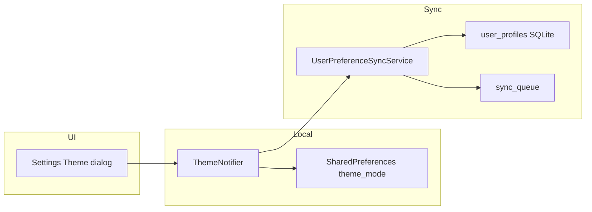

# Feature design doc — Theme & diary UI prefs

> **Scope:** **Light / dark / system** theme via `MaterialApp`, **InnerGlow-style** `ThemeData` (`AppTheme`), **SharedPreferences** for local choice, **best-effort cloud sync** of appearance into **`user_profiles`** (local SQLite + sync queue). **Font size** and **paper style** enums + Riverpod notifiers + the same sync path exist; **Settings UI currently exposes only Theme** (font/paper controls were removed from Settings but providers remain for future or indirect use).  
> **Canonical name** (feature list): **Theme & diary UI prefs** — sub-areas: **Theme**, **Diary font** (sync field only until UI wired), **Font size**, **Paper style**.

---

## 0. Document control

| Field | Value |
|-------|--------|
| **Feature name (canonical)** | **Theme & diary UI prefs** |
| **Short slug** | `theme-diary-ui-prefs` |
| **Doc version** | `0.1` |
| **Last updated** | `2026-04-03` |
| **Owner / maintainer** | `[TBD]` |
| **Reviewers (default)** | Anyone changing `AppTheme`, `theme_provider`, `UserPreferenceSyncService.syncAppearanceToCloud`, or Profile/Settings appearance copy |
| **Status of this doc** | `Draft` |

---

## 1. Summary

### 1.1 One-line purpose

Drive **app-wide theme** (`ThemeMode`) from Riverpod + persisted strings, apply **`AppTheme.lightTheme` / `AppTheme.darkTheme`** in `MaterialApp`, and keep **diary-related appearance** (font size, paper style, optional diary font) **consistent locally** with optional **sync to `user_profiles`**.

### 1.2 Elevator pitch

Users open **Settings → Appearance → Theme** and pick **Light**, **Dark**, or **System Default**. `ThemeNotifier` persists to `SharedPreferences` and calls **`UserPreferenceSyncService.syncAppearanceToCloud`** so **`user_profiles`** can be upserted locally and queued for Supabase. **`AppTheme`** defines the InnerGlow palette (Nunito via **google_fonts**, Material 3, warm cream / dark brown surfaces). **`FontSizeNotifier`** and **`PaperStyleNotifier`** mirror the same pattern (prefs + sync) but **no screen currently imports `fontSizeProvider` or `paperStyleProvider`** — wiring is reserved for diary/editor surfaces or a future settings section.

### 1.3 In scope / out of scope

| In scope | Out of scope |
|----------|----------------|
| `theme_provider.dart`, `theme_mode` prefs, `main.dart` `MaterialApp` | Per-screen overrides that ignore `ThemeData` (document exceptions if added) |
| `lib/theme/app_theme.dart` — color roles, text themes | **Responsive typography** (`lib/ui/responsive/*`) — separate kit |
| `font_size_provider.dart`, `paper_style_provider.dart` (persistence + sync) | **Language / locale** selection (Profile shows “English” — not driven by these providers) |
| `UserPreferenceSyncService.syncAppearanceToCloud` | Full **user_settings** row shape (reminders, privacy flags) except where appearance sync merges |
| Profile **read-only** display of preferences (e.g. Theme label) | **Marketing** brand assets outside Flutter `ThemeData` |

---

## 2. Product & UX

### 2.1 User-facing surfaces

- **Screens / routes:** **Settings** (`settings_screen.dart`) — **Appearance** card with **Theme** list tile → dialog (`_showThemeDialog`) for Light / Dark / System Default.
- **Profile** (`profile_screen.dart`) — **Preferences** section shows **Theme** from `userData.preferences['theme']` (fallback **“System Default”**). This map comes from **`user_settings`** fetch in `UserDataService`; it may **not** always mirror the live `ThemeNotifier` label if keys differ — see §3.8.4.
- **Entry points:** Bottom nav → Profile → Settings; or direct navigation to Settings where linked from elsewhere.

### 2.2 UX principles & constraints

- **System default:** Respects OS light/dark when `ThemeMode.system`.
- **Accessibility:** Theme contrast is centralized in `AppTheme`; large screens should still use `MediaQuery`/responsive tokens where applicable.
- **Offline:** Theme choice works offline (SharedPreferences); sync is best-effort when signed in.

### 2.3 Related product docs

- `bc/CHANGE-SYSTEM/feature-list.md` — row **Theme & diary UI prefs**
- `bc/CHANGE-SYSTEM/feature-doc-template.md`

---

## 3. Technical architecture

### 3.1 Stack & layers

| Layer | Details |
|-------|---------|
| **Client (Flutter)** | Riverpod notifiers, `MaterialApp` in `main.dart`, `google_fonts` + `AppTheme` |
| **State** | `themeProvider` → `ThemeMode`; `fontSizeProvider` → `FontSize`; `paperStyleProvider` → `PaperStyle` |
| **Backend** | Supabase **`user_profiles`** (and sync queue) for `theme_preference`, `diary_font`, `font_size`, `paper_style` |
| **Persistence** | **SharedPreferences:** `theme_mode`, `font_size`, `paper_style`; **local SQLite** `user_profiles` via `UserPreferenceSyncService` |

### 3.2 Key modules & file paths

```
lib/
  main.dart                    # MaterialApp: theme / darkTheme / themeMode
  theme/app_theme.dart         # AppTheme.lightTheme, AppTheme.darkTheme
  providers/theme_provider.dart
  providers/font_size_provider.dart
  providers/paper_style_provider.dart
  services/user_preference_sync_service.dart   # syncAppearanceToCloud
  screens/settings_screen.dart                 # Theme UI only (Appearance)
  screens/profile_screen.dart                 # Theme label in Preferences
  services/user_data_service.dart             # preferences map for Profile
  models/user_models.dart                     # UserProfile-style fields incl. fontSize, paperStyle
```

### 3.3 Data model (feature-specific)

| Store / table | Role |
|---------------|------|
| **SharedPreferences** `theme_mode` | `light` \| `dark` \| `system` — loaded in `ThemeNotifier._loadTheme` |
| **SharedPreferences** `font_size` | `small` \| `medium` \| `large` |
| **SharedPreferences** `paper_style` | `plain` \| `ruled` \| `grid` |
| **Local `user_profiles`** | Cache + sync payload: `theme_preference`, `diary_font`, `font_size`, `paper_style` |
| **Supabase `user_profiles`** | Remote columns aligned with sync queue upsert (see sync service) |

**Note:** `user_settings` (local / remote) holds reminders and related flags; **appearance** updates go through **`user_profiles`** in `UserPreferenceSyncService`.

### 3.4 External dependencies

- **Packages:** `shared_preferences`, `flutter_riverpod`, `google_fonts`, `supabase_flutter`, `sqflite` (local DB for sync queue path)
- **Env:** None specific to theme (standard Supabase auth for sync)

### 3.5 Platform notes

- **Android / iOS / desktop:** `ThemeMode.system` follows platform brightness.
- **Web:** Same `MaterialApp` wiring if the app targets web later.

### 3.6 Functions & methods (code map)

#### 3.6.1 Entry points & orchestration

| Symbol | File | Role |
|--------|------|------|
| `MyApp.build` → `ref.watch(themeProvider)` | `main.dart` | Supplies `themeMode` to `MaterialApp` |
| `ThemeNotifier.setThemeMode` | `theme_provider.dart` | Persists + `syncAppearanceToCloud(themeMode: state)` |
| `FontSizeNotifier.setFontSize` | `font_size_provider.dart` | Persists + sync `font_size` as **int** (`state.size.toInt()`) |
| `PaperStyleNotifier.setPaperStyle` | `paper_style_provider.dart` | Persists + sync `paper_style` string |
| `_showThemeDialog` | `settings_screen.dart` | Sets `ThemeMode.light` / `dark` / `system` via notifier |

#### 3.6.2 Services

| Symbol | File | Notes |
|--------|------|--------|
| `UserPreferenceSyncService.syncAppearanceToCloud` | `user_preference_sync_service.dart` | Merges into `user_profiles` row, `addToSyncQueue` for `user_profiles` |
| `_themeModeToString` | same | `ThemeMode` → `light` / `dark` / `system` for `theme_preference` |

#### 3.6.3 Widgets / UI

| Widget | File | When used |
|--------|------|-----------|
| `MaterialApp` | `main.dart` | `theme: AppTheme.lightTheme`, `darkTheme: AppTheme.darkTheme`, `themeMode: themeMode` |
| `AppTheme` | `app_theme.dart` | Static `ThemeData` getters |

#### 3.6.4 Backend / Edge

| Location | Purpose |
|----------|---------|
| Sync worker / `supabase_sync_service` | Propagates `user_profiles` fields after local queue |

### 3.7 Variables, constants & configuration keys

#### 3.7.1 Constants & enums

| Name | Meaning |
|------|---------|
| `ThemeNotifier._themeKey` | `'theme_mode'` |
| `FontSizeNotifier._fontSizeKey` | `'font_size'` |
| `FontSize` enum | `small` (14), `medium` (16), `large` (18) — **display names** Small / Medium / Large |
| `PaperStyleNotifier._paperStyleKey` | `'paper_style'` |
| `PaperStyle` enum | `plain`, `ruled`, `grid` — default **ruled** |

#### 3.7.2 Keys (storage, prefs)

| Key | Where | Purpose |
|-----|--------|---------|
| `theme_mode` | SharedPreferences | Persisted theme choice |
| `font_size` | SharedPreferences | Diary font tier |
| `paper_style` | SharedPreferences | Notebook background style |
| `theme_preference`, `font_size`, `paper_style`, `diary_font` | `user_profiles` | Sync columns |

#### 3.7.3 Environment

| Name | Notes |
|------|--------|
| N/A | — |

### 3.8 Core logic & behaviour

#### 3.8.1 Main flow (theme)

1. App start: `ThemeNotifier.build` runs `_loadTheme()` async; initial state `ThemeMode.system` until prefs read.
2. User changes theme in Settings → `setThemeMode` → state update → prefs `setString` → `syncAppearanceToCloud` with current `ThemeMode`.
3. `MaterialApp` rebuilds with new `themeMode`.

#### 3.8.2 Main flow (font / paper — programmatic)

Same pattern as theme: `setFontSize` / `setPaperStyle` → prefs → `syncAppearanceToCloud` with partial fields (existing row merge in SQLite).

#### 3.8.3 Business rules & invariants

- Theme string in prefs must be one of **`light`**, **`dark`**, **`system`**; unknown → treat as system in `_loadTheme`.
- **`FontSize.fromString`:** unknown → **medium**.
- **`PaperStyle.fromString`:** unknown → **ruled** (plain/grid only when explicitly set).
- Sync runs only if **`Supabase.auth.currentUser`** is non-null; otherwise **no-op** (local prefs still saved).

#### 3.8.4 Edge cases & failure modes

| Scenario | Behaviour |
|----------|-----------|
| Sync throws | `ErrorLoggingService` **ERRSYS134** (low), theme still applied locally |
| Profile “Theme” vs live app | Profile reads **`preferences['theme']`** from **`user_settings`**-shaped data; runtime app uses **`theme_mode`** in prefs and **`ThemeNotifier`**. If keys or sources diverge, label can be stale — **reconcile** if bugs reported |
| Font/paper providers unused | State persists if something calls setters; **no UI** currently calls them — safe for future wiring |

### 3.9 State management

| Provider | File | Holds |
|----------|------|--------|
| `themeProvider` | `theme_provider.dart` | `ThemeMode` |
| `fontSizeProvider` | `font_size_provider.dart` | `FontSize` |
| `paperStyleProvider` | `paper_style_provider.dart` | `PaperStyle` |

---

## 4. Boundaries & coupling

### 4.1 Upstream

- **Authentication** — sync requires logged-in user.
- **Database / sync** — `DatabaseManager`, `LocalEntryService.addToSyncQueue`.

### 4.2 Downstream

- **Every screen** inherits `Theme.of(context)` from `AppTheme`.
- **Analytics / Paywall / Profile** — consume `Theme` for styling only.

### 4.3 Shared hotspots

- **`app_theme.dart`** — global look-and-feel; coordinate with marketing/design.
- **`UserPreferenceSyncService.syncAppearanceToCloud`** — shared with any future **diary font** picker.

---

## 5. Change control alignment

### 5.1 `primary_feature`

Use **Theme & diary UI prefs** for theme tokens, providers, Settings Appearance, and `AppTheme`; **User data & preferences** if only Profile fetch mapping changes.

### 5.2 Approver

Match **Theme & diary UI prefs** for visual/UX code; **User data & preferences** if exclusively server schema for `user_profiles`.

### 5.3 CTASK expectations

- **DB migration** on `user_profiles` or Supabase appearance columns → separate CTASK + QA on sync.
- **Doc-only** theme tweaks → implementation CTASK optional.

### 5.4 Risk class

**Medium** — affects all screens; sync mistakes can confuse multi-device users; **not** high-security (no secrets).

---

## 6. Operations & quality

### 6.1 Feature flags

None.

### 6.2 Observability

- **ERRSYS134** on failed appearance sync (theme, font size, paper style operations).

### 6.3 Performance

Theme load is one async prefs read per app start; negligible.

### 6.4 Security & privacy

Appearance prefs are non-sensitive; **diary_font** name is metadata only.

---

## 7. Testing strategy

### 7.1 Manual critical paths

1. Settings → Theme → each option → restart app → theme persists.
2. OS dark mode + System Default → UI follows system.
3. Logged in → change theme → verify local `user_profiles` row updated (debug) and sync queue entry.
4. If font/paper UI is added later → repeat persistence + sync for those.

### 7.2 Automated

| Type | Location |
|------|----------|
| Unit | `[TBD]` — `ThemeNotifier` mapping, `FontSize.fromString` |

### 7.3 Regression triggers

Touch **`AppTheme`** → smoke **Settings**, **Profile**, **Splash**, **Paywall** for contrast.

---

## 8. Releases & migration

### 8.1 User-visible

Note in release notes when **default theme**, **palette**, or **font family** changes.

### 8.2 Data migrations

Renaming SharedPreferences keys requires **one-time migration** or users reset to defaults.

### 8.3 Rollback

Revert `AppTheme` + provider together to avoid half-themed UI.

---

## 9. Documentation & support

### 9.1 User-facing

Strings in Settings theme dialog; Profile labels.

### 9.2 FAQ

| Issue | Note |
|-------|------|
| Theme doesn’t match Profile | See §3.8.4 — two data sources |
| Font size doesn’t change diary | Providers not wired to editor yet |

---

## 10. Glossary

| Term | Definition |
|------|------------|
| **Theme mode** | Flutter `ThemeMode.light` / `dark` / `system` |
| **Appearance sync** | `syncAppearanceToCloud` → `user_profiles` |

---

## 11. Open questions & decisions

### 11.1 Open questions

1. Wire **`fontSizeProvider` / `paperStyleProvider`** into **new diary** / editor UI and/or restore Settings rows?
2. Unify Profile **Theme** display with **`ThemeNotifier.currentThemeDisplayName`** (single source of truth)?
3. Expose **`diary_font`** in UI and pass to `syncAppearanceToCloud(diaryFont: …)`?

### 11.2 Decisions

| Date | Decision | Rationale |
|------|----------|-----------|
| `2026-04-03` | Initial doc from code | Reflects Settings: theme only; font/paper providers unused in UI |

---

## 12. Appendix

### 12.1 References

- `lib/theme/app_theme.dart`
- `lib/providers/theme_provider.dart`
- `lib/services/user_preference_sync_service.dart`
- `lib/services/database/database_manager.dart` (`user_profiles` schema)

### 12.2 Diagram (data flow — theme)



### 12.3 Changelog of *this* doc

| Version | Date | Notes |
|---------|------|-------|
| `0.1` | `2026-04-03` | Initial |
