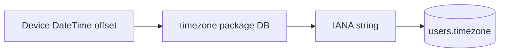

# Feature design doc — Timezone

> **Scope:** **IANA timezone detection** from the device clock (**`timezone`** package), **`users.timezone`** updates in **Supabase**, and **background init** after **signup** / when **creating** or **refreshing** profile paths. No dedicated settings UI — Profile shows timezone from **`UserData`** (see **Profile & settings** / **User data** docs).

---

## 0. Document control

| Field | Value |
|-------|--------|
| **Feature name (canonical)** | **Timezone** |
| **Short slug** | `timezone` |
| **Doc version** | `0.1` |
| **Last updated** | `2026-04-03` |
| **Owner / maintainer** | `[TBD]` |
| **Reviewers (default)** | Anyone changing `TimezoneService.getDeviceTimezone` matching rules, `users.timezone` contract, or auth signup hooks |
| **Status of this doc** | `Draft` |

---

## 1. Summary

### 1.1 One-line purpose

Resolve the device’s current **UTC offset** to an **IANA zone name**, persist it on the **`users`** row in **Supabase**, and support **re-check** when the stored value may differ (travel).

### 1.2 Elevator pitch

**`TimezoneService`** loads the **`timezone`** package database via **`initializeTimeZones()`** (lazy on first **`getDeviceTimezone`**). **`getDeviceTimezone`** reads **`DateTime.now().timeZoneOffset`**, then finds an IANA location whose **current** offset matches: a **fast path** list (e.g. `Asia/Kolkata`, `America/New_York`, …), then a **full scan** of **`tz.timeZoneDatabase.locations`** if needed. If nothing matches, returns **`UTC`**. **`updateUserTimezone`** issues a direct **`supabase.from('users').update({'timezone': timezone})`**. **`initializeUserTimezone(userId)`** combines get + update. **`checkAndUpdateTimezone(userId)`** compares DB **`users.timezone`** to the device and updates if different — **implemented** in code but **not referenced elsewhere in `lib/`** at doc time (candidate for app resume / splash). **Signup** and **auth** flows call **`initializeUserTimezone`** in the **background** (`.catchError` → **ERRSYS162** in auth paths). **`UserDataService`** uses **`getDeviceTimezone`** when **creating** a new local **`users`** row and may call **`initializeUserTimezone`** when an existing profile has **`timezone == null`**.

### 1.3 In scope / out of scope

| In scope | Out of scope |
|----------|----------------|
| `lib/services/timezone_service.dart` | **DST policy** documentation for every region — operational |
| **`users.timezone`** string in Supabase | **SQLite `users`** mirror — owned by **User data & sync** (local row may lag until fetch) |
| Offset → IANA heuristic | **Manual timezone picker** UI |

---

## 2. Product & UX

### 2.1 User-facing surfaces

- **Indirect:** Profile **Timezone** line (from **`userData.timezone`**).
- **No** dedicated timezone settings screen.

### 2.2 UX principles & constraints

- Detection is **best-effort**; wrong IANA for the same offset is possible (**first match wins**).
- Failures fall back to **`UTC`** and log **ERRSYS160** (low).

### 2.3 Related product docs

- `bc/CHANGE-SYSTEM/feature-list.md` — **Timezone**
- **User data & preferences**, **Profile & settings**, **Authentication**

---

## 3. Technical architecture

### 3.1 Stack & layers

| Layer | Details |
|-------|---------|
| **Package** | `timezone` — `initializeTimeZones()`, `TZDateTime`, location DB |
| **Remote** | Supabase **`users.timezone`** (string, IANA-style id) |

### 3.2 Key modules & file paths

```
lib/services/timezone_service.dart
lib/providers/auth_provider.dart      # signUp → initializeUserTimezone (background)
lib/services/auth_service.dart        # same pattern
lib/services/user_data_service.dart   # new user + null timezone paths
```

### 3.3 Data model (feature-specific)

| Field | Role |
|-------|------|
| **`users.timezone`** | IANA string, e.g. `Asia/Kolkata`; updated by **`updateUserTimezone`** |

### 3.4 External dependencies

- **Pub:** `timezone` / `timezone/data/latest.dart`
- **Supabase:** authenticated client for **`users`** update

### 3.5 Platform notes

- Uses **Dart `DateTime`** offset — consistent with host OS timezone.
- **Web:** `timezone` package behavior may differ; verify if web target is enabled.

### 3.6 Functions & methods (code map)

| Symbol | Role |
|--------|------|
| `initializeTimezoneDatabase` | Idempotent **`initializeTimeZones()`** |
| `getDeviceTimezone` | Offset match → IANA string or **`UTC`** |
| `updateUserTimezone` | Supabase patch **`users.timezone`** |
| `initializeUserTimezone` | **`getDeviceTimezone`** + **`updateUserTimezone`** |
| `checkAndUpdateTimezone` | Read DB → compare → update if drift |

### 3.7 Variables, constants & configuration keys

| Name | Meaning |
|------|---------|
| `commonTimezones` | Fast-path list in **`getDeviceTimezone`** (order matters for duplicates) |
| **ERRSYS160** | Failure in **`getDeviceTimezone`** (logged low) — *note: same code may appear in other modules for unrelated ops; grep before attributing* |
| **ERRSYS161** | **`updateUserTimezone`** failure |
| **ERRSYS162** | Signup/auth background timezone init failure (auth files) |
| **ERRSYS163** | **`checkAndUpdateTimezone`** catch |
| **ERRSYS165** | **`UserDataService`** timezone init from profile path (low) |

### 3.8 Core logic & behaviour

#### 3.8.1 Offset matching algorithm

1. Compute **`offsetHours`** and **`offsetMinutes`** from **`DateTime.now().timeZoneOffset`**.
2. For each candidate location, compute **`TZDateTime.now(location).timeZoneOffset`** and compare hours + minute component.
3. First equal match returns that **IANA** name.
4. Ambiguity: **many** zones share an offset at a given moment; **list order** biases common regions.

#### 3.8.2 When `initializeUserTimezone` runs

- After **signUp** (auth provider / auth service).
- **`UserDataService`**: new user creation; optional background init when **`timezone`** null on existing profile.

#### 3.8.3 `checkAndUpdateTimezone`

- Intended for **travel** detection; **not wired** to **`AppLifecycleService`** or splash in current `lib/` grep — consider calling on resume if product requires.

### 3.9 State management

- **None** — static service methods only.

---

## 4. Boundaries & coupling

### 4.1 Upstream

- **Auth** — must have **`userId`** for DB updates.

### 4.2 Downstream

- Any server or client logic that interprets **`users.timezone`** for “local midnight” or scheduling (notifications use **local `TimeOfDay`** separately).

### 4.3 Shared hotspots

- **`users`** row also updated by **sync** / **UserDataService** — avoid conflicting writes without coordination.

---

## 5. Change control alignment

### 5.1 Default `primary_feature`

**Timezone** for detection/heuristic/Supabase update; **Authentication** if only signup hook changes.

### 5.2 Risk class

**Low** — wrong IANA rarely breaks core journaling; may affect server-side date logic if added later.

---

## 6. Operations & quality

### 6.1 Observability

- **ERRSYS160–163**, **165** as listed; severity mostly **low/medium**.

### 6.2 Performance

- Full **location scan** can be costly on first cold call; **common list** mitigates typical cases.

---

## 7. Testing strategy

### 7.1 Manual

1. Sign up on device → **`users.timezone`** populated in Supabase.
2. Emulator with specific zone → returned string matches expected **fast-path** or fallback.
3. Force DB **`timezone`** different from device → call **`checkAndUpdateTimezone`** in a test harness → row updates.

---

## 8. Releases & migration

- Changing **column type** or semantics of **`users.timezone`** requires migration + client update.

---

## 9. Documentation & support

| Issue | Note |
|-------|------|
| Always shows UTC | Check **`getDeviceTimezone`** exception path and Supabase update success |
| Wrong city name | Expected limitation of offset-only matching |

---

## 10. Glossary

| Term | Definition |
|------|------------|
| **IANA** | Olson timezone id, e.g. `Europe/Berlin` |

---

## 11. Open questions & decisions

### 11.1 Open questions

1. Wire **`checkAndUpdateTimezone`** to **app lifecycle** or **splash**?
2. Replace offset heuristic with **platform channel** native timezone id where available?

### 11.2 Decisions

| Date | Decision | Rationale |
|------|----------|-----------|
| `2026-04-03` | Doc lists **`checkAndUpdateTimezone`** as unused in navigation | Matches repo grep |

---

## 12. Appendix

### 12.1 References

- `lib/services/timezone_service.dart`
- `bc/CHANGE-SYSTEM/feature-doc-template.md`

### 12.2 Diagram



### 12.3 Changelog of *this* doc

| Version | Date | Notes |
|---------|------|-------|
| `0.1` | `2026-04-03` | Initial |
