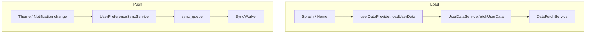

# Feature design doc — User data & preferences

> **Scope:** **Aggregated user shell** (`UserData`: profile, stats, “preferences” view of `user_settings`), **local-first fetch** via **`DataFetchService`**, **prefetch/merge** via **`DataPrefetchService`**, **outbound preference sync** via **`UserPreferenceSyncService`** (SQLite + `sync_queue`), and **global state** in **`userDataProvider`**. **Streak/grace helpers** also live in **`user_data_service.dart`** — behaviour is documented in **Streaks & grace**; this doc only notes coupling.

---

## 0. Document control

| Field | Value |
|-------|--------|
| **Feature name (canonical)** | **User data & preferences** |
| **Short slug** | `user-data-preferences` |
| **Doc version** | `0.1` |
| **Last updated** | `2026-04-03` |
| **Owner / maintainer** | `[TBD]` |
| **Reviewers (default)** | Anyone changing `UserDataService.fetchUserData`, `DataFetchService` user profile/settings paths, or `UserPreferenceSyncService` payloads |
| **Status of this doc** | `Draft` |

---

## 1. Summary

### 1.1 One-line purpose

Load and hold the **signed-in user’s** profile, **derived stats**, and **settings-shaped preferences** locally and from Supabase, and **push** notification and **appearance** changes to the cloud through the **sync queue**.

### 1.2 Elevator pitch

After auth, **`UserDataService.fetchUserData`** builds a **`UserData`** object: profile from **`users`** (via **`DataFetchService.fetchUserProfile`** or direct Supabase), stats from **entries** + **`streaks`** (read-only aggregation), and preferences from **`user_settings`** (**`DataFetchService.fetchUserSettings`** or Supabase). **`userDataProvider`** exposes this for **Profile**, **Home**, **Splash**, etc. Edits to **reminders** and **theme/font/paper** go **SQLite-first** in **`UserPreferenceSyncService`**, then enqueue **`user_settings`** / **`user_profiles`** for **`SyncWorker`**. **`DataPrefetchService`** merges remote rows into SQLite on cold start / prefetch flows (timestamp rules vary by entity).

### 1.3 In scope / out of scope

| In scope | Out of scope |
|----------|----------------|
| `user_data_service.dart`, `user_data_provider.dart`, `user_preference_sync_service.dart` | **Theme/font/paper UI state** as the source of truth — see **Theme & diary UI prefs** (providers call into sync here) |
| `data_fetch_service.dart` — user profile & settings fetch/store | Full **DataFetchService** entry/analytics APIs — see **Diary entries**, **Analytics** |
| `data_prefetch_service.dart` — profile/settings merge helpers | **SyncWorker** implementation — see **Sync, DB & connectivity** |
| `UserData` / `UserDataState` shapes | **Premium**, **Auth** screens beyond data needs |

---

## 2. Product & UX

### 2.1 User-facing surfaces

- **Screens / routes:** **Profile**, **Settings**, **Home** (reload user data), **Splash** (load with `useLocalOnly` vs network).
- **Entry points:** Post-login / app resume; user changes appearance or notification prefs.
- **Primary journeys:** See name/avatar/stats on Profile; adjust theme → persists locally → syncs; change reminder time → local row + queue.

### 2.2 UX principles & constraints

- **Offline:** `loadUserData(useLocalOnly: true)` reads SQLite only; no Supabase create-user path.
- **First-time remote user:** If **`users`** has no row, client may **insert locally** and enqueue **`user_profile`** (when online path is used).
- **Preferences map** in `UserData` may mix **raw `user_settings` columns** with **default placeholders** when no row exists (`theme`, `notifications`, etc. in `_fetchUserPreferences`).

### 2.3 Related product docs

- `bc/CHANGE-SYSTEM/feature-list.md` — **User data & preferences**
- `bc/CHANGE-SYSTEM/features-docs/sync-DB-&-connectivity.md` — queue + RPC
- `bc/Project3/tables_queries.md` — `users`, `user_settings`, `user_profiles` (reference)

---

## 3. Technical architecture

### 3.1 Stack & layers

| Layer | Details |
|-------|---------|
| **Client (Flutter)** | Riverpod (`Notifier`), `sqflite`, `supabase_flutter` |
| **State** | `userDataProvider`, convenience `userStatsProvider` / `userPreferencesProvider` |
| **Backend** | Supabase tables **`users`**, **`user_settings`**, **`user_profiles`** |
| **Persistence** | Local SQLite rows + **`sync_queue`** for outbound sync |

### 3.2 Key modules & file paths

```
lib/services/user_data_service.dart
lib/providers/user_data_provider.dart
lib/services/user_preference_sync_service.dart
lib/services/data_fetch_service.dart   (user profile & settings sections)
lib/services/data_prefetch_service.dart
lib/providers/data_providers.dart      (dataFetchServiceProvider)
```

**Related UI (not owned here):** `lib/screens/profile_screen.dart`, `lib/screens/settings_screen.dart`; **Theme & diary UI prefs:** `theme_provider.dart`, `font_size_provider.dart`, `paper_style_provider.dart`.

### 3.3 Data model (feature-specific)

| Entity / table | Role |
|----------------|------|
| **`users`** | `id`, email, `display_name`, `avatar_url`, `timezone`, flags; local insert + **`user_profile`** queue when creating first-time user |
| **`user_settings`** | Reminders (`reminder_*`), `grace_system_enabled`, `privacy_lock_enabled`, `region_preference`, `export_format_default` |
| **`user_profiles`** | **Appearance mirror:** `theme_preference`, `diary_font`, `font_size`, `paper_style` |
| **`UserData` (in-memory)** | `stats` map: `entries_count`, `current_streak`, `longest_streak`, `days_active`, `last_entry_date` |
| **`preferences` (in-memory)** | From `user_settings` row or **defaults** if null |

### 3.4 External dependencies

- **Packages:** `supabase_flutter`, `sqflite`, `flutter_riverpod`
- **Services:** Supabase PostgREST for `users`, `user_settings`
- **Env / secrets:** Standard Supabase client (no feature-specific keys)

### 3.5 Platform notes

- **Offline / airplane mode:** `useLocalOnly` avoids network; profile missing locally → fetch failure path.
- **Web:** Same services; connectivity behaviour follows global app.

### 3.6 Functions & methods (code map)

#### 3.6.1 Entry points & orchestration

| Symbol | File | Role |
|--------|------|------|
| `UserDataService.fetchUserData` | `user_data_service.dart` | Composes profile + stats + preferences → `UserData` |
| `UserDataNotifier.loadUserData` | `user_data_provider.dart` | Splash/Home; passes `dataFetchService` from `dataFetchServiceProvider` |
| `UserDataNotifier.clearUserData` | `user_data_provider.dart` | Logout |
| `UserPreferenceSyncService.syncNotificationSettingsToCloud` | `user_preference_sync_service.dart` | Upsert `user_settings` + queue `user_settings` |
| `UserPreferenceSyncService.syncAppearanceToCloud` | `user_preference_sync_service.dart` | Upsert `user_profiles` + queue `user_profiles` |

#### 3.6.2 Services & repositories

| Symbol | File | Notes |
|--------|------|--------|
| `DataFetchService.fetchUserProfile` | `data_fetch_service.dart` | Local-first; optional force refresh → Supabase + store |
| `DataFetchService.fetchUserSettings` | `data_fetch_service.dart` | Same pattern; stores with `is_synced` / `last_sync_at` |
| `DataFetchService.storeUserProfile` / `storeUserSettings` | `data_fetch_service.dart` | Used by **`DataPrefetchService`** merge |
| `DataPrefetchService.fetchAndMergeUserProfile` | `data_prefetch_service.dart` | Compare `updated_at` vs local `last_sync_at` before store |
| `DataPrefetchService.fetchAndMergeUserSettings` | `data_prefetch_service.dart` | **Always store** when remote row exists (comment: no reliable `updated_at` merge on Supabase side in flow) |

#### 3.6.3 Widgets / UI building blocks

| Widget / builder | File | When used |
|------------------|------|-----------|
| N/A | — | Providers consumed by Profile/Home/Splash |

#### 3.6.4 Backend / Edge

| Function / route / RPC | Location | Purpose |
|-------------------------|----------|---------|
| `users` / `user_settings` / `user_profiles` | Supabase | CRUD via client; sync worker performs upserts for queued payloads |

### 3.7 Variables, constants & configuration keys

#### 3.7.1 Constants & enums

| Name | Type / file | Value / meaning |
|------|-------------|-----------------|
| `UserDataState` | `user_data_provider.dart` | `userData`, `isLoading`, `error`, `additionalData` |
| Default prefs map | `user_data_service.dart` | `_fetchUserPreferences` when `response == null` |

#### 3.7.2 Keys (storage, prefs, routing)

| Key / route name | Where defined | Purpose |
|------------------|---------------|---------|
| `last_fetch_date` | `DataSyncFlagService` | Prefetch gating (see **Sync** doc) — not owned here |

#### 3.7.3 Environment & remote config

| Name | Notes |
|------|--------|
| N/A | — |

### 3.8 Core logic & behaviour

#### 3.8.1 Main flow (happy path — `fetchUserData`)

1. Require `Supabase.auth.currentUser`.
2. **`_fetchUserProfile`:** use `DataFetchService` when injected; else direct `users` select. If no row and not `useLocalOnly`, **create** local `users` row from auth metadata + device timezone, enqueue **`user_profile`**.
3. **`_fetchUserStats`:** entry count from `DataFetchService.fetchEntries` (wide range) or local/query fallback; streaks from **local `streaks`** only (read-only).
4. **`_fetchUserPreferences`:** `DataFetchService.fetchUserSettings` or Supabase `user_settings`; **defaults** if null.
5. Return **`UserDataResult`** with assembled **`UserData`**.

#### 3.8.2 State machine / status rules

| State | Entered when | Notes |
|-------|----------------|-------|
| Loading | `loadUserData` start | `isLoading: true` |
| Ready | Success | `userData` set |
| Error | Failure | `error` string; ERRSYS011 on exception in notifier |

#### 3.8.3 Business rules & invariants

- **Stats:** `UserDataService` does **not** write streaks in `_fetchUserStats` (comments point to entry/streak flows).
- **Duplicate user insert:** Detect Postgres duplicate / unique errors → retry fetch from Supabase or read local.
- **Notification sync:** Preserves non-edited columns (`grace_system_enabled`, `privacy_lock_enabled`, etc.) from existing local row when building payload.
- **Appearance sync:** Merges with existing `user_profiles` row for unspecified fields.

#### 3.8.4 Edge cases & failure modes

| Scenario | Behaviour |
|----------|-----------|
| `useLocalOnly` + no local profile | `DataResult` error “No local profile”; `fetchUserData` fails early |
| Preferences fetch error | Defaults returned; ERRSYS120 logged |
| `UserPreferenceSyncService` failure | ERRSYS134 logged; local state may still have partial SQLite write depending on failure point |

#### 3.8.5 Pseudocode

```
fetchUserData():
  profile = fetchUserProfile(...)
  if !profile.success → fail
  stats = fetchUserStats(...)
  prefs = fetchUserPreferences(...)
  return UserData(profile, stats, prefs)
```

### 3.9 State management (providers / notifiers)

| Provider | File | What it holds |
|----------|------|----------------|
| `userDataProvider` | `user_data_provider.dart` | `UserDataState` |
| `userStatsProvider` | `user_data_provider.dart` | `userData.stats` |
| `userPreferencesProvider` | `user_data_provider.dart` | `userData.preferences` |
| `wellnessDataProvider` / `gratitudeDataProvider` / … | `user_data_provider.dart` | `additionalData` buckets (stubs today) |
| `dataFetchServiceProvider` | `data_providers.dart` | Injected into `loadUserData` |

---

## 4. Boundaries & coupling

### 4.1 Upstream

- **Authentication** — must have `currentUser` for remote paths.
- **DatabaseManager / SQLite** — all local tables.
- **TimezoneService** — default timezone on new user; background init if `timezone` null.

### 4.2 Downstream

- **Sync, DB & connectivity** — `sync_queue` entity types **`user_profile`**, **`user_settings`**, **`user_profiles`**.
- **Notifications** — `NotificationService` calls **`syncNotificationSettingsToCloud`**.
- **Theme & diary UI prefs** — providers call **`syncAppearanceToCloud`**.

### 4.3 Shared hotspots

- **`user_data_service.dart`** also contains **streak recalculation**, **grace**, **`applyGapIfNeeded`**, **`ensureStreaksRecordExists`** — coordinate with **Streaks & grace** and **DataPrefetchService** (`fetchAndMergeStreaks`, `ensureHabitsDailyFromEntries`).

---

## 5. Change control alignment

### 5.1 Default `primary_feature`

Use **User data & preferences** when changing **`UserData` shape**, **`UserPreferenceSyncService`** payloads, or **`DataFetchService`** user profile/settings contract.

### 5.2 Typical approver

Match team key for this feature in the change dashboard.

### 5.3 CTASK expectations

- Any new **column** on `users` / `user_settings` / `user_profiles` → migration + app CTASK + sync payload review.
- **Default preferences** keys → update UI consumers and this doc.

### 5.4 Risk class

**Medium** — wrong merge or queue payload can desync multi-device preferences; profile creation errors block first-run UX.

---

## 6. Operations & quality

### 6.1 Feature flags

None specific.

### 6.2 Observability

- **ERRSYS117** — `fetchUserData` top-level failure  
- **ERRSYS011** — `loadUserData` exception  
- **ERRSYS118 / ERRSYS121** — profile fetch / retry  
- **ERRSYS119 / ERRSYS120** — duplicate / creation / preferences  
- **ERRSYS134** — `UserPreferenceSyncService`  
- **ERRDATA220 / ERRDATA222** — `DataFetchService` store/fetch profile/settings  
- **ERRSYS168 / ERRSYS169** — prefetch merge profile/settings  

### 6.3 Performance & limits

- Stats path may scan **10 years** of entries via `fetchEntries` when `DataFetchService` is used — consider impact if entry volume grows.

### 6.4 Security & privacy

- **PII:** `users` holds email, display name, avatar URL — treat per app privacy policy.
- **RLS:** Assumed on Supabase; client uses authenticated session.

---

## 7. Testing strategy

### 7.1 Critical test cases (manual)

1. Fresh login → profile row created locally + sync queue contains `user_profile` when applicable.
2. Toggle theme → `user_profiles` local row + queue `user_profiles`; second device receives after sync.
3. Change reminder → `user_settings` + queue; reschedule notifications as per **Notifications** feature.
4. Offline splash → `useLocalOnly: true` shows cached `UserData` when data exists.

### 7.2 Automated tests

| Type | Location / pattern |
|------|---------------------|
| Unit | `[TBD]` — `DataResult` / default prefs mapping |

### 7.3 Regression triggers

- Touch **`UserPreferenceSyncService`** → re-test **Profile**, **Settings**, **notification** scheduling, **multi-device** sync.

---

## 8. Releases & migration

### 8.1 Version / release notes

User-visible only when new profile fields or preference toggles ship.

### 8.2 Data migrations

SQLite **`users`**, **`user_settings`**, **`user_profiles`** columns must stay aligned with **`DatabaseManager`** and Supabase schema.

### 8.3 Rollback

Revert app build; server-side columns require coordinated migration rollback.

---

## 9. Documentation & support

### 9.1 User-facing help

Strings live on Profile/Settings screens.

### 9.2 Runbooks

- **Stats look wrong:** Verify local **`entries`** and **`streaks`**, not only remote.
- **Preferences not syncing:** Check **`sync_queue`** rows and **`SyncWorker`** logs.

### 9.3 FAQ

| Issue | Note |
|-------|------|
| “Theme reverts” | Check **`user_profiles`** merge on other device and sync order |

---

## 10. Glossary & naming

| Term | Definition |
|------|------------|
| **Preferences (UserData)** | Often the **`user_settings`** row (or defaults); not the same as **ThemeProvider** state until synced |
| **user_profile vs user_profiles** | Queue entity **`user_profile`** → table **`users`**; **`user_profiles`** → appearance row |

---

## 11. Open questions & decisions

### 11.1 Open questions

1. Should **`_fetchUserPreferences`** defaults be aligned with **ThemeProvider** defaults?
2. Consolidate **stats** entry scan window vs dedicated count query for large histories?

### 11.2 Decisions

| Date | Decision | Rationale |
|------|----------|-----------|
| `2026-04-03` | Document **UserPreferenceSyncService** as outbound path for prefs | Matches `user_preference_sync_service.dart` |

---

## 12. Appendix

### 12.1 References

- `lib/services/user_data_service.dart`
- `lib/services/data_fetch_service.dart`
- `lib/services/user_preference_sync_service.dart`
- `bc/CHANGE-SYSTEM/feature-doc-template.md`

### 12.2 Diagram



### 12.3 Changelog of *this* doc

| Version | Date | Notes |
|---------|------|-------|
| `0.1` | `2026-04-03` | Initial |
