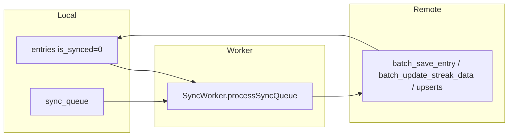

# Feature design doc — Sync, DB & connectivity

> **Scope:** **Local-first SQLite** (`DatabaseManager`, `diary_app.db`), **outbound sync** via **`SyncWorker`** + **`SupabaseSyncService`** (RPCs **`batch_save_entry`**, **`batch_update_streak_data`**), **`sync_queue`** for non-entry / follow-on entities, **online detection** (`ConnectivityService`, DNS **`hasRealInternet`**), **`syncStatusProvider`** UX state, and **`DataSyncFlagService`** (`last_fetch_date`) for **prefetch vs resume**. **Pull** helpers (`fetchEntryFromCloud`, per-table fetches) live in **`SupabaseSyncService`** — used by **Diary entries** merge and **DataFetchService** patterns.

---

## 0. Document control

| Field | Value |
|-------|--------|
| **Feature name (canonical)** | **Sync, DB & connectivity** |
| **Short slug** | `sync-db-connectivity` |
| **Doc version** | `0.1` |
| **Last updated** | `2026-04-03` |
| **Owner / maintainer** | `[TBD]` |
| **Reviewers (default)** | Anyone changing `SyncWorker.processSyncQueue`, `SupabaseSyncService` RPC payloads, `DatabaseManager` migrations, or `ConnectivityService.isOnline` |
| **Status of this doc** | `Draft` |

---

## 1. Summary

### 1.1 One-line purpose

Keep **diary data** available **offline** in SQLite, **push** unsynced changes to **Supabase** when the device has **real internet**, and expose **sync status** to the UI while **avoiding duplicate work** via **`is_synced`** flags and **queue cleanup**.

### 1.2 Elevator pitch

**`LocalEntryService`** upserts rows and enqueues **`sync_queue`**; for **entries**, **`SyncWorker`** primarily drives sync by scanning **`entries.is_synced = 0`**, loading **`getFullEntryForSync`**, calling **`SupabaseSyncService.batchSaveEntry`** (Postgres RPC **`batch_save_entry`**), then **`markAsSynced`**, which sets **`is_synced = 1`** and **deletes** `sync_queue` rows for that **`entry_id`**. A second pass drains **`sync_queue`** for **`streak`**, **`user_profile`**, **`user_settings`**, **`user_profiles`**, **`error_log`** via **`batchUpdateStreakData`**, **`syncUserProfile`**, etc. **`ConnectivityService.startMonitoring`** triggers **`processSyncQueue`** when connectivity becomes non-none; **`AppLifecycleService`** runs queue on **resume**; **`EntryNotifier`** runs queue after batch save. **`ConnectivityService.isOnline`** combines **connectivity_plus** with **`hasRealInternet()`** (DNS lookup) to avoid “Wi‑Fi with no route” false positives.

### 1.3 In scope / out of scope

| In scope | Out of scope |
|----------|----------------|
| `sync_worker.dart`, `supabase_sync_service.dart`, `sync_status_provider.dart`, `connectivity_service.dart`, `database_manager.dart`, `data_sync_flag_service.dart` | **Supabase AI queue** (Edge) — separate feature |
| `LocalEntryService` sync helpers (`markAsSynced`, queue CRUD) | **Full** `DataFetchService` / prefetch — cross-feature |
| `sync_queue` table semantics | **Postgres RPC** definitions — document in migrations / DB repo |

---

## 2. Product & UX

### 2.1 User-facing surfaces

- **`syncStatusProvider`:** **`idle` → `syncing` → `saved` / `error`** (driven from **`EntryNotifier`** batch save + sync worker path).
- **Indirect:** No dedicated “sync screen”; connectivity affects **Analytics** offline UI, **History** local-only, etc.

### 2.2 UX principles & constraints

- **Optimistic local writes** — cloud may lag until **`processSyncQueue`** runs.
- **Errors** on sync status log **ERRSYS021** (medium).

### 2.3 Related product docs

- `bc/CHANGE-SYSTEM/feature-list.md` — **Sync, DB & connectivity**
- `bc/Project3/tables_queries.md` — remote tables (reference)

---

## 3. Technical architecture

### 3.1 Stack & layers

| Layer | Details |
|-------|---------|
| **Local DB** | SQLite **`sqflite`**, **`DatabaseManager`** v9, `diary_app.db` |
| **Remote** | Supabase Flutter client (user session + RPCs) |
| **Queue** | `sync_queue` (JSON `data`, `entity_type`, `retry_count`) |
| **Net** | `connectivity_plus` + `dart:io` DNS lookup |

### 3.2 Key modules & file paths

```
lib/services/sync/sync_worker.dart
lib/services/sync/supabase_sync_service.dart
lib/providers/sync_status_provider.dart
lib/services/connectivity_service.dart
lib/services/connectivity_check_io.dart   # hasRealInternet (DNS)
lib/services/connectivity_check_stub.dart
lib/services/database/database_manager.dart
lib/services/database/local_entry_service.dart
lib/services/data_sync_flag_service.dart
```

### 3.3 Data model (feature-specific)

#### 3.3.1 Local `entries`

- **`is_synced`**, **`last_sync_at`** — drive **`getUnsyncedEntries`**.

#### 3.3.2 `sync_queue`

| Field | Role |
|-------|------|
| `entity_type` | `entry` (enqueued on upsert), `streak`, `user_profile`, `user_settings`, `user_profiles`, `error_log` |
| `table_name` / `operation` | Metadata |
| `data` | JSON-encoded payload |
| `retry_count` | Incremented on failure; **&lt; 10** to keep retrying (filtered query) |

**Note:** Entry rows are **removed** from `sync_queue` in **`markAsSynced`** after successful RPC — worker uses **`is_synced`** as source of truth for entries.

#### 3.3.3 `DataSyncFlagService`

- **`last_fetch_date`** (`yyyy-MM-dd` in SharedPreferences) — **null** ⇒ treat as **full prefetch** needed (e.g. login); set after successful merge.

### 3.4 External dependencies

- **Packages:** `sqflite`, `path`, `connectivity_plus`, `supabase_flutter`, `shared_preferences`

### 3.5 Platform notes

- **Web:** `connectivity_check_stub` may differ from IO — **`ConnectivityService.isOnline`** uses conditional import.

### 3.6 Functions & methods (code map)

#### 3.6.1 SyncWorker

| Symbol | Role |
|--------|------|
| `processSyncQueue` | Single-flight `_isProcessing`; early exit if nothing to do / offline; **entries → queue** |
| `_isOnline` | connectivity + **`InternetAddress.lookup('google.com')`** |

#### 3.6.2 SupabaseSyncService

| Symbol | Role |
|--------|------|
| `fetchEntryFromCloud` | Deduped in-flight map by `userId+date` |
| `fetch*FromCloud` | Per-table pull for merge / repair |
| `batchSaveEntry` | RPC **`batch_save_entry`** with nested sections |
| `batchUpdateStreakData` | RPC **`batch_update_streak_data`**; `p_habits_data` **empty array** (habits not synced remotely) |
| `syncUserProfile` / `syncUserSettings` / `syncUserProfiles` | Upsert + local `is_synced` |
| `insertErrorLog` | Push queued client errors to **`error_logs`** |

#### 3.6.3 ConnectivityService

| Symbol | Role |
|--------|------|
| `startMonitoring` | On reconnect → **`processSyncQueue`** |
| `isOnline` | `checkConnectivity` + **`hasRealInternet()`** |
| `dispose` | Cancel subscription |

#### 3.6.4 DatabaseManager

| Symbol | Role |
|--------|------|
| `_version` | **9** — migrations v2–v9 (streaks, users, sync_queue columns, user_profiles, yesterday_insight, entry_insights_local, cleanup trigger) |

### 3.7 Variables, constants & configuration keys

#### 3.7.1 Keys

| Key | Store | Purpose |
|-----|-------|---------|
| `last_fetch_date` | SharedPreferences | Prefetch gate |

#### 3.7.2 Error codes (sample)

| Code | Context |
|------|---------|
| ERRDATA021 / ERRDATA022 | Sync worker entry / queue failure |
| ERRSYS021 | Sync status error |
| ERRNET001 | Connectivity listener |
| ERRSYS001–003 | DB init / upgrade |
| ERRSYS109–116 | Cloud fetch helpers |
| ERRSYS170–172 | User sync upserts |
| ERRSYS200 / ERRSYS300 | RPC batch save / streak |
| ERRDB018 | markAsSynced |
| ERRSYS160–162 | DataSyncFlagService |

### 3.8 Core logic & behaviour

#### 3.8.1 `processSyncQueue` ordering

1. If **no** unsynced entries **and** no relevant queue items → return.
2. If **offline** → return.
3. **For each** unsynced entry: **`batchSaveEntry`** → **`markAsSynced`** (clears queue rows for entry).
4. **For each** queue item (filtered entity types): route to **`batchUpdateStreakData`** / profile / settings / **`insertErrorLog`** → **`removeSyncQueueItem`** or **`incrementRetryCount`**.

#### 3.8.2 Triggers (who calls `processSyncQueue`)

- **`ConnectivityService`** on link up
- **`AppLifecycleService`** on **resumed**
- **`EntryNotifier`** after batch save (**`SyncWorker`**)
- **`HomeScreen`** / splash-style **land** (via existing app patterns)

#### 3.8.3 Sync status

- **`setSyncing`** when user edits batch path starts debounce save
- **`setSaved`** after successful batch + queue process in **`EntryNotifier`**
- **`setError`** → ERRSYS021

### 3.9 State management

| Provider | File | Holds |
|----------|------|--------|
| `syncStatusProvider` | `sync_status_provider.dart` | `SyncState` — `SyncStatus` enum + optional error / last saved |

---

## 4. Boundaries & coupling

### 4.1 Upstream

- **Supabase auth** — RPCs use user JWT.
- **Postgres RPCs** — must exist and match parameter names.

### 4.2 Downstream

- **Diary entries** — merge + save pipeline.
- **Streaks & grace** — streak queue items.
- **Theme / settings** — `user_profiles` / `user_settings` queue.

### 4.3 Shared hotspots

- **`batch_save_entry`** — any schema change to entries or child tables must update RPC + `batchSaveEntry` params.
- **`DatabaseManager` migrations** — affects entire app startup.

---

## 5. Change control alignment

### 5.1 `primary_feature`

**Sync, DB & connectivity** for worker, sync service, DB manager, connectivity, data sync flags.

### 5.2 Approver

Match **Sync, DB & connectivity**; **Diary entries (core)** if only entry merge without transport change.

### 5.3 CTASK expectations

- **RPC signature** change → coordinated migration + app CTASK + QA multi-device.
- **SQLite migration** → backup / test upgrade path.

### 5.4 Risk class

**High** — data loss or divergence if sync breaks.

---

## 6. Operations & quality

### 6.1 Feature flags

None.

### 6.2 Observability

- Error codes above; failed queue items increment **`retry_count`** until cap.

### 6.3 Performance

- **`_isProcessing`** prevents overlapping **`processSyncQueue`** runs.
- Entry fetch dedupe in **`_inFlightEntryFetches`**.

### 6.4 Security & privacy

- Sync uses **user-scoped** Supabase client; RLS on server.

---

## 7. Testing strategy

### 7.1 Manual critical paths

1. Airplane mode → edit entry → online → **`is_synced`** flips + server row matches.
2. Toggle Wi‑Fi → **`ConnectivityService`** triggers queue.
3. Kill app mid-sync → retry on next launch / resume.
4. Logout → **`clearLastFetchDate`** (if wired) → next session full fetch.

### 7.2 Automated

| Type | Location |
|------|----------|
| Unit | `[TBD]` — `SyncQueueItem` parsing, retry filter |

### 7.3 Regression triggers

Change **`batchSaveEntry`** or **`markAsSynced`** → full offline/online matrix.

---

## 8. Releases & migration

### 8.1 User-visible

Rarely surfaced; DB migrations may require **app update** floor.

### 8.2 Data migrations

Follow **`DatabaseManager._onUpgrade`** ordering; test from v1→v9.

---

## 9. Documentation & support

### 9.1 Runbooks

- **Stuck unsynced:** Check **`is_synced`**, network, Supabase logs, **`retry_count`** on queue.
- **DB init failure ERRSYS001:** Device storage / corruption.

### 9.2 FAQ

| Issue | Note |
|-------|------|
| Duplicate rows on server | Usually RPC idempotency / conflict policy — verify **`batch_save_entry`** |

---

## 10. Glossary

| Term | Definition |
|------|------------|
| **markAsSynced** | Local success after RPC; clears entry queue rows |
| **last_fetch_date** | Prefetch checkpoint for merged remote data |

---

## 11. Open questions & decisions

### 11.1 Open questions

1. **`SyncWorker._isOnline`** vs **`ConnectivityService.isOnline`** — two implementations (both DNS); consolidate?
2. **`processSyncQueue`** stub on **`SupabaseSyncService`** — dead code; remove?

### 11.2 Decisions

| Date | Decision | Rationale |
|------|----------|-----------|
| `2026-04-03` | Doc reflects entry-first then queue | Matches `sync_worker.dart` |

---

## 12. Appendix

### 12.1 References

- `lib/services/sync/sync_worker.dart`
- `lib/services/sync/supabase_sync_service.dart`
- `lib/services/database/database_manager.dart`
- `bc/CHANGE-SYSTEM/feature-doc-template.md`

### 12.2 Diagram (push sync)



### 12.3 Changelog of *this* doc

| Version | Date | Notes |
|---------|------|-------|
| `0.1` | `2026-04-03` | Initial |
